# Module 06: System Hacking

> **Status:** ✅ Completed
>
> **Difficulty:** ⭐⭐⭐⭐⭐
>
> **Labs Completed:** 6
>
> **Tools Covered:** *(To be updated after completing all labs.)*

---

# Module Summary

This module focuses on System Hacking, one of the most critical phases of the ethical hacking methodology, where information collected during footprinting, scanning, enumeration, and vulnerability analysis is used to compromise target systems. Throughout this module, I learned how ethical hackers gain unauthorized access, escalate privileges, maintain persistent access, perform Active Directory attacks, and remove evidence of compromise while understanding the defensive measures used to detect and mitigate these techniques.

The practical labs covered password attacks, reverse shell access, buffer overflow exploitation, privilege escalation, persistence mechanisms, log clearing, Active Directory attacks, and AI-assisted system hacking using various penetration testing tools and Windows administrative features. Rather than focusing solely on individual tools and commands, this documentation explains the methodology, attack lifecycle, security implications, and defensive perspective associated with each phase of system hacking.

---

# Overview

System Hacking is performed after completing the information gathering phases of a penetration test. Information collected during footprinting, scanning, enumeration, and vulnerability analysis is leveraged to gain access to target systems, elevate privileges, establish persistence, and accomplish the objectives of a security assessment.

This module demonstrates how attackers and ethical hackers exploit weaknesses in authentication mechanisms, operating systems, applications, and Active Directory environments to obtain and maintain unauthorized access. It also explores common post-exploitation activities, persistence techniques, and methods used to evade detection by clearing forensic evidence. Additionally, the module introduces AI-assisted system hacking to improve productivity during penetration testing activities.

Throughout the practical labs, I learned not only how various system hacking techniques are performed, but also why each phase is important, how they contribute to the overall attack lifecycle, and what defensive controls can be implemented to detect, prevent, and respond to such attacks.

---

# Learning Objectives

After completing this module, I was able to:

- Understand the complete methodology of system hacking.
- Gain unauthorized access using multiple attack techniques.
- Perform password attacks and exploit authentication weaknesses.
- Establish remote access to compromised systems.
- Perform privilege escalation using operating system weaknesses.
- Understand persistence mechanisms used to maintain access.
- Remove forensic evidence by clearing system logs.
- Perform Active Directory attacks using common penetration testing techniques.
- Understand post-exploitation activities performed after gaining access.
- Utilize AI-assisted tools during system hacking activities.
- Recognize the security risks associated with compromised systems and Active Directory environments.
- Understand defensive measures used to detect and mitigate system hacking attacks.

---

# Key Concepts

- System Hacking
- Gaining Access
- Password Attacks
- Buffer Overflow
- Reverse Shell
- Privilege Escalation
- User Account Control (UAC)
- Persistence
- Registry Run Keys
- Keylogging
- Clearing Logs
- Post-Exploitation
- Active Directory Attacks
- Kerberoasting
- AS-REP Roasting
- Pass-the-Hash
- Credential Access
- Lateral Movement
- Artificial Intelligence in System Hacking

---

# Tools Used

*(To be updated after completing all labs.)*

---

# Labs Covered

| Lab | Description |
|------|-------------|
| Lab 1 | Gain Access to the System |
| Lab 2 | Perform Privilege Escalation to Gain Higher Privileges |
| Lab 3 | Maintain Remote Access and Hide Malicious Activities |
| Lab 4 | Clear Logs to Hide the Evidence of Compromise |
| Lab 5 | Perform Active Directory (AD) Attacks Using Various Tools |
| Lab 6 | Perform System Hacking Using AI |

---

# Lab 1: Gain Access to the System

## Objective

To gain unauthorized access to a target system by exploiting weaknesses in authentication mechanisms using credential interception, password cracking, reverse shell access, and buffer overflow techniques.

---

## Background

Gaining access is the first phase of system hacking, where attackers leverage information collected during reconnaissance, scanning, enumeration, and vulnerability analysis to compromise target systems. Common techniques include password attacks, exploitation of vulnerable services, and authentication attacks that allow attackers to obtain valid user credentials without directly compromising the operating system.

This lab demonstrates several techniques used to gain initial access to a target system, beginning with an active online attack that exploits Windows name resolution protocols to capture authentication hashes and recover user credentials.

---

## Task 1: Perform Active Online Attack to Crack the System's Password Using Responder

### Tools Used

- [Responder](../../Tools/Responder.md)
- [John the Ripper](../../Tools/John-the-Ripper.md)

---

### Activity Performed

An active online password attack was performed using Responder to exploit the Link-Local Multicast Name Resolution (LLMNR) and NetBIOS Name Service (NBT-NS) protocols enabled by default on Windows systems. These protocols provide fallback name resolution when DNS resolution fails, making them susceptible to spoofing attacks within local networks.

Responder was configured to listen on the network interface and poison LLMNR and NBT-NS broadcast requests originating from the target Windows 11 system. When the victim attempted to access a network resource, Responder impersonated the requested server and successfully captured the NTLMv2 authentication challenge-response transmitted by the target.

The captured authentication hash was extracted and supplied to John the Ripper, which performed offline password cracking and successfully recovered the user's plaintext password. This demonstrated how insecure name resolution protocols combined with weak passwords can lead to credential compromise without directly attacking the target system.

---

### Observations

- Successfully poisoned LLMNR/NBT-NS name resolution requests.
- Captured the NTLMv2 authentication hash of the logged-in Windows user.
- Extracted the captured authentication hash for offline analysis.
- Successfully recovered the user's plaintext password using John the Ripper.
- Demonstrated the security risks associated with legacy name resolution protocols in Windows environments.

---

### Responder Listening

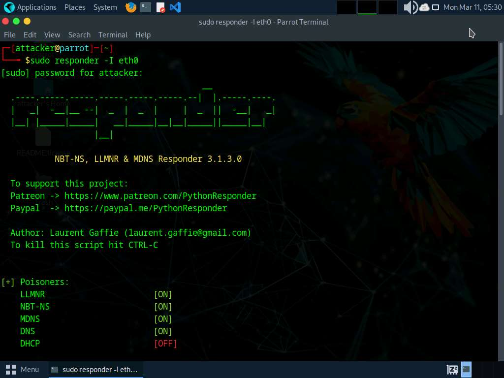

**Figure 1.1:** Responder was configured to monitor the network interface and poison LLMNR/NBT-NS requests, allowing authentication attempts from the target system to be intercepted.

---

### Captured NTLM Authentication Hash

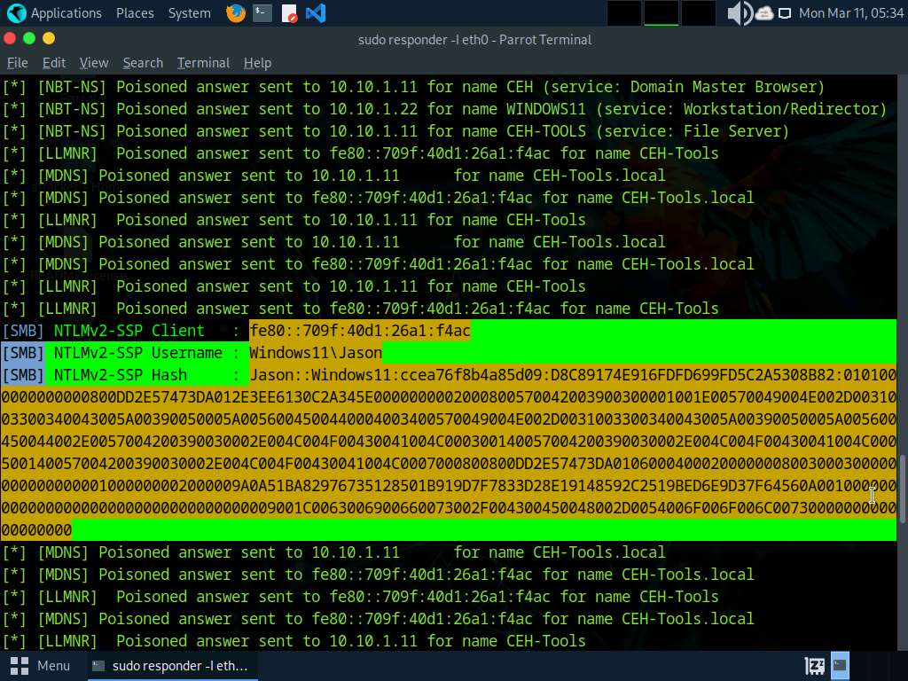

**Figure 1.2:** Responder successfully intercepted the NTLMv2 authentication challenge-response of the target user, demonstrating how LLMNR/NBT-NS poisoning can expose credential hashes within an internal network.

---

### Password Successfully Recovered

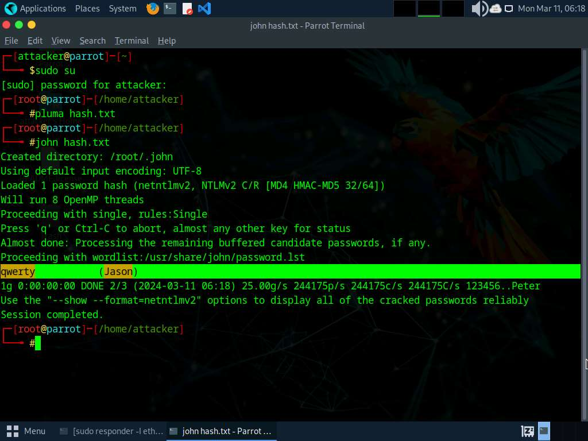

**Figure 1.3:** John the Ripper successfully recovered the plaintext password from the captured NTLM authentication hash, illustrating the effectiveness of offline password cracking against weak credentials.

---

### Learning Outcome

This task demonstrated how insecure Windows name resolution protocols such as LLMNR and NBT-NS can be exploited to capture NTLM authentication hashes and recover user credentials. It reinforced the importance of disabling unnecessary legacy protocols, enforcing strong password policies, and implementing network protections to mitigate credential interception attacks.

---

### Attack Flow

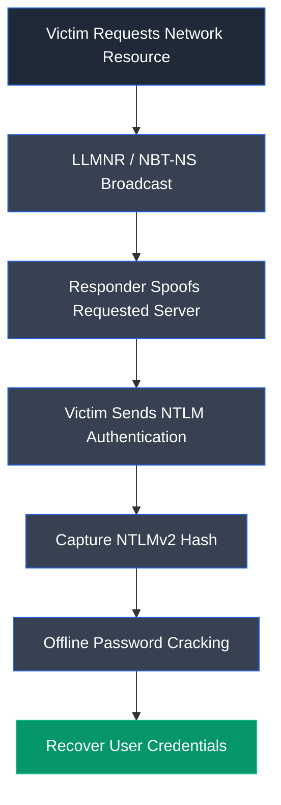
```mermaid
flowchart TD

    A[Victim Requests Network Resource]
    --> B[LLMNR / NBT-NS Broadcast]
    --> C[Responder Spoofs Requested Server]
    --> D[Victim Sends NTLM Authentication]
    --> E[Capture NTLMv2 Hash]
    --> F[Offline Password Cracking]
    --> G[Recover User Credentials]

    classDef start fill:#1f2937,color:#fff,stroke:#2563eb
    classDef process fill:#374151,color:#fff,stroke:#2563eb
    classDef decision fill:#7c3aed,color:#fff,stroke:#8b5cf6
    classDef success fill:#059669,color:#fff,stroke:#10b981

    class A start
    class B,C,D,E,F process
    class G success
```

---

## Task 2: Gain Access to a Remote System Using Reverse Shell Generator

### Tools Used

- [Reverse Shell Generator](../../Tools/Reverse-Shell-Generator.md)
- [Metasploit](../../Tools/Metasploit.md)

---

### Activity Performed

A reverse shell payload was generated using Reverse Shell Generator to automate the creation of reverse shell payloads and listener configurations. Instead of manually constructing payloads and Metasploit listener commands, the tool generated the required MSFVenom payload and corresponding Meterpreter listener based on the specified local IP address and listening port.

The generated payload was transferred to the target Windows system and executed, establishing a Meterpreter reverse shell connection with the attacking machine. The active session was verified using Meterpreter commands, confirming successful remote access to the compromised host.

In addition to Meterpreter, Reverse Shell Generator was used to create a HoaxShell PowerShell payload. After configuring the HoaxShell listener and executing the generated PowerShell script on the target system, a second reverse shell session was successfully established. The active session was verified by identifying the logged-on user through remote command execution.

This task demonstrated how automated payload generation simplifies reverse shell deployment while illustrating multiple methods of establishing remote command execution on a compromised Windows system.

---

### Observations

- Successfully generated a Windows Meterpreter reverse shell payload.
- Established a Meterpreter session with the target Windows system.
- Verified successful remote access using Meterpreter commands.
- Generated a HoaxShell PowerShell reverse shell payload.
- Successfully established a PowerShell-based reverse shell session.
- Verified remote command execution by identifying the logged-on user.

---

### MSFVenom Payload Generated

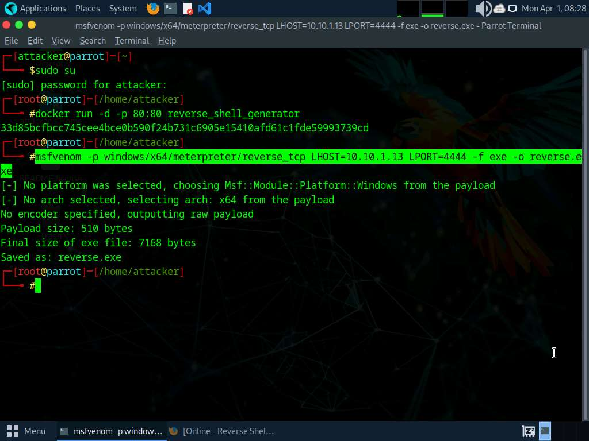

**Figure 1.4:** Reverse Shell Generator automatically generated the MSFVenom payload command based on the configured listener IP address and port, simplifying reverse shell payload creation.

---

### Meterpreter Session Established

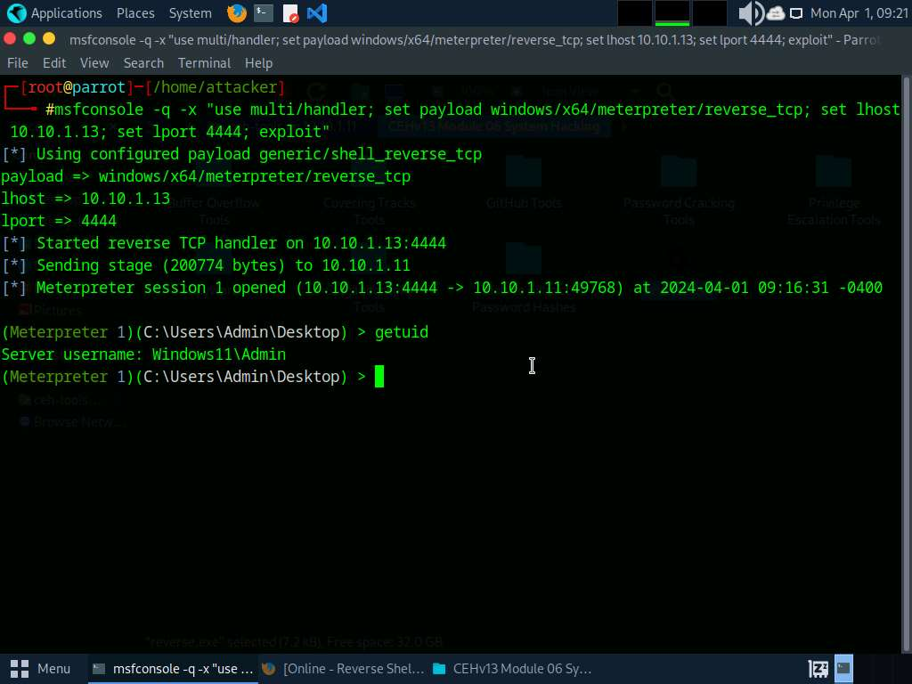

**Figure 1.5:** Execution of the generated payload established a Meterpreter session with the target Windows system, providing interactive remote access to the compromised host.

---

### HoaxShell Payload Generated

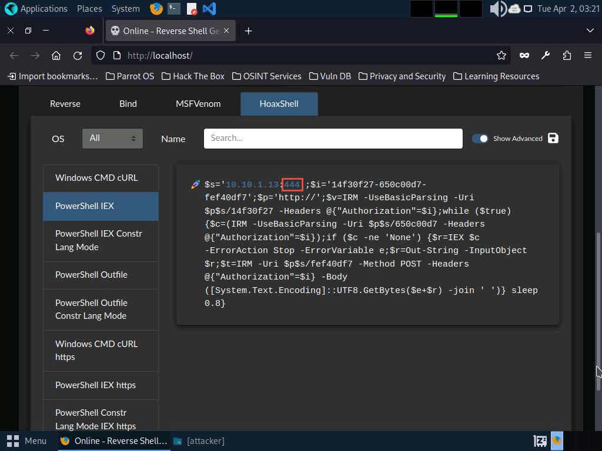

**Figure 1.6:** Reverse Shell Generator produced a PowerShell-based HoaxShell payload, enabling remote access using native Windows PowerShell capabilities.

---

### HoaxShell Session Established

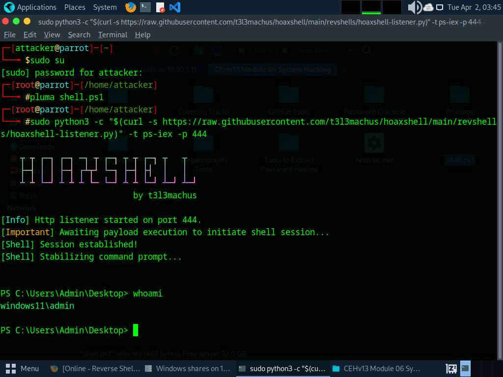

**Figure 1.7:** The generated PowerShell payload successfully established a HoaxShell session, allowing remote command execution and verification of the active user on the compromised system.

---

### Learning Outcome

This task demonstrated how reverse shell payload generation and automated listener configuration can streamline remote access during penetration testing. It also highlighted the effectiveness of multiple reverse shell techniques, including Meterpreter and PowerShell-based sessions, while emphasizing the importance of endpoint protection, application control, and network monitoring in detecting and preventing unauthorized remote access.

---

### Attack Flow

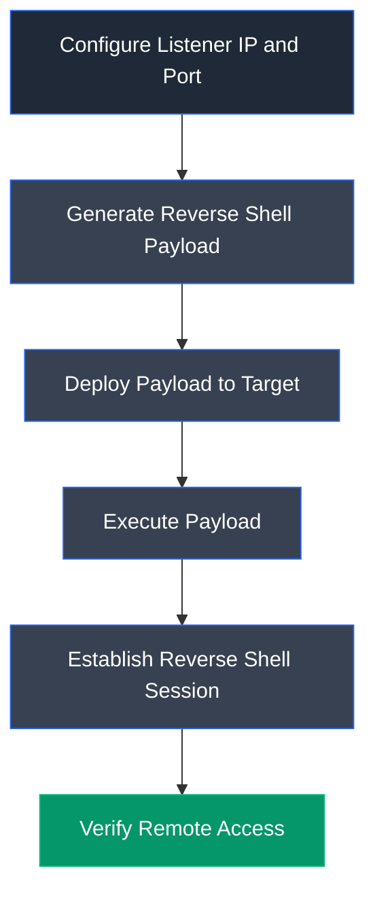
```mermaid
flowchart TD

    A[Configure Listener IP and Port]
    --> B[Generate Reverse Shell Payload]
    --> C[Deploy Payload to Target]
    --> D[Execute Payload]
    --> E[Establish Reverse Shell Session]
    --> F[Verify Remote Access]

    classDef start fill:#1f2937,color:#fff,stroke:#2563eb
    classDef process fill:#374151,color:#fff,stroke:#2563eb
    classDef success fill:#059669,color:#fff,stroke:#10b981

    class A start
    class B,C,D,E process
    class F success
```

---

## Task 3: Perform Buffer Overflow Attack to Gain Access to a Remote System

### Tools Used

- [Immunity Debugger](../../Tools/Immunity-Debugger.md)
- [Netcat](../../Tools/Netcat.md)
- [Spike](../../Tools/Spike.md)
- [Mona](../../Tools/Mona.md)
- [Metasploit](../../Tools/Metasploit.md)

---

### Activity Performed

A buffer overflow attack was performed against a vulnerable server application to gain remote access by manipulating the application's execution flow. The exploitation process followed a structured methodology consisting of vulnerability identification, exploit development, instruction pointer control, shellcode generation, and payload execution.

**Vulnerability Identification:**  
The vulnerable server was attached to Immunity Debugger, allowing its execution to be monitored throughout the attack. Initial interaction with the service using Netcat identified the available functions, after which Spike templates were used to perform spiking against individual commands. The TRUN function caused the application to crash and overwrite stack registers, confirming the presence of a buffer overflow vulnerability.

**Fuzzing and Offset Identification:**  
Python fuzzing scripts were executed to determine the approximate number of bytes required to crash the application. Pattern generation and offset calculation utilities from the Metasploit Framework were then used to determine the exact offset at which the Extended Instruction Pointer (EIP) register could be overwritten.

**Instruction Pointer Control:**  
Custom Python scripts verified that the EIP register could be reliably overwritten with controlled values. Additional testing identified the absence of problematic characters within the payload, ensuring that the generated shellcode would execute correctly without corruption during transmission.

**Exploit Development:**  
Mona was used within Immunity Debugger to enumerate loaded modules and identify a module lacking modern memory protection mechanisms. The appropriate `JMP ESP` return address was located and incorporated into the exploit to redirect program execution toward the injected shellcode.

**Shellcode Generation and Exploitation:**  
A Windows reverse TCP shell payload was generated using MSFVenom and embedded into the exploit script. After configuring Netcat to listen for incoming connections, the completed exploit was executed against the vulnerable server. Successful execution redirected program control to the injected shellcode, resulting in a reverse shell connection from the target system and providing remote command execution.

This task demonstrated the complete exploit development lifecycle, from identifying a vulnerable function to achieving remote code execution through a successfully crafted buffer overflow exploit.

---

### Observations

- Identified the TRUN function as vulnerable to buffer overflow attacks.
- Determined the approximate crash size through fuzzing.
- Successfully calculated the precise offset required to overwrite the EIP register.
- Verified complete control over the EIP register using controlled input values.
- Confirmed that the payload contained no bad characters affecting shellcode execution.
- Identified a suitable module without memory protection using Mona.
- Located a valid `JMP ESP` return address for exploit redirection.
- Successfully generated reverse shell payload using MSFVenom.
- Established a reverse shell connection to the target vulnerable system.
- Verified successful remote command execution after exploitation.

---

### Vulnerable Server Attached to Immunity Debugger

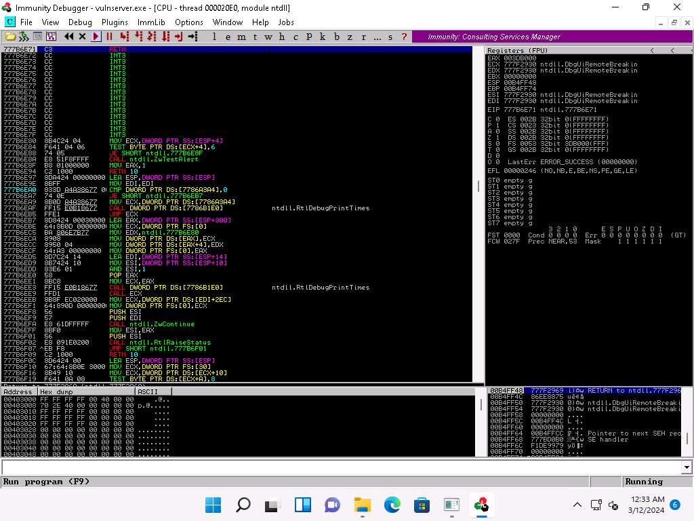

**Figure 1.8:** The vulnerable server was attached to Immunity Debugger and executed under controlled conditions, enabling runtime analysis and exploit development throughout the buffer overflow assessment.

---

### Buffer Overflow Triggered through the TRUN Function

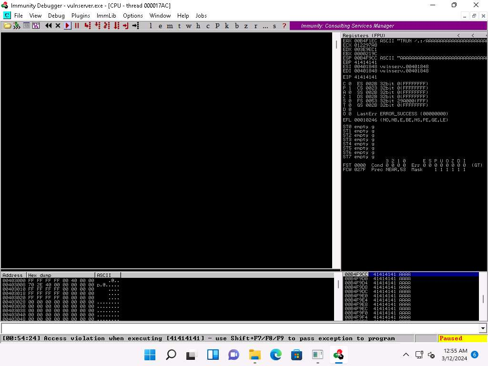

**Figure 1.9:** Executing the vulnerable `TRUN` function caused the application to pause within Immunity Debugger and overwrite critical processor registers, confirming the presence of a controllable buffer overflow vulnerability.

---

### Fuzzing Identified the Crash Point

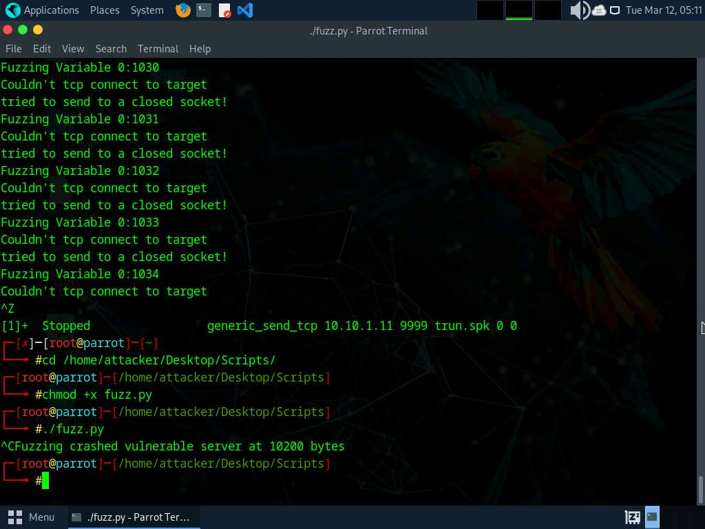

**Figure 1.10:** Fuzzing progressively increased the input size until the vulnerable application crashed, allowing the approximate buffer size required for exploitation to be identified.

---

### EIP Register Successfully Controlled

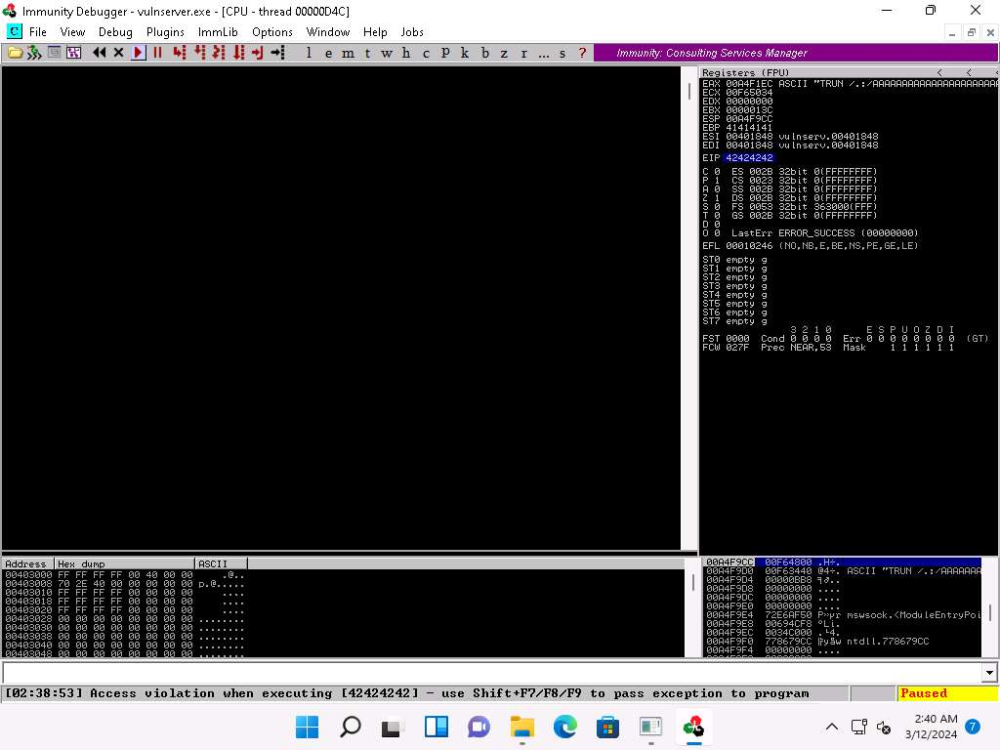

**Figure 1.11:** The EIP register was successfully overwritten with a controlled value, confirming that execution flow could be redirected to attacker-controlled shellcode.

---

### Bad Character Analysis

**Figure 1.12:** Examination of the injected payload confirmed the absence of problematic characters that could interfere with shellcode execution during exploitation.

---

### Vulnerable Module Identified Using Mona

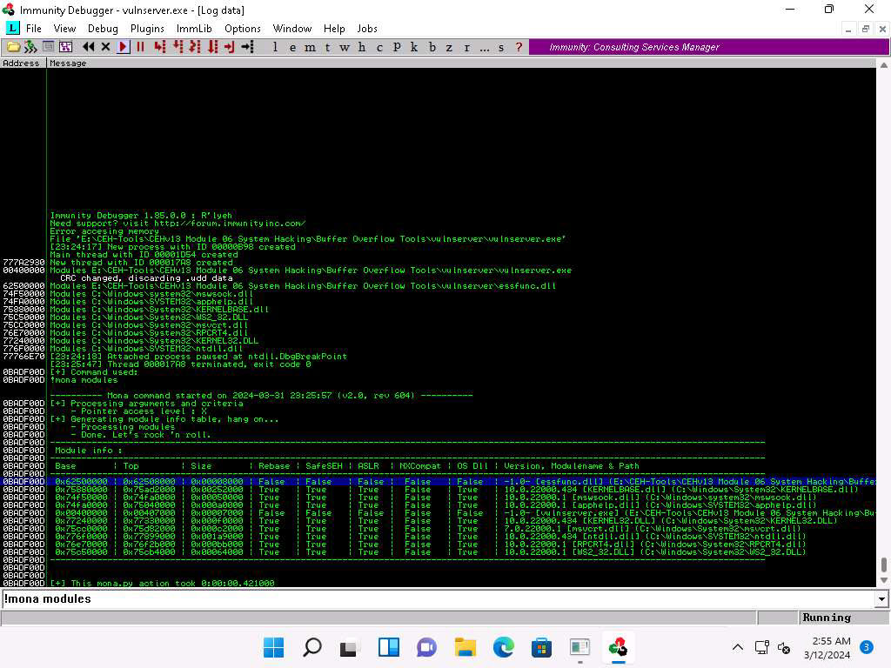

**Figure 1.13:** Mona identified a module without modern memory protection mechanisms, providing a suitable target for reliable exploitation.

---

### JMP ESP Return Address Identified

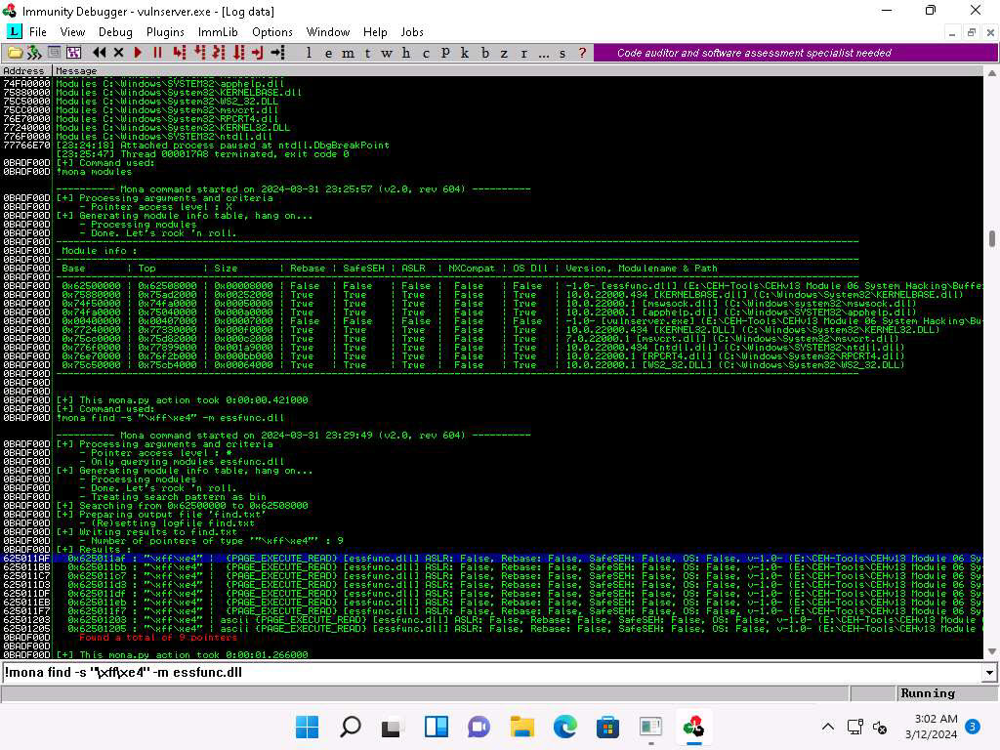

**Figure 1.14:** Mona located a valid `JMP ESP` instruction within the vulnerable module, enabling execution to be redirected toward the injected shellcode.

---

### Reverse Shell Successfully Established

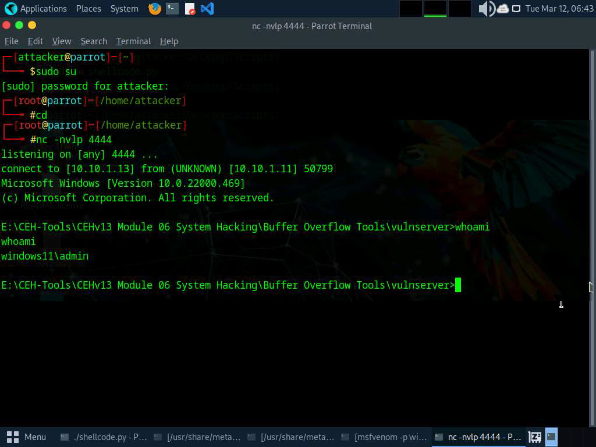

**Figure 1.15:** Successful execution of the exploit established a reverse shell connection, providing remote command execution on the compromised target system.

---

### Learning Outcome

This task demonstrated the complete methodology of buffer overflow exploitation, including vulnerability discovery, fuzzing, offset calculation, instruction pointer control, shellcode generation, and payload execution. It reinforced how insecure memory handling can lead to arbitrary code execution and highlighted the importance of modern exploit mitigation techniques such as DEP, ASLR, and secure software development practices.

---

### Attack Flow

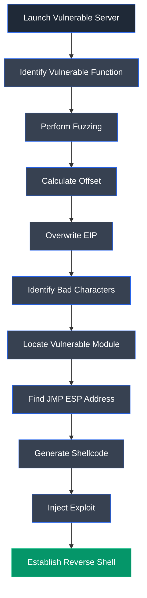
```mermaid
flowchart TD

    A[Launch Vulnerable Server]
    --> B[Identify Vulnerable Function]
    --> C[Perform Fuzzing]
    --> D[Calculate Offset]
    --> E[Overwrite EIP]
    --> F[Identify Bad Characters]
    --> G[Locate Vulnerable Module]
    --> H[Find JMP ESP Address]
    --> I[Generate Shellcode]
    --> J[Inject Exploit]
    --> K[Establish Reverse Shell]

    classDef start fill:#1f2937,color:#fff,stroke:#2563eb
    classDef process fill:#374151,color:#fff,stroke:#2563eb
    classDef exploit fill:#7c3aed,color:#fff,stroke:#8b5cf6
    classDef success fill:#059669,color:#fff,stroke:#10b981

    class A start
    class B,C,D,E,F,G,H,I,J process
    class K success
```

---