# Module 07: Malware Threats

> **Status:** ✅ Completed
>
> **Difficulty:** ⭐⭐⭐⭐☆
>
> **Labs Completed:** 4
>
> **Tools Covered:** njRAT, JPS Virus Maker, Hybrid Analysis, Detect It Easy (DIE), IDA, OllyDbg, TCPView, CurrPorts, Process Monitor

---

# Module Summary

This module explores the techniques used by attackers to develop, deploy, analyze, and monitor malware within target systems. It provides practical experience in creating Trojans and viruses, conducting static and dynamic malware analysis, and understanding malware behavior through system and network monitoring. The module also emphasizes defensive strategies for malware detection, analysis, and mitigation.

---

# Overview

Malware remains one of the most significant threats to modern information systems due to its ability to compromise confidentiality, integrity, and availability. Attackers continuously develop sophisticated malware capable of stealing sensitive information, establishing unauthorized remote access, disrupting system operations, and evading security controls.

This module introduces the practical aspects of malware operations by demonstrating how Trojans and viruses can compromise target systems, followed by techniques used by security professionals to analyze malicious software. Through both static and dynamic malware analysis, learners gain insight into malware functionality, behavior, communication patterns, and system impact, enabling a deeper understanding of modern malware threats and appropriate defensive measures.

---

# Learning Objectives

After completing this module, the learner will be able to:

- Understand the purpose, characteristics, and lifecycle of malware.
- Gain remote access to a target system using a Remote Access Trojan (RAT).
- Create and execute a simple virus for educational purposes within a controlled lab environment.
- Perform static malware analysis using online analysis platforms and executable inspection tools.
- Analyze executable files through malware disassembly techniques.
- Monitor malware network activity using network monitoring tools.
- Observe malware behavior through process monitoring and system activity analysis.
- Apply defensive strategies to detect, analyze, and mitigate malware threats.

---

# Key Concepts

- Malware Fundamentals
- Trojan Horse
- Remote Access Trojan (RAT)
- Computer Virus
- Malware Infection Lifecycle
- Malware Persistence
- Static Malware Analysis
- Dynamic Malware Analysis
- Malware Disassembly
- Behavioral Analysis
- Process Monitoring
- Network Connection Monitoring
- Malware Detection
- Indicators of Compromise (IoCs)
- Malware Mitigation Strategies

---

# Tools Used

- [njRAT](../../Tools/njRAT.md)
- [JPS Virus Maker](../../Tools/JPS-Virus-Maker.md)
- [Hybrid Analysis](../../Tools/Hybrid-Analysis.md)
- [Detect It Easy (DIE)](../../Tools/Detect-It-Easy.md)
- [IDA](../../Tools/IDA.md)
- [OllyDbg](../../Tools/OllyDbg.md)
- [TCPView](../../Tools/TCPView.md)
- [CurrPorts](../../Tools/CurrPorts.md)
- [Process Monitor](../../Tools/Process-Monitor.md)

---

# Labs Covered

| Lab | Description |
|------|-------------|
| Lab 1 | Gain access to the target system using Trojans |
| Lab 2 | Infect the target system using a Virus |
| Lab 3 | Perform Static Malware Analysis |
| Lab 4 | Perform Dynamic Malware Analysis |

---

# Lab 1: Gain Access to the Target System using Trojans

## Objective

Gain administrative control over a target system using a Remote Access Trojan (RAT) in a controlled lab environment. This lab demonstrates how attackers establish persistent remote access, manage compromised systems, and perform various post-exploitation activities through a Trojan.

## Background

Remote Access Trojans (RATs) are a category of malware designed to provide unauthorized remote control over compromised systems. Once executed on a victim machine, a RAT establishes communication with an attacker-controlled system, enabling activities such as file management, process manipulation, registry modification, command execution, screen monitoring, webcam access, keylogging, and remote administration.

In this lab, the **njRAT** Remote Access Trojan is used to simulate a real-world malware attack. The attacker creates a malicious executable, delivers it to the victim machine, and establishes a persistent connection after execution. Through this connection, the attacker gains complete remote control over the victim system and performs several administrative and surveillance activities to demonstrate the capabilities of modern RAT-based malware.

The practical is performed within an isolated lab environment using a Windows 11 machine as the attacker system and a Windows Server 2022 machine as the victim system. The exercise highlights both the offensive techniques employed by attackers and the importance of implementing effective malware detection, endpoint protection, and user awareness to defend against Trojan-based attacks.

---

## Task 1: Gain Control over a Victim Machine using the njRAT RAT Trojan

### Tools Used

- [njRAT](../../Tools/njRAT.md)

---

### Activity Performed

A Remote Access Trojan (RAT) was created using **njRAT** by configuring the attacker's host information and generating a malicious executable payload. The payload was transferred to the victim system and executed, establishing a persistent connection between the attacker and the compromised machine.

Once the connection was established, the attacker remotely interacted with the victim system through the njRAT command-and-control interface. Various post-exploitation activities, including remote command execution and desktop monitoring, were performed to demonstrate the capabilities of a Remote Access Trojan. The exercise also demonstrated the persistence mechanism of the malware by automatically reconnecting to the attacker after the victim system restarted.

---

### Observations

- Successfully generated a Trojan payload using njRAT.
- Established a remote connection with the victim machine.
- Executed commands remotely through the Remote Shell.
- Accessed the victim's desktop remotely.
- Observed persistent reconnection after the victim system restarted.

---

### njRAT Builder Configuration

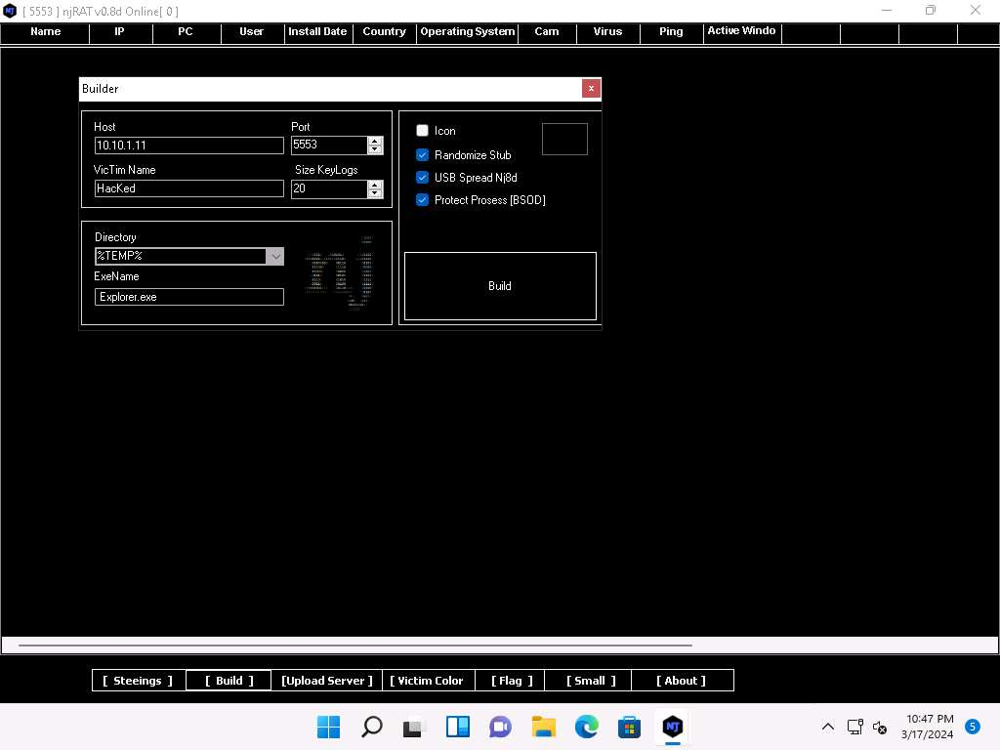

**Figure 1.1:** The njRAT builder was configured with the attacker's host information and payload options before generating the Trojan executable.

---

### Victim Connection Established

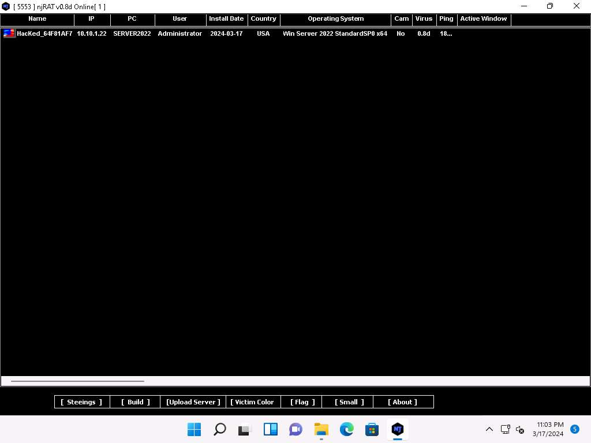

**Figure 1.2:** The victim system successfully connected to the njRAT command-and-control interface after executing the malicious payload.

---

### Remote Shell Access

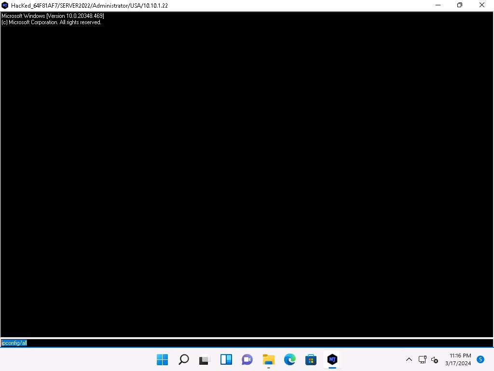

**Figure 1.3:** The Remote Shell feature allowed commands to be executed on the compromised system, demonstrating remote administrative access.

---

### Remote Desktop Monitoring

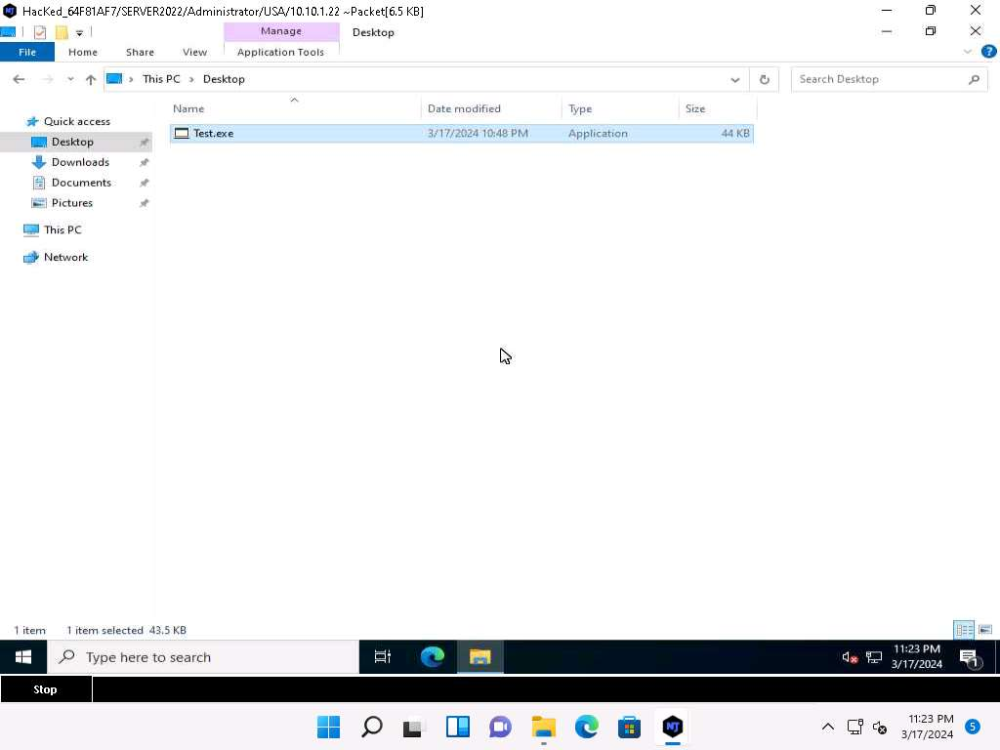

**Figure 1.4:** The Remote Desktop feature enabled live monitoring and interaction with the victim's desktop without physical access.

---

### Persistent Connection

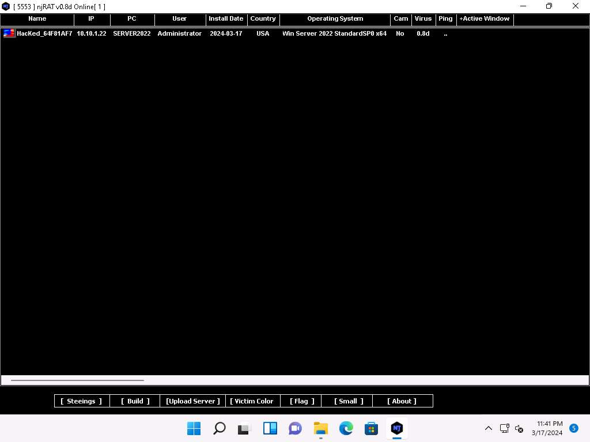

**Figure 1.5:** The Trojan automatically re-established communication with the attacker after the victim system restarted, demonstrating persistence.

---

### Learning Outcome

This task demonstrated how a Remote Access Trojan can be deployed to establish persistent remote control over a target system, enabling attackers to execute commands, monitor user activity, and maintain long-term unauthorized access.

---

### Attack Flow

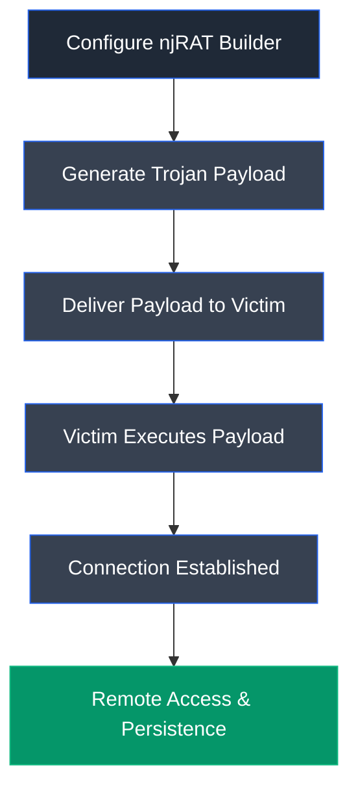
```mermaid
flowchart TD

    A[Configure njRAT Builder]
    --> B[Generate Trojan Payload]
    --> C[Deliver Payload to Victim]
    --> D[Victim Executes Payload]
    --> E[Connection Established]
    --> F[Remote Access & Persistence]

    classDef start fill:#1f2937,color:#fff,stroke:#2563eb
    classDef process fill:#374151,color:#fff,stroke:#2563eb
    classDef decision fill:#7c3aed,color:#fff,stroke:#8b5cf6
    classDef success fill:#059669,color:#fff,stroke:#10b981

    class A start
    class B,C,D,E process
    class F success
```

---

## Overall Learning Outcome

This lab demonstrated how a Remote Access Trojan (RAT) can be created, deployed, and used to compromise a target system within a controlled environment. By establishing a persistent connection with the victim machine, it showcased how attackers can remotely execute commands, monitor user activity, and maintain unauthorized access. The exercise also reinforced the importance of endpoint protection, secure user practices, and effective malware detection mechanisms in preventing Trojan-based attacks.

---

# Lab 2: Infect the Target System using a Virus

## Objective

Create a customized virus using the JPS Virus Maker tool and execute it on a target system to observe its impact on system configuration, security settings, and user accessibility within a controlled lab environment.

---

## Background

A computer virus is a type of malware that attaches itself to legitimate files or programs and executes malicious actions when triggered. Viruses can modify system configurations, disable security mechanisms, alter user credentials, and disrupt normal system operations. Attackers often distribute viruses through phishing emails, malicious downloads, removable media, or network shares to compromise target systems.

In this lab, the **JPS Virus Maker** tool is used to create a customized virus by selecting predefined malicious actions. The generated executable is delivered to a victim machine, where its execution demonstrates how malware can manipulate operating system settings, disable administrative functions, modify authentication credentials, and affect the overall usability of the compromised system. The exercise highlights the importance of endpoint security, malware detection, and user awareness in defending against virus-based attacks.

---

## Task 1: Create a Virus using the JPS Virus Maker Tool and Infect the Target System

### Tools Used

- [JPS Virus Maker](../../Tools/JPS-Virus-Maker.md)

---

### Activity Performed

A custom virus was created using the **JPS Virus Maker** tool by configuring various malicious options, including disabling administrative utilities, modifying system settings, enabling persistence, and changing the Windows account password. The generated malicious executable was then delivered to the target machine through a shared network location and executed to simulate a real-world malware infection.

After execution, the virus successfully compromised the victim system by altering system behavior, disabling security-related features, and modifying authentication settings. The infection demonstrated how malicious software can manipulate operating system configurations, restrict user access to administrative functions, and affect the normal operation of a compromised host. Finally, the infected machine was restored to its original state by reverting the lab environment.

---

### Observations

- Successfully created a custom virus using JPS Virus Maker.
- Generated a malicious executable (`Server.exe`).
- Successfully infected the victim machine.
- The virus modified the Windows account password.
- Administrative features such as Task Manager were disabled.
- System behavior was altered, demonstrating the impact of malware infection.

---

### JPS Virus Configuration

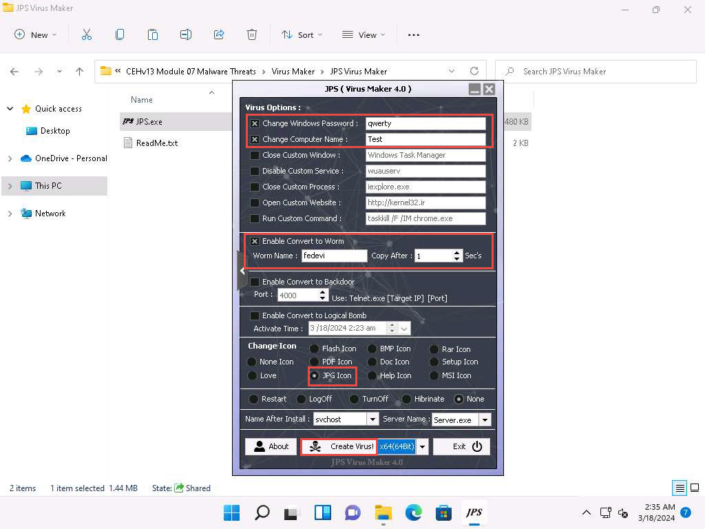

**Figure 2.1:** The JPS Virus Maker tool was configured with multiple malicious options before generating the virus executable.

---

### Virus Successfully Created

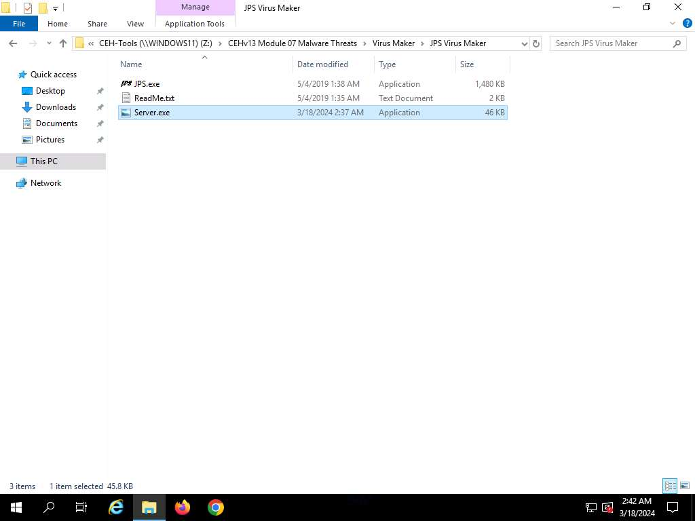

**Figure 2.2:** The customized virus was successfully generated as `Server.exe` and made ready for deployment.

---

### Successful Virus Infection

**Figure 2.3:** The victim system exhibited abnormal behavior after executing the malicious file, indicating a successful virus infection.

---

### Password Modification Detected

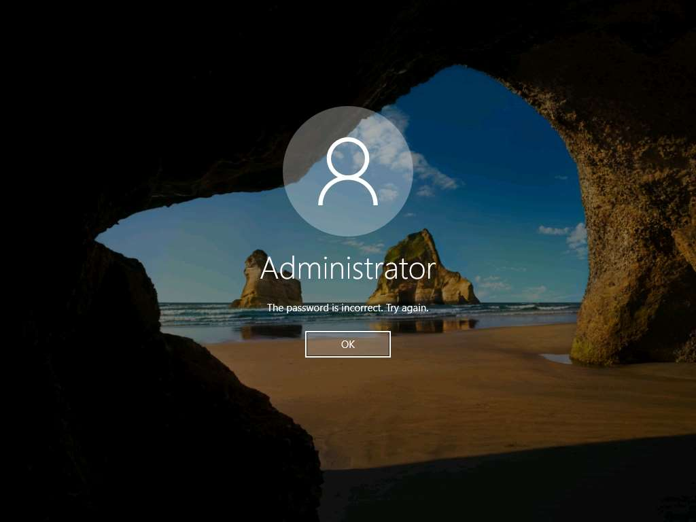

**Figure 2.4:** The original Windows credentials were rejected, demonstrating that the virus successfully modified the system password.

---

### Task Manager Disabled

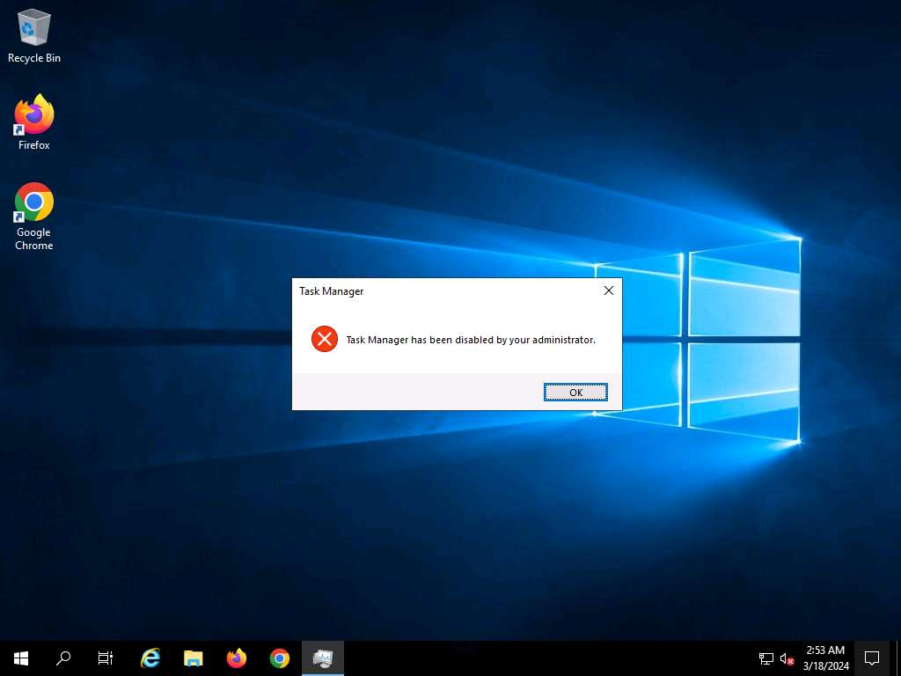

**Figure 2.5:** Administrative functionality was restricted after infection, preventing Task Manager from being opened.

---

### Learning Outcome

This task demonstrated how a customized virus can be created and deployed to compromise a target system by modifying operating system settings, disabling security features, and restricting administrative access, highlighting the importance of effective endpoint protection and malware prevention mechanisms.

---

### Attack Flow

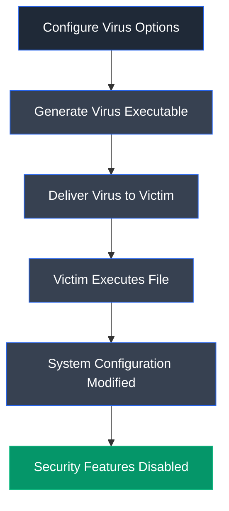
```mermaid
flowchart TD

    A[Configure Virus Options]
    --> B[Generate Virus Executable]
    --> C[Deliver Virus to Victim]
    --> D[Victim Executes File]
    --> E[System Configuration Modified]
    --> F[Security Features Disabled]

    classDef start fill:#1f2937,color:#fff,stroke:#2563eb
    classDef process fill:#374151,color:#fff,stroke:#2563eb
    classDef decision fill:#7c3aed,color:#fff,stroke:#8b5cf6
    classDef success fill:#059669,color:#fff,stroke:#10b981

    class A start
    class B,C,D,E process
    class F success
```

---

## Overall Learning Outcome

This lab demonstrated how a customized virus can be created and deployed to compromise a target system within a controlled environment. The practical illustrated how malware can alter system configurations, modify user credentials, disable administrative features, and disrupt normal system functionality. It also reinforced the importance of endpoint security, malware detection, secure user practices, and timely system recovery in defending against virus-based attacks.

---

# Lab 3: Perform Static Malware Analysis

## Objective

Perform static malware analysis using multiple analysis tools to examine suspicious files without executing them. This lab demonstrates how malware can be analyzed through online scanning services, executable inspection, and binary disassembly to identify its characteristics, functionality, and potential threats.

---

## Background

Static malware analysis is the process of examining malicious files without executing them on a system. Unlike dynamic analysis, it focuses on inspecting the file's structure, metadata, signatures, hashes, imported functions, executable format, and assembly instructions to understand its behavior safely. This approach enables security professionals to identify malware characteristics, determine its origin, detect packing or obfuscation techniques, and assess its potential impact without risking system compromise.

In this lab, multiple static analysis techniques are demonstrated using online malware scanning services, executable identification tools, and disassemblers. These techniques provide valuable insight into malware characteristics, executable structure, imported functions, and program logic, helping analysts understand malicious software before execution.

---

## Task 1: Perform Malware Scanning using Hybrid Analysis

### Tools Used

- [Hybrid Analysis](../../Tools/Hybrid-Analysis.md)

### Activity Performed

A suspicious executable was uploaded to the **Hybrid Analysis** online malware analysis platform to perform static malware scanning. The service analyzed the file using multiple security engines and generated a comprehensive report containing the threat score, malware classification, file hashes, and antivirus detection results. The analysis provided valuable insight into the malicious nature of the sample without executing it on a local system.

### Observations

- Successfully uploaded the malware sample for analysis.
- Generated a public malware analysis report.
- The sample was identified as malicious with a high threat score.
- Multiple antivirus engines detected the malware.

### Hybrid Analysis Report

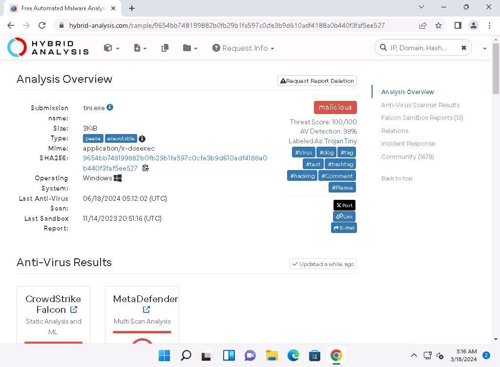

**Figure 3.1:** Hybrid Analysis generated a detailed malware report showing the threat score and analysis summary.

---

### Antivirus Detection Results

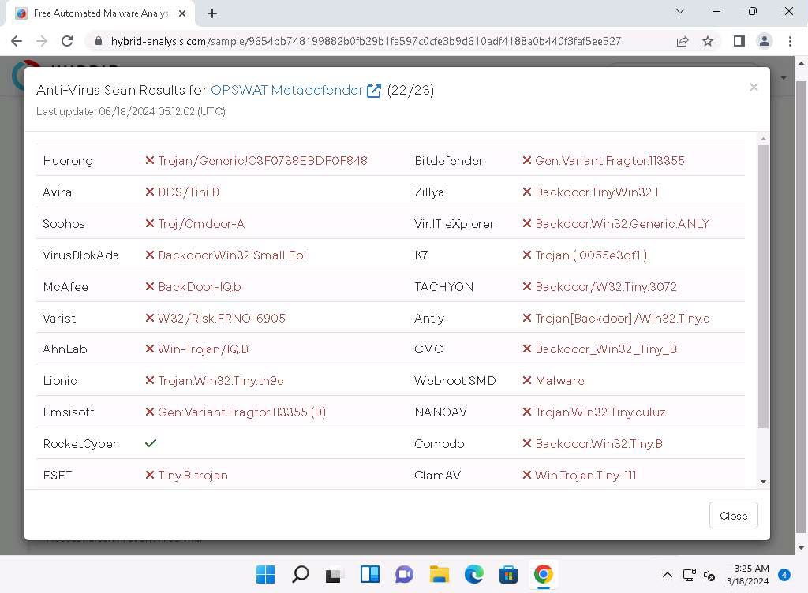

**Figure 3.2:** Multiple antivirus engines identified the uploaded file as malicious.

### Learning Outcome

This task demonstrated how online malware analysis platforms can safely identify malicious files, assess their threat level, and provide valuable intelligence without executing the malware on a production system.

### Attack Flow

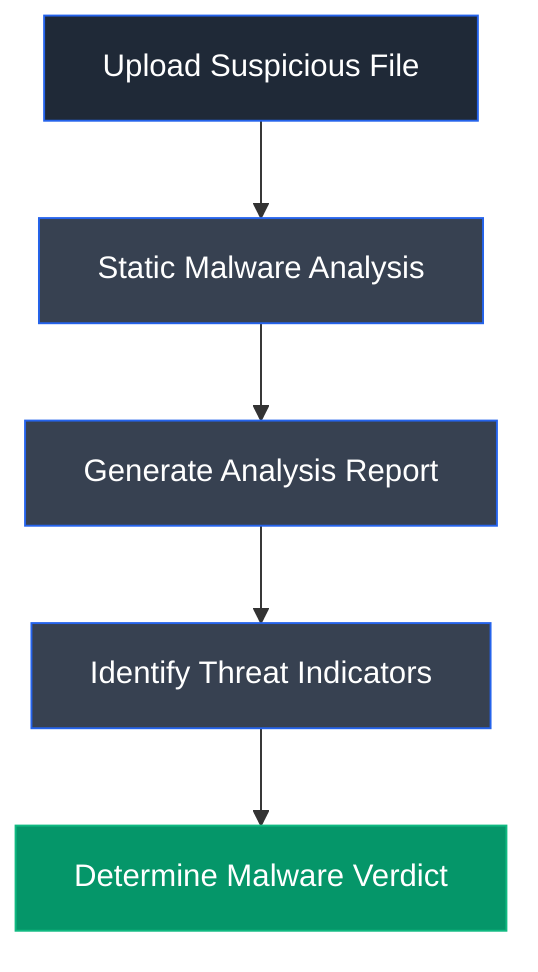
```mermaid
flowchart TD

    A[Upload Suspicious File]
    --> B[Static Malware Analysis]
    --> C[Generate Analysis Report]
    --> D[Identify Threat Indicators]
    --> E[Determine Malware Verdict]

    classDef start fill:#1f2937,color:#fff,stroke:#2563eb
    classDef process fill:#374151,color:#fff,stroke:#2563eb
    classDef decision fill:#7c3aed,color:#fff,stroke:#8b5cf6
    classDef success fill:#059669,color:#fff,stroke:#10b981

    class A start
    class B,C,D process
    class E success
```

---

## Task 2: Analyze ELF Executable File using Detect It Easy (DIE)

### Tools Used

- [Detect It Easy (DIE)](../../Tools/Detect-It-Easy.md)

---

### Activity Performed

The **Detect It Easy (DIE)** tool was used to perform static analysis of an ELF executable without executing the file. The analysis identified executable characteristics such as the operating system, compiler, programming language, hashes, entropy, entry point, and other metadata, enabling a better understanding of the binary's structure and origin.

---

### Observations

- Successfully analyzed the ELF executable.
- Identified executable characteristics and compiler information.
- Retrieved metadata including hashes and entry point.
- Performed static inspection without executing the file.

---

### DIE File Analysis

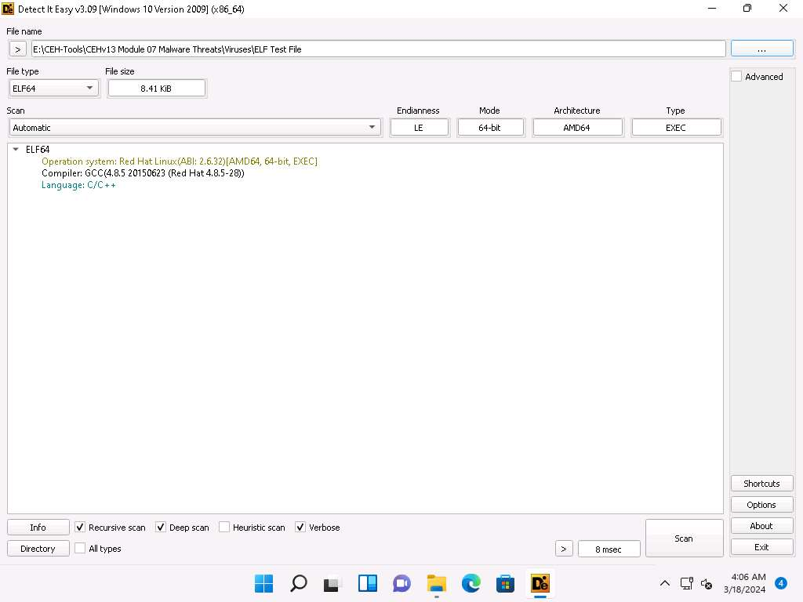

**Figure 3.3:** Detect It Easy identified the executable format, operating system, compiler, and programming language.

---

### DIE File Information

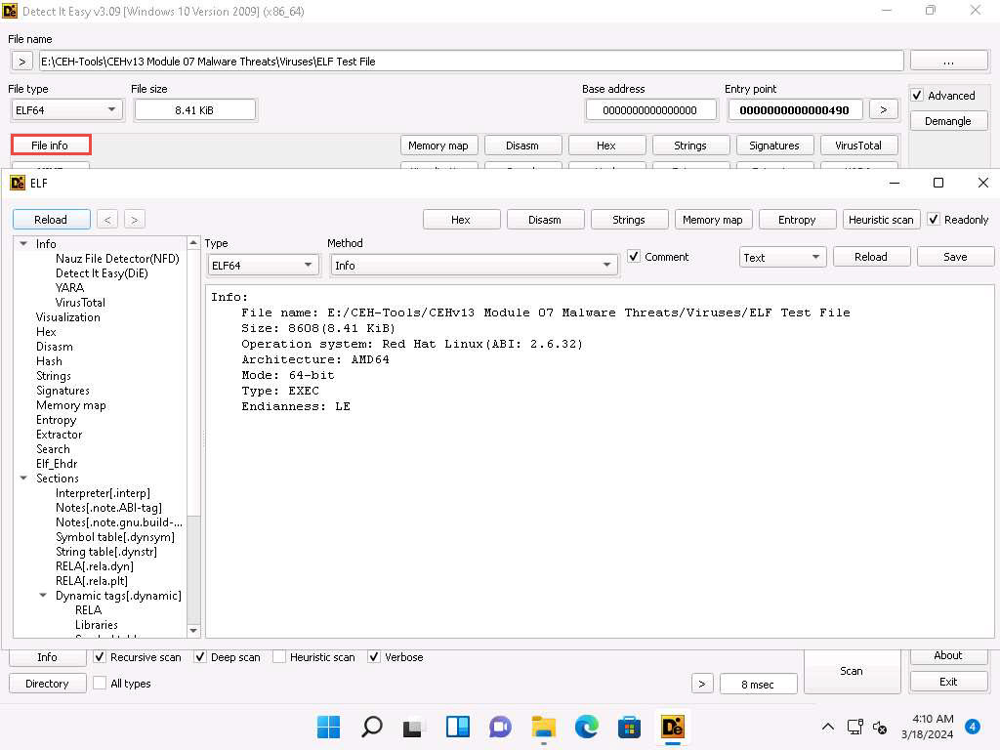

**Figure 3.4:** File metadata including hashes, entropy, entry point, and other executable information was examined.

---

### Learning Outcome

This task demonstrated how executable files can be statically analyzed to identify important characteristics and metadata without running the malware.

---

### Attack Flow

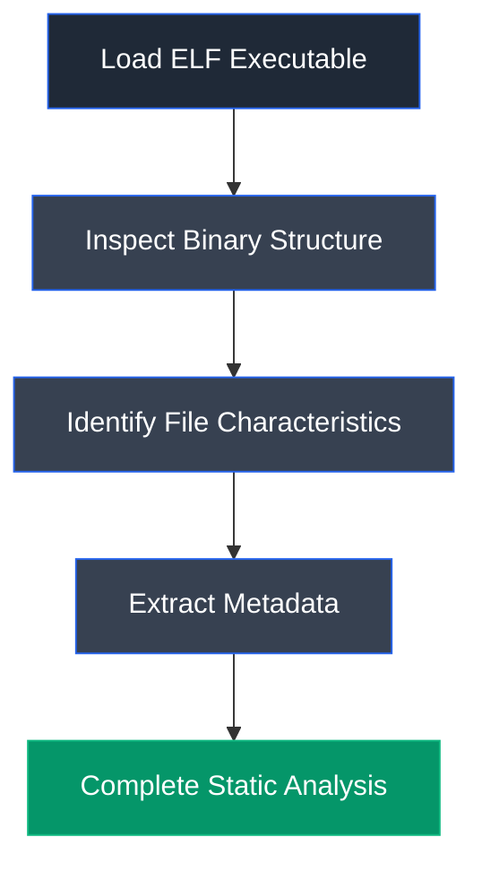
```mermaid
flowchart TD

    A[Load ELF Executable]
    --> B[Inspect Binary Structure]
    --> C[Identify File Characteristics]
    --> D[Extract Metadata]
    --> E[Complete Static Analysis]

    classDef start fill:#1f2937,color:#fff,stroke:#2563eb
    classDef process fill:#374151,color:#fff,stroke:#2563eb
    classDef decision fill:#7c3aed,color:#fff,stroke:#8b5cf6
    classDef success fill:#059669,color:#fff,stroke:#10b981

    class A start
    class B,C,D process
    class E success
```

---

## Task 3: Perform Malware Disassembly using IDA and OllyDbg

### Tools Used

- [IDA](../../Tools/IDA.md)
- [OllyDbg](../../Tools/OllyDbg.md)

---

### Activity Performed

Static malware disassembly was performed using **IDA** and **OllyDbg** to inspect the internal structure of executable files. IDA was used to analyze assembly instructions, visualize the program control flow, and examine executable components. OllyDbg complemented the analysis by loading the executable into a debugging environment, allowing inspection of the CPU state and memory mappings without executing the malware in a normal operating environment.

---

### Observations

- Successfully disassembled the executable using IDA.
- Examined the program control flow.
- Loaded the executable into OllyDbg.
- Inspected CPU analysis and memory mappings.

### IDA Disassembly View

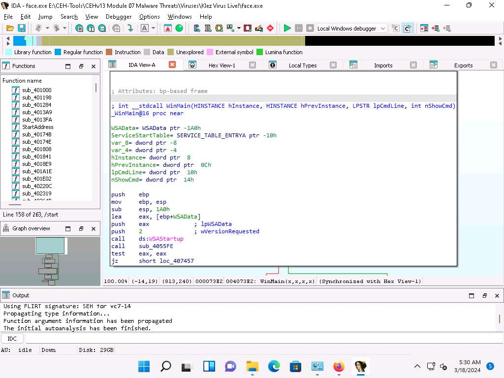

**Figure 3.5:** IDA disassembled the executable and displayed its assembly instructions for static analysis.

---

### IDA Flow Graph

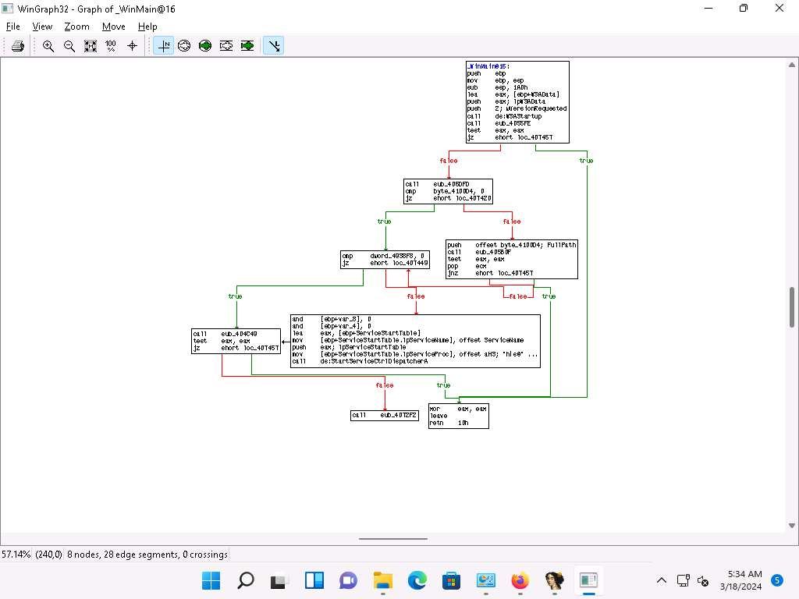

**Figure 3.6:** The flow graph visualized the control flow between different execution blocks within the malware.

---

### OllyDbg CPU Analysis

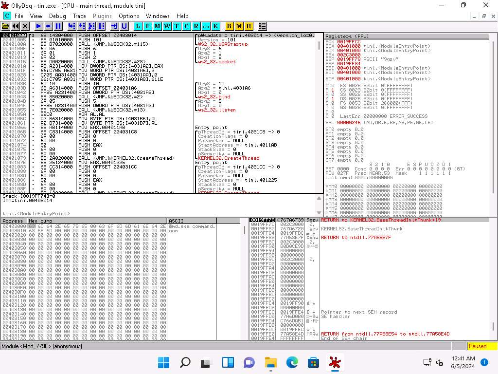

**Figure 3.7:** OllyDbg loaded the executable and displayed the processor instructions for debugging and analysis.

---

### OllyDbg Memory Analysis

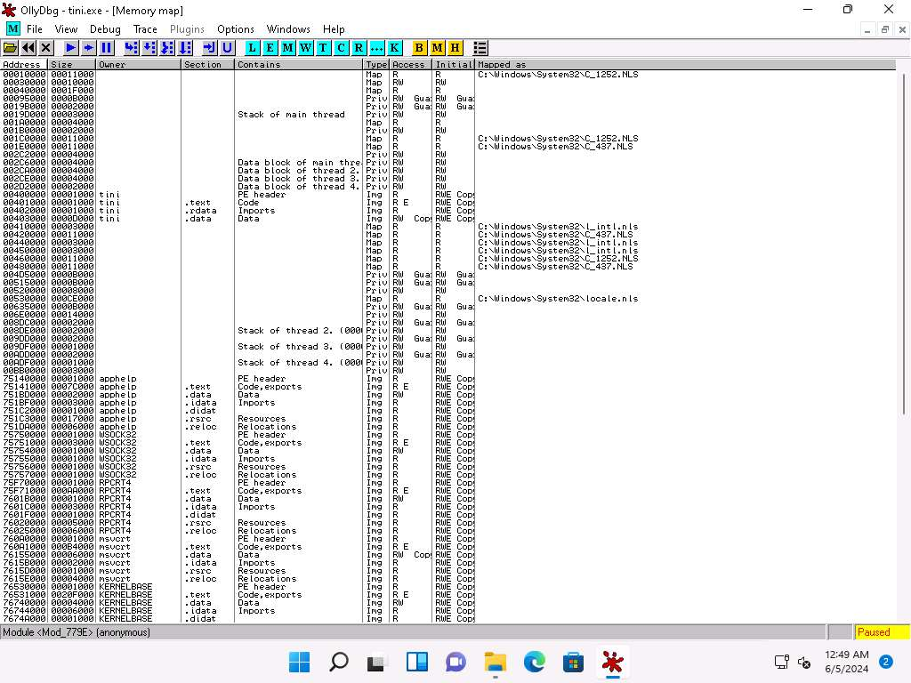

**Figure 3.8:** The memory map displayed the executable's memory regions during static inspection.

---

### Learning Outcome

This task demonstrated how disassemblers and debuggers can be used to inspect executable files, understand program logic, and analyze malware behavior through static reverse engineering techniques.

---

### Attack Flow

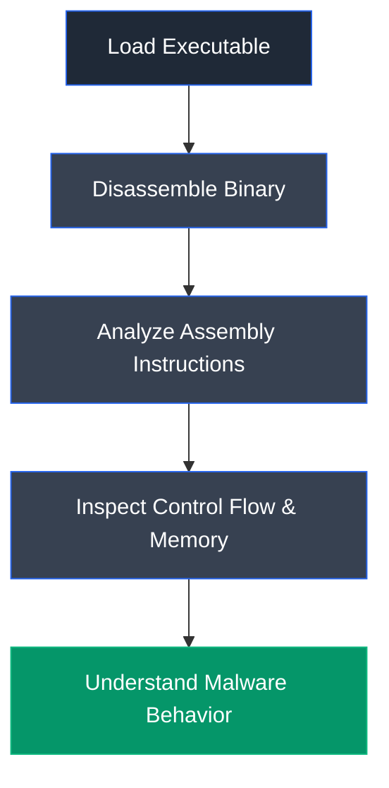
```mermaid
flowchart TD

    A[Load Executable]
    --> B[Disassemble Binary]
    --> C[Analyze Assembly Instructions]
    --> D[Inspect Control Flow & Memory]
    --> E[Understand Malware Behavior]

    classDef start fill:#1f2937,color:#fff,stroke:#2563eb
    classDef process fill:#374151,color:#fff,stroke:#2563eb
    classDef decision fill:#7c3aed,color:#fff,stroke:#8b5cf6
    classDef success fill:#059669,color:#fff,stroke:#10b981

    class A start
    class B,C,D process
    class E success
```

---

## Overall Learning Outcome

This lab demonstrated various static malware analysis techniques for safely examining malicious files without executing them. By using online malware scanning services, executable identification tools, and disassembly utilities, it highlighted how analysts can identify malware characteristics, inspect executable structures, analyze program logic, and assess potential threats while minimizing the risk of system compromise.

---

# Lab 4: Perform Dynamic Malware Analysis

## Objective

Perform dynamic malware analysis by monitoring network ports and running processes to identify malicious activity on a compromised system. This lab demonstrates how malware establishes communication channels and how system monitoring tools can be used to detect and investigate suspicious processes.

---

## Background

Dynamic malware analysis involves observing the behavior of malicious software while it is executing in a controlled environment. Unlike static analysis, which inspects files without execution, dynamic analysis focuses on runtime activities such as network communications, process creation, file system interactions, registry modifications, and memory usage. These observations help security professionals understand malware behavior, identify indicators of compromise (IoCs), and develop effective detection and mitigation strategies.

In this lab, a Remote Access Trojan (njRAT) is executed on a victim machine to simulate a real-world compromise. Dynamic analysis tools are then used to monitor the malware's network connections and process activities, providing insight into how malicious software interacts with the operating system during execution.

---

## Task 1: Perform Port Monitoring using TCPView and CurrPorts

### Tools Used

- [TCPView](../../Tools/TCPView.md)
- [CurrPorts](../../Tools/CurrPorts.md)

---

### Activity Performed

A compromised Windows Server 2022 machine running a Remote Access Trojan (njRAT) was analyzed using **TCPView** and **CurrPorts**. These tools were used to monitor active TCP connections, identify suspicious network communication, examine the remote endpoint associated with the malware, and inspect the properties of the malicious process. This demonstrated how port monitoring tools can be used to detect malware communicating with remote command-and-control (C2) servers.

---

### Observations

- Successfully identified the Trojan process through TCPView.
- Observed the active TCP connection established by the malware.
- Identified the remote IP address and communication port.
- Examined detailed process information using CurrPorts.

---

### TCPView Trojan Connection

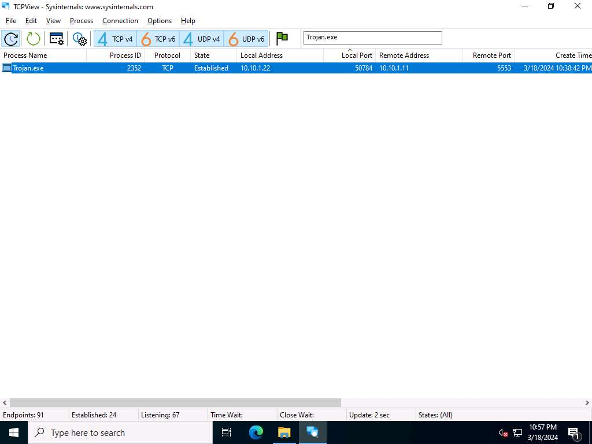

**Figure 4.1:** TCPView identified the active TCP connection established by the Trojan process, including its local and remote communication endpoints.

---

### CurrPorts Trojan Connection

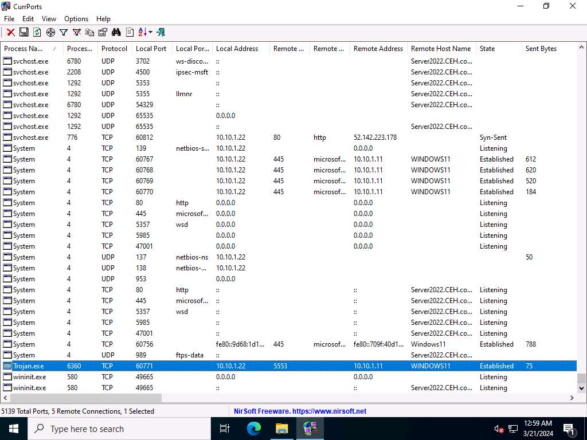

**Figure 4.2:** CurrPorts displayed the active network connection created by the malicious process along with the associated process information.

---

### CurrPorts Process Properties

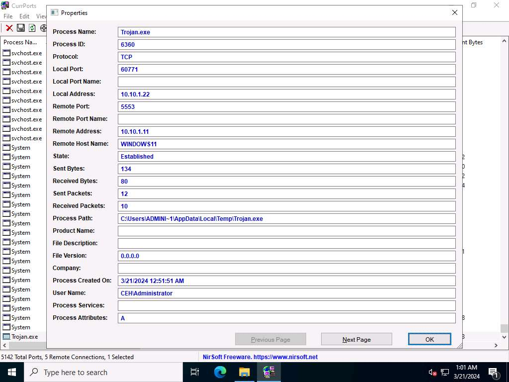

**Figure 4.3:** The process properties provided detailed information about the Trojan executable, including its location, process details, and remote connection information.

---

### Learning Outcome

This task demonstrated how network monitoring tools can be used to identify suspicious TCP connections, investigate malicious processes, and analyze malware communication with remote systems.

---

### Attack Flow

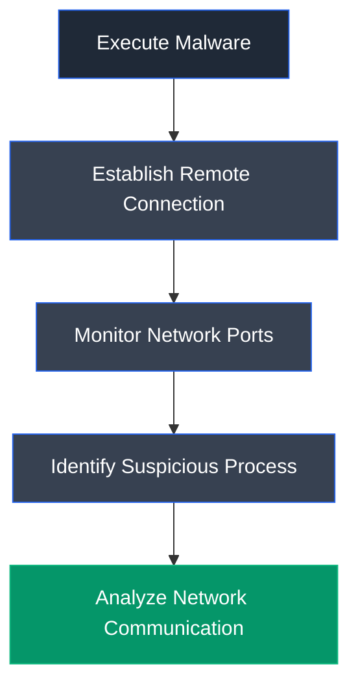
```mermaid
flowchart TD

    A[Execute Malware]
    --> B[Establish Remote Connection]
    --> C[Monitor Network Ports]
    --> D[Identify Suspicious Process]
    --> E[Analyze Network Communication]

    classDef start fill:#1f2937,color:#fff,stroke:#2563eb
    classDef process fill:#374151,color:#fff,stroke:#2563eb
    classDef decision fill:#7c3aed,color:#fff,stroke:#8b5cf6
    classDef success fill:#059669,color:#fff,stroke:#10b981

    class A start
    class B,C,D process
    class E success
```

---

## Task 2: Perform Process Monitoring using Process Monitor

### Tools Used

- [Process Monitor](../../Tools/Process-Monitor.md)

---

### Activity Performed

The **Process Monitor** utility was used to observe the runtime behavior of the Trojan process on the victim machine. The tool monitored process creation, file system activity, registry interactions, and execution details in real time. Additional analysis of the process properties, execution details, and loaded modules provided insight into how malware interacts with the operating system during execution.

---

### Observations

- Successfully located the Trojan process.
- Examined detailed event information generated by the malware.
- Inspected process properties and execution details.
- Viewed stack information and loaded modules associated with the malicious process.

---

### Trojan Process Activity

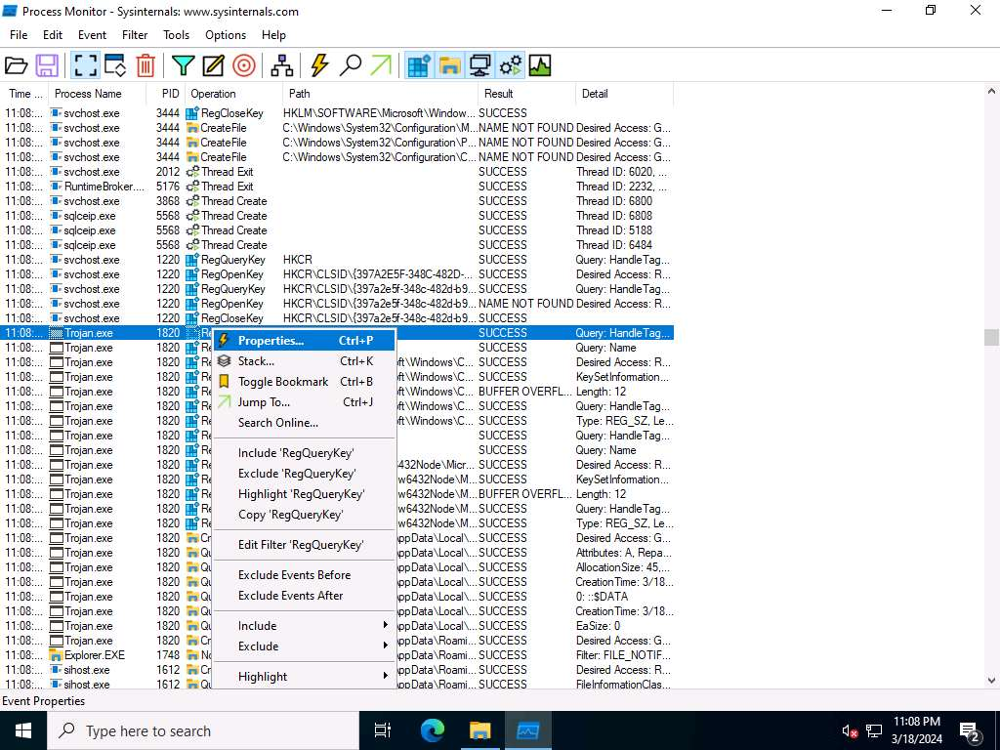

**Figure 4.4:** Process Monitor detected the running Trojan process and displayed its real-time activity.

---

### Event Properties

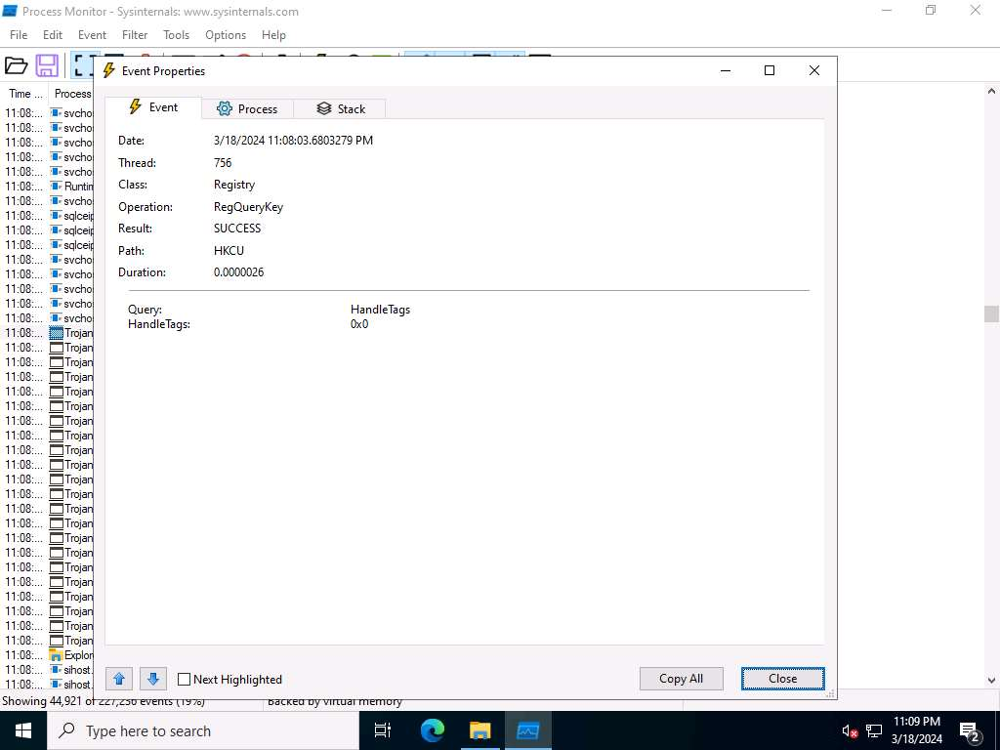

**Figure 4.5:** The Event tab displayed detailed information about the selected process activity, including the operation, result, and execution path.

---

### Process Properties

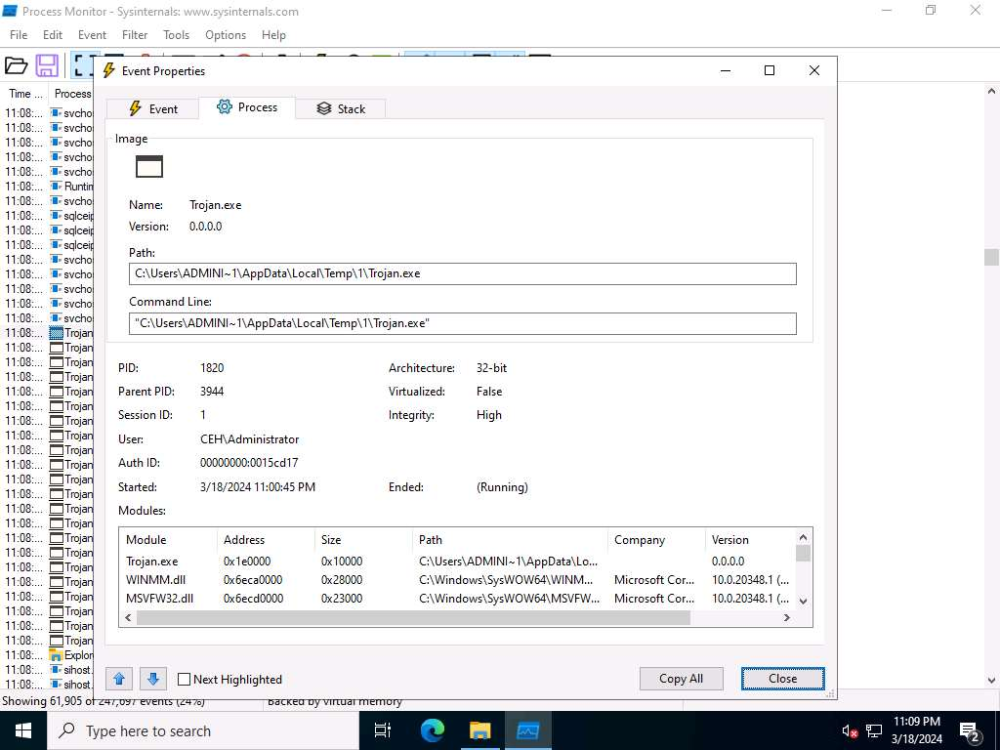

**Figure 4.6:** The Process tab provided additional information about the running Trojan process and its execution context.

---

### Stack Information

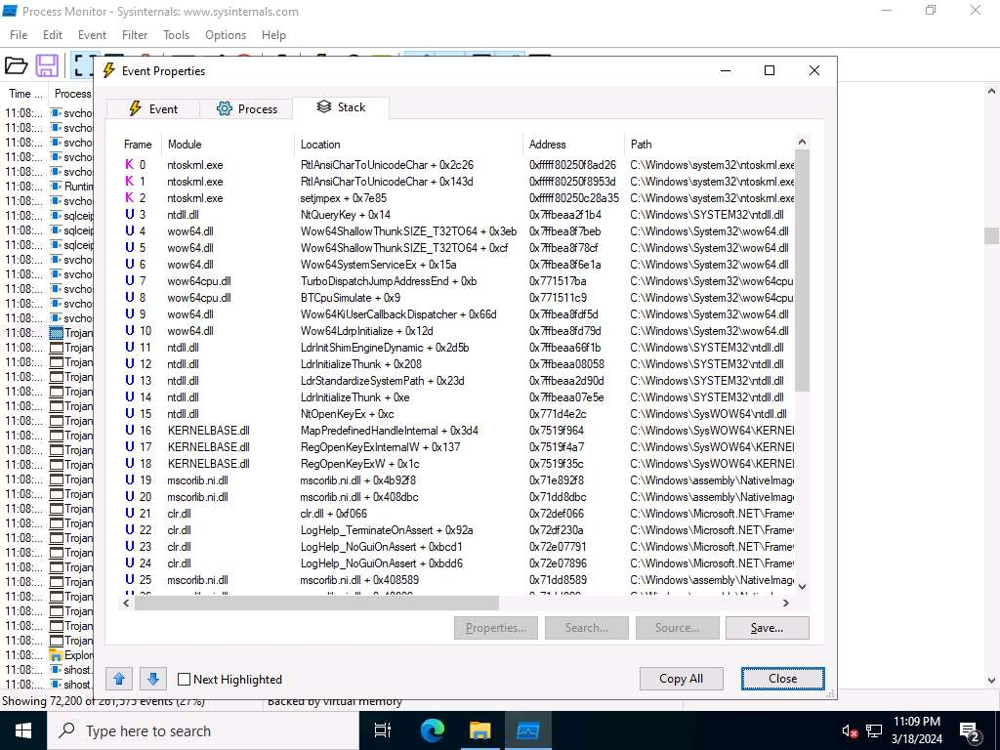

**Figure 4.7:** The Stack tab displayed the execution stack and loaded modules associated with the selected process.

---

### Learning Outcome

This task demonstrated how process monitoring tools can be used to observe malware behavior in real time, investigate process execution details, and identify suspicious runtime activities.

---

### Attack Flow

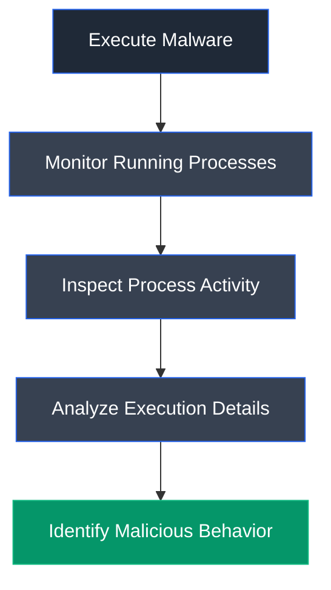
```mermaid
flowchart TD

    A[Execute Malware]
    --> B[Monitor Running Processes]
    --> C[Inspect Process Activity]
    --> D[Analyze Execution Details]
    --> E[Identify Malicious Behavior]

    classDef start fill:#1f2937,color:#fff,stroke:#2563eb
    classDef process fill:#374151,color:#fff,stroke:#2563eb
    classDef decision fill:#7c3aed,color:#fff,stroke:#8b5cf6
    classDef success fill:#059669,color:#fff,stroke:#10b981

    class A start
    class B,C,D process
    class E success
```

---

## Overall Learning Outcome

This lab demonstrated how dynamic malware analysis techniques can be used to investigate malicious software while it is actively executing. By monitoring network communications and runtime process activity, it highlighted how security analysts can detect suspicious behavior, identify malware communication channels, inspect process execution, and collect valuable indicators of compromise for incident response and malware investigation.

---

# Key Takeaways

- Understood the fundamentals of malware, including Trojans, viruses, and their impact on target systems.
- Created and deployed a Remote Access Trojan (njRAT) to establish persistent remote access to a victim machine.
- Developed a custom virus using JPS Virus Maker and observed its effects on system configuration and security settings.
- Performed static malware analysis using Hybrid Analysis, Detect It Easy (DIE), IDA, and OllyDbg to examine malware characteristics without execution.
- Analyzed executable metadata, binary structures, assembly instructions, and control flow during reverse engineering.
- Performed dynamic malware analysis using TCPView, CurrPorts, and Process Monitor to monitor malicious network communications and runtime process activity.
- Identified Indicators of Compromise (IoCs) through network connections, process behavior, executable metadata, and malware analysis reports.
- Reinforced the importance of combining static and dynamic analysis techniques to accurately assess malware functionality and behavior.
- Strengthened practical understanding of malware analysis methodologies while recognizing the defensive controls required to detect and mitigate malware threats.

---

# Defensive Perspective

The techniques demonstrated throughout this module emphasize the importance of implementing layered endpoint security controls to defend against modern malware threats. Organizations should deploy updated antivirus and endpoint detection and response (EDR) solutions, restrict the execution of untrusted applications, enforce application whitelisting, monitor network communications for suspicious outbound connections, and regularly inspect running processes for malicious activity. Security teams should also perform static and dynamic malware analysis within isolated environments, maintain timely patch management, educate users about phishing and malicious attachments, and continuously monitor systems for Indicators of Compromise (IoCs) to rapidly detect, contain, and remediate malware infections.

---

# Interview Questions

1. What is malware, and how does it differ from legitimate software?
2. What is the difference between a Trojan and a virus?
3. Explain the difference between static and dynamic malware analysis.
4. What information can be obtained through Hybrid Analysis?
5. What types of executable characteristics can Detect It Easy (DIE) identify?
6. How does IDA assist during malware reverse engineering?
7. What is the purpose of OllyDbg during malware analysis?
8. How can TCPView and CurrPorts help identify malicious network activity?
9. What information can Process Monitor provide during malware investigations?
10. What are Indicators of Compromise (IoCs), and why are they important during incident response?
11. Why should malware analysis always be performed in an isolated laboratory environment?
12. How can organizations defend against Trojan and virus infections?

---

# My Reflection

This module provided practical experience in both offensive and defensive aspects of malware analysis. By creating and deploying Trojans and viruses, followed by performing static and dynamic analysis using industry-standard tools, I gained a deeper understanding of how malicious software behaves throughout its lifecycle. The exercises also reinforced the importance of identifying Indicators of Compromise (IoCs), analyzing malware safely within isolated environments, and implementing layered security controls to effectively detect, investigate, and mitigate malware threats.

---