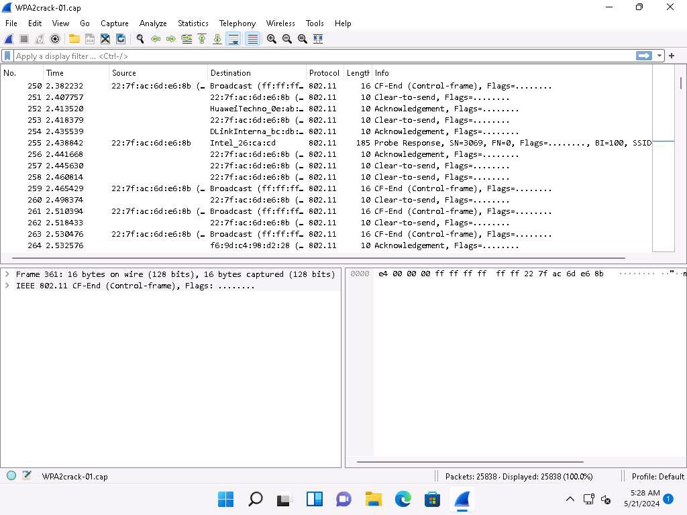
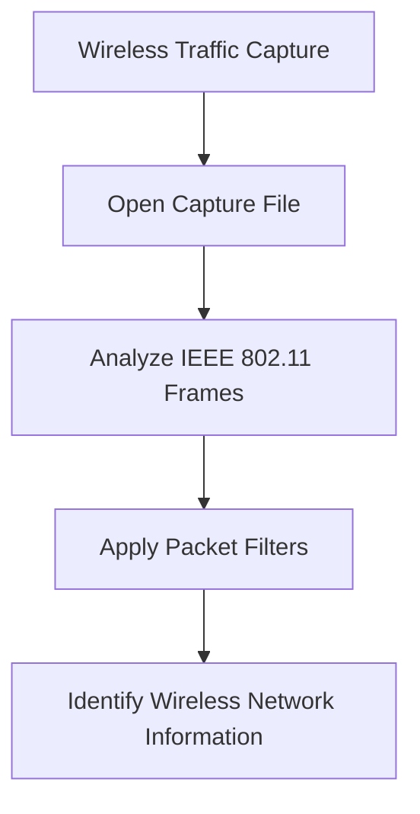
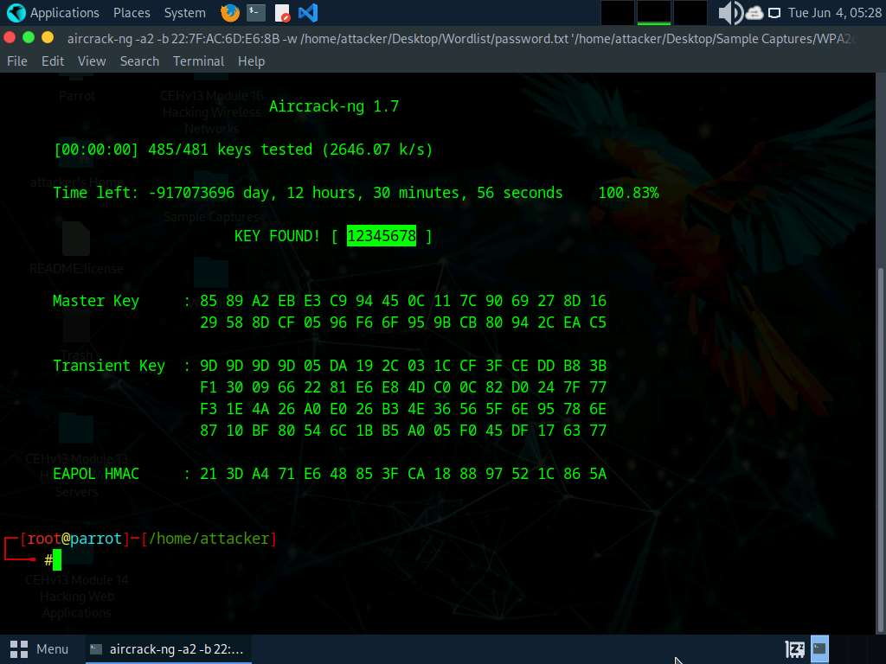
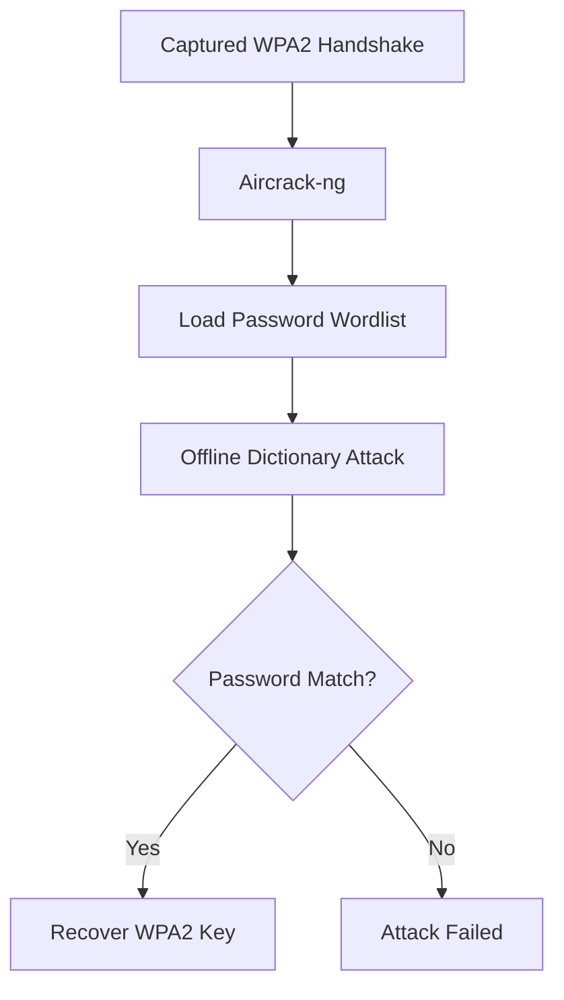

# Module 16: Hacking Wireless Networks

> **Status:** ✅ Completed
>
> **Difficulty:** ⭐⭐⭐☆☆
>
> **Labs Completed:** 2
>
> **Tools Covered:** Wireshark, Aircrack-ng

---

# Module Summary

This module introduces the fundamentals of wireless network security and demonstrates how ethical hackers analyze wireless traffic and assess the security of Wi-Fi networks. The practical exercises focus on understanding IEEE 802.11 wireless communication, analyzing captured wireless packets, and evaluating the strength of WPA2 wireless authentication using industry-standard security tools.

Through the practical labs, I learned how to inspect wireless packet captures using Wireshark and understand the methodology used by Aircrack-ng to perform WPA2 password recovery through offline dictionary attacks against captured WPA handshakes.

---

# Overview

Wireless Local Area Networks (WLANs) rely on radio frequency communication instead of physical cables, making them flexible and convenient but also introducing unique security challenges. Since wireless communication is broadcast over the air, anyone within signal range can potentially capture transmitted frames. Strong encryption and authentication mechanisms such as WPA2 and WPA3 are therefore essential to protect wireless networks from unauthorized access.

This module demonstrates wireless packet analysis, wireless reconnaissance, and WPA2 password auditing using widely adopted penetration testing tools. It also highlights the importance of secure wireless configurations, strong passphrases, and modern authentication mechanisms.

---

# Learning Objectives

After completing this module, I was able to:

- Understand the fundamentals of IEEE 802.11 wireless networks.
- Explain how wireless traffic differs from wired network traffic.
- Analyze captured wireless packets using Wireshark.
- Identify wireless management, control, and data frames.
- Understand the purpose of monitor mode during wireless packet capture.
- Explain WPA2 authentication and the WPA four-way handshake.
- Perform WPA2 password auditing using Aircrack-ng.
- Understand the security improvements introduced by WPA3 and SAE.
- Recognize best practices for securing wireless networks.

---

# Key Concepts

- Wireless Local Area Network (WLAN)
- IEEE 802.11
- Access Point (AP)
- Wireless Client
- SSID
- BSSID
- Monitor Mode
- Wireless Packet Capture
- Packet Filtering
- Radiotap Header
- Management Frames
- Control Frames
- Data Frames
- WPA
- WPA2
- WPA3
- Four-Way Handshake
- Simultaneous Authentication of Equals (SAE)
- Offline Dictionary Attack

---

# Tools Used

- [Wireshark](../../Tools/Wireshark.md)
- [Aircrack-ng](../../Tools/Aircrack-ng.md)

---

# Labs Covered

## Lab 1 - Perform Wireless Traffic Analysis

### Objective

To understand how wireless packets are captured and analyzed using Wireshark in order to identify wireless network characteristics, communication protocols, and security-related information.

---

### Background

Wireless traffic analysis is the foundation of wireless penetration testing. Before attempting any attack, a penetration tester analyzes captured wireless traffic to identify wireless networks, access points, authentication methods, encryption protocols, and connected devices. Since wireless communication occurs over radio waves, packet analysis helps reveal valuable information about the target network.

---

### Task 1 - Wi-Fi Packet Analysis using Wireshark

#### Tools Used

- [Wireshark](../../Tools/Wireshark.md)

---

#### Activity Performed

A previously captured wireless packet capture (`WPA2crack-01.cap`) was opened using Wireshark. Since the lab environment does not provide a physical wireless adapter, the supplied capture file was used to analyze IEEE 802.11 wireless traffic. The captured packets were inspected to identify wireless communication, packet details, and protocol information. Wireshark's filtering capability can further be used to locate specific wireless frames and analyze network activity.

---

#### Observations

- Successfully opened the provided wireless capture file.
- Identified IEEE 802.11 wireless frames.
- Observed captured wireless network traffic.
- Understood how packet filtering simplifies wireless traffic analysis.
- Learned the role of packet analysis during wireless reconnaissance.

---

#### Wireless Packet Analysis

*Figure 1.1 – Wireshark analyzing IEEE 802.11 wireless packets from a previously captured wireless traffic file.*

---

#### Learning Outcome

This task demonstrated how Wireshark analyzes captured wireless traffic and helps identify wireless communication protocols, frame types, and network information. I understood the importance of wireless packet analysis during reconnaissance before performing wireless security assessments.

---

#### Attack Flow

---

#### Overall Learning Outcome

This lab introduced wireless traffic analysis and demonstrated how captured wireless packets can be inspected to understand wireless network communication before performing security testing.

---

## Lab 2 - Perform Wireless Attacks

### Objective

To understand how Aircrack-ng performs WPA2 password auditing using a captured wireless packet file containing a WPA2 authentication handshake.

---

### Background

WPA2 protects wireless networks using strong encryption and authentication mechanisms. Instead of attacking the encryption algorithm directly, Aircrack-ng performs an offline dictionary attack against a captured WPA2 handshake to determine whether the wireless password is weak and can be recovered.

---

### Task 1 - Crack a WPA2 Network using Aircrack-ng

#### Tools Used

- [Aircrack-ng](../../Tools/Aircrack-ng.md)

---

#### Activity Performed

The provided wireless packet capture containing a previously captured WPA2 handshake was supplied to Aircrack-ng together with a password wordlist. Aircrack-ng compared candidate passwords from the wordlist against the captured authentication data and successfully recovered the WPA2 pre-shared key, demonstrating how weak wireless passwords can be identified during authorized security assessments.

---

#### Observations

- Loaded the provided wireless capture file.
- Performed an offline dictionary attack.
- Tested candidate passwords from the supplied wordlist.
- Successfully recovered the WPA2 pre-shared key.
- Understood that Aircrack-ng attacks weak passwords rather than WPA2 encryption itself.

---

#### WPA2 Password Recovery

*Figure 2.1 – Aircrack-ng performing an offline dictionary attack against a captured WPA2 handshake and successfully recovering the wireless password.*

---

#### Learning Outcome

This task demonstrated how Aircrack-ng audits WPA2 security by testing candidate passwords against a captured authentication handshake. I learned that the effectiveness of this attack depends primarily on password strength rather than weaknesses in WPA2 encryption.

---

#### Attack Flow

---

#### Overall Learning Outcome

This lab demonstrated how wireless password auditing is performed using Aircrack-ng. Rather than breaking WPA2 encryption, the tool evaluates the strength of the wireless password by performing an offline dictionary attack against a captured WPA2 authentication handshake.

---

# Key Takeaways

- Understood the fundamentals of IEEE 802.11 wireless networking.
- Learned how Wireshark analyzes captured wireless traffic.
- Identified the purpose of monitor mode and packet analysis.
- Understood wireless management, control, and data frames.
- Learned how WPA2 authentication works using the four-way handshake.
- Performed WPA2 password auditing using Aircrack-ng.
- Understood the security improvements introduced by WPA3 and SAE.
- Recognized the importance of strong wireless passwords.

---

# Defensive Perspective

Wireless networks should always use modern security protocols such as WPA3 whenever available. If WPA2 is used, strong and unique passphrases should be enforced to resist dictionary attacks. Organizations should disable obsolete protocols such as WEP, regularly monitor wireless traffic for suspicious activity, and conduct periodic wireless security assessments to identify misconfigurations and weak credentials.

---

# Interview Questions

1. What is IEEE 802.11?
2. What is the purpose of Wireshark?
3. What is Monitor Mode?
4. What is the difference between an SSID and a BSSID?
5. Explain the WPA2 four-way handshake.
6. How does Aircrack-ng recover a WPA2 password?
7. Why is WPA3 more secure than WPA2?
8. What is an offline dictionary attack?
9. What information can be obtained through wireless traffic analysis?
10. Why is WEP considered insecure?

---

# My Reflection

This module provided a practical introduction to wireless network security and wireless penetration testing. I learned how wireless packet analysis supports reconnaissance using Wireshark and how Aircrack-ng evaluates WPA2 password strength through offline dictionary attacks against captured authentication handshakes. Most importantly, I understood that strong wireless security depends not only on encryption standards such as WPA2 or WPA3 but also on strong passphrases and secure authentication mechanisms.