# Module 19: Cloud Computing

> **Status:** ✅ Completed
>
> **Difficulty:** ⭐⭐⭐⭐☆
>
> **Labs Completed:** 4
>
> **Tools Covered:** AADInternals, AWS CLI, Trivy

---

# Module Summary

This module explores the security challenges associated with cloud computing environments and demonstrates practical techniques used to assess cloud security. Through hands-on labs, the module covers Azure Active Directory reconnaissance, Amazon S3 bucket enumeration and exploitation, IAM privilege escalation through policy misconfigurations, and vulnerability assessment of Docker container images. It also emphasizes defensive strategies for securing cloud resources, enforcing least privilege, and identifying common cloud misconfigurations.

---

# Overview

Cloud computing delivers on-demand access to computing resources such as servers, storage, databases, networking, and applications over the Internet. Organizations increasingly rely on cloud platforms to improve scalability, flexibility, and operational efficiency through service models such as Infrastructure as a Service (IaaS), Platform as a Service (PaaS), and Software as a Service (SaaS). While cloud adoption offers significant advantages, it also introduces new security risks including exposed storage services, excessive permissions, insecure configurations, and vulnerable container deployments.

This module provides hands-on experience in performing reconnaissance against Azure environments, exploiting misconfigured Amazon S3 buckets, escalating IAM privileges through policy weaknesses, and assessing Docker container images for known vulnerabilities.

---

# Learning Objectives

After completing this module, you will be able to:

- Understand cloud computing concepts and service models.
- Perform reconnaissance against Azure Active Directory environments.
- Enumerate and exploit misconfigured Amazon S3 buckets.
- Escalate IAM user privileges by exploiting policy misconfigurations.
- Assess Docker container images for known vulnerabilities.
- Understand common cloud attack vectors and cloud security best practices.

---

# Key Concepts

- Cloud Computing
- Infrastructure as a Service (IaaS)
- Platform as a Service (PaaS)
- Software as a Service (SaaS)
- Microsoft Azure
- Azure Active Directory (Azure AD)
- Amazon Web Services (AWS)
- Amazon S3 Buckets
- Identity and Access Management (IAM)
- Cloud Reconnaissance
- Privilege Escalation
- Docker Security
- Container Vulnerability Assessment
- Shared Responsibility Model
- Principle of Least Privilege

---

# Tools Used

- [AADInternals](../../Tools/AADInternals.md)
- [AWS CLI](../../Tools/AWS-CLI.md)
- [Trivy](../../Tools/Trivy.md)

---

# Labs Covered

| Lab | Description |
|------|-------------|
| Lab 1 | Perform Reconnaissance on Azure |
| Lab 2 | Exploit S3 Buckets |
| Lab 3 | Perform Privilege Escalation to Gain Higher Privileges |
| Lab 4 | Perform Vulnerability Assessment on Docker Images |

---

# Lab 1: Perform Reconnaissance on Azure

## Objective

Perform reconnaissance against an Azure Active Directory (Azure AD) environment using AADInternals to gather publicly available tenant information, enumerate valid users, retrieve login details, identify the tenant ID, and discover associated Azure domains.

---

## Background

Reconnaissance is the first phase of a cloud security assessment, where publicly accessible information is collected to understand the target environment before attempting further attacks. Azure Active Directory exposes certain information that can assist attackers in identifying tenant details, valid user accounts, authentication methods, and registered domains. Security professionals perform this reconnaissance to identify exposed information, evaluate security configurations, and recommend measures to reduce information disclosure.

---

## Task 1: Azure Reconnaissance with AADInternals

### Tools Used

- [AADInternals](../../Tools/AADInternals.md)

---

### Activity Performed

AADInternals was installed and imported into PowerShell to perform reconnaissance against an Azure Active Directory tenant. Public tenant information was gathered, including tenant details, DNS configuration, and registered domains. User enumeration was performed to identify valid Azure AD accounts, followed by retrieval of login information, tenant identifiers, and associated domains. These activities demonstrated how publicly accessible Azure information can be leveraged during the reconnaissance phase of a cloud security assessment.

---

### Observations

- Installed and imported the AADInternals PowerShell module.
- Performed reconnaissance against the target Azure AD tenant.
- Retrieved publicly available tenant information.
- Enumerated valid Azure Active Directory user accounts.
- Retrieved Azure AD login information.
- Identified the tenant ID associated with the target domain.
- Listed all registered domains belonging to the Azure tenant.

---

### Azure AD Tenant Reconnaissance

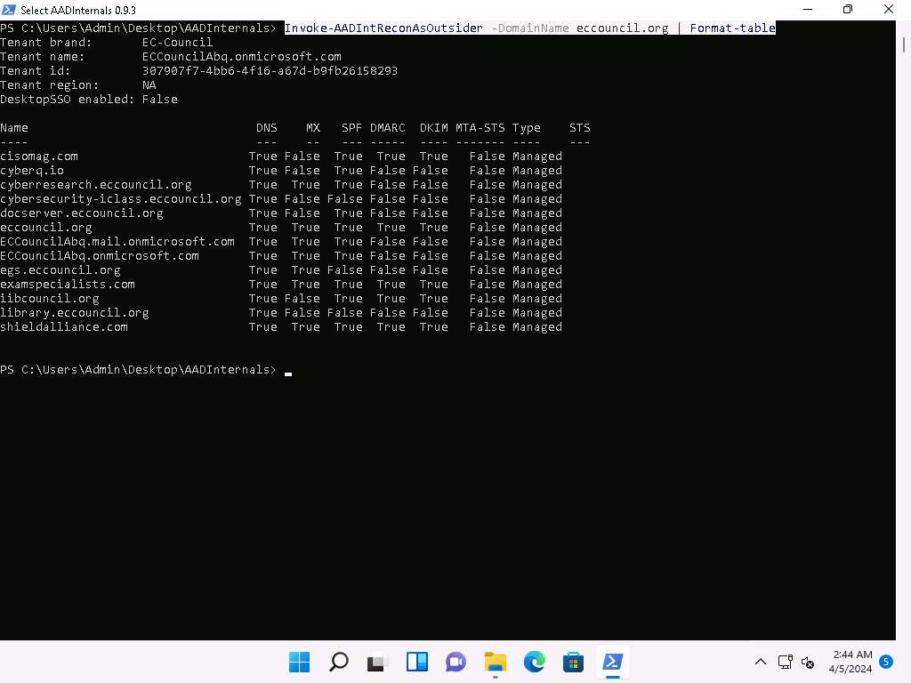

**Figure 1.1:** Public information about the Azure Active Directory tenant, including tenant details, verified domains, DNS records, and mail configuration, was successfully gathered using AADInternals.

---

### Azure AD User Enumeration

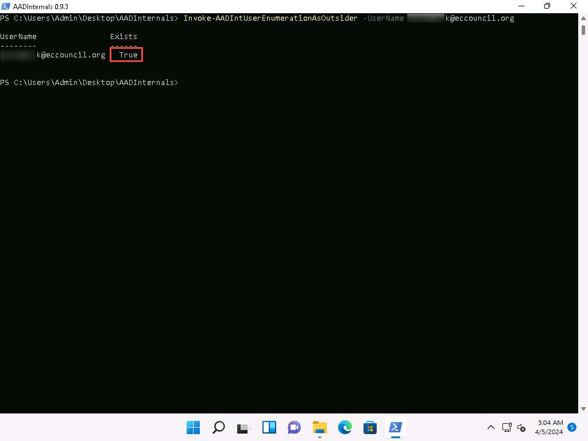

**Figure 1.2:** User enumeration confirmed whether the specified Azure Active Directory account existed within the target tenant, allowing identification of valid user accounts.

---

### Azure AD Login Information

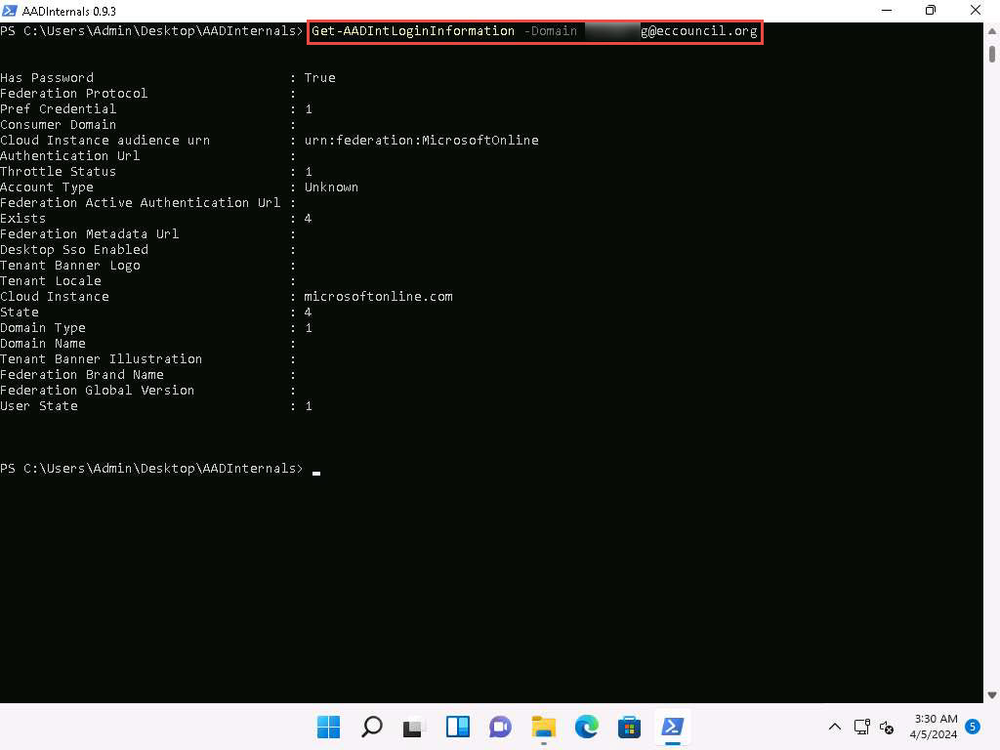

**Figure 1.3:** Login information for the target Azure Active Directory domain was retrieved, providing insight into the authentication configuration of the tenant.

---

### Azure Tenant Domains

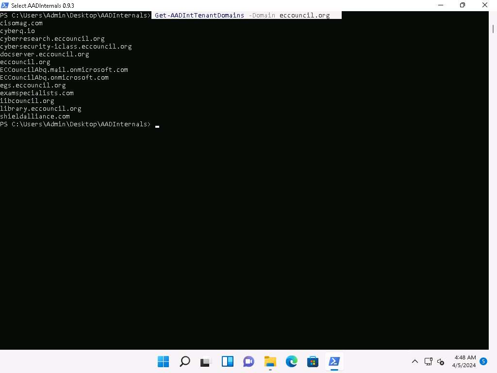

**Figure 1.4:** All registered domains associated with the Azure Active Directory tenant were successfully enumerated, revealing the organization's cloud domain structure.

---

### Learning Outcome

This task demonstrated how publicly accessible Azure Active Directory information can be collected using AADInternals during the reconnaissance phase of a cloud security assessment. It highlighted the risks of information disclosure, user enumeration, and exposed tenant metadata, reinforcing the importance of securing cloud identities and minimizing information exposure.

---

### Attack Flow

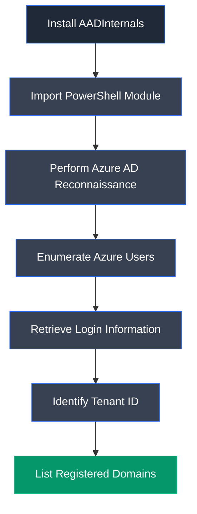
```mermaid
flowchart TD

    A[Install AADInternals]
    --> B[Import PowerShell Module]
    --> C[Perform Azure AD Reconnaissance]
    --> D[Enumerate Azure Users]
    --> E[Retrieve Login Information]
    --> F[Identify Tenant ID]
    --> G[List Registered Domains]

    classDef start fill:#1f2937,color:#fff,stroke:#2563eb
    classDef process fill:#374151,color:#fff,stroke:#2563eb
    classDef success fill:#059669,color:#fff,stroke:#10b981

    class A start
    class B,C,D,E,F process
    class G success
```

---

## Overall Learning Outcome

This lab provided practical experience in performing reconnaissance against Azure Active Directory using AADInternals. By collecting tenant information, enumerating valid user accounts, retrieving authentication details, identifying tenant identifiers, and discovering registered domains, the exercise demonstrated how publicly exposed cloud information can support reconnaissance activities while emphasizing the importance of securing cloud identities and minimizing information exposure.

---

# Lab 2: Exploit S3 Buckets

## Objective

Enumerate and exploit a publicly accessible Amazon S3 bucket using AWS CLI by listing bucket contents, uploading files, and deleting objects to demonstrate the security risks associated with misconfigured cloud storage.

---

## Background

Amazon Simple Storage Service (Amazon S3) is a cloud object storage service used to store files such as documents, images, videos, backups, and application data. Misconfigured S3 buckets with overly permissive access controls may expose sensitive information or allow unauthorized users to upload, modify, or delete stored objects. Ethical hackers assess S3 bucket permissions to identify insecure configurations and recommend appropriate access controls to prevent unauthorized access.

---

## Task 1: Exploit Open S3 Buckets using AWS CLI

### Tools Used

- [AWS CLI](../../Tools/AWS-CLI.md)

---

### Activity Performed

AWS CLI was configured to communicate with Amazon Web Services using valid account credentials. A publicly accessible S3 bucket was enumerated to identify its contents. The bucket was then accessed through both the AWS CLI and a web browser to verify its publicly exposed files. A sample text file was uploaded to the bucket, verified through the browser, and later removed using AWS CLI to demonstrate how insecure bucket permissions allow unauthorized file manipulation.

---

### Observations

- Configured AWS CLI with valid AWS credentials.
- Enumerated the contents of a publicly accessible S3 bucket.
- Verified bucket contents through the public S3 endpoint.
- Uploaded a file to the target S3 bucket.
- Confirmed the uploaded file through the browser.
- Deleted the uploaded file using AWS CLI.
- Verified successful removal of the file from the bucket.

---

### S3 Bucket Enumeration

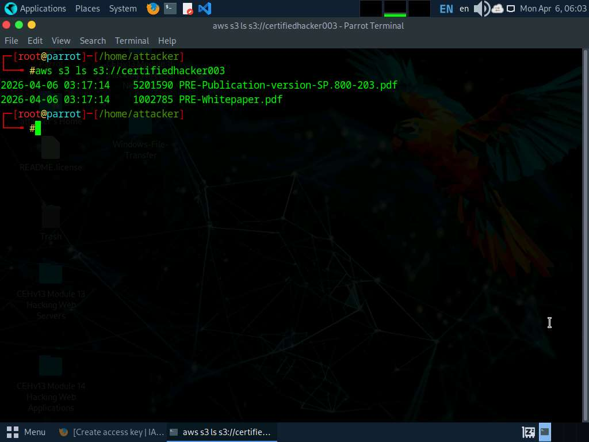

**Figure 2.1:** AWS CLI successfully enumerated the contents of the publicly accessible S3 bucket.

---

### Public S3 Bucket Contents

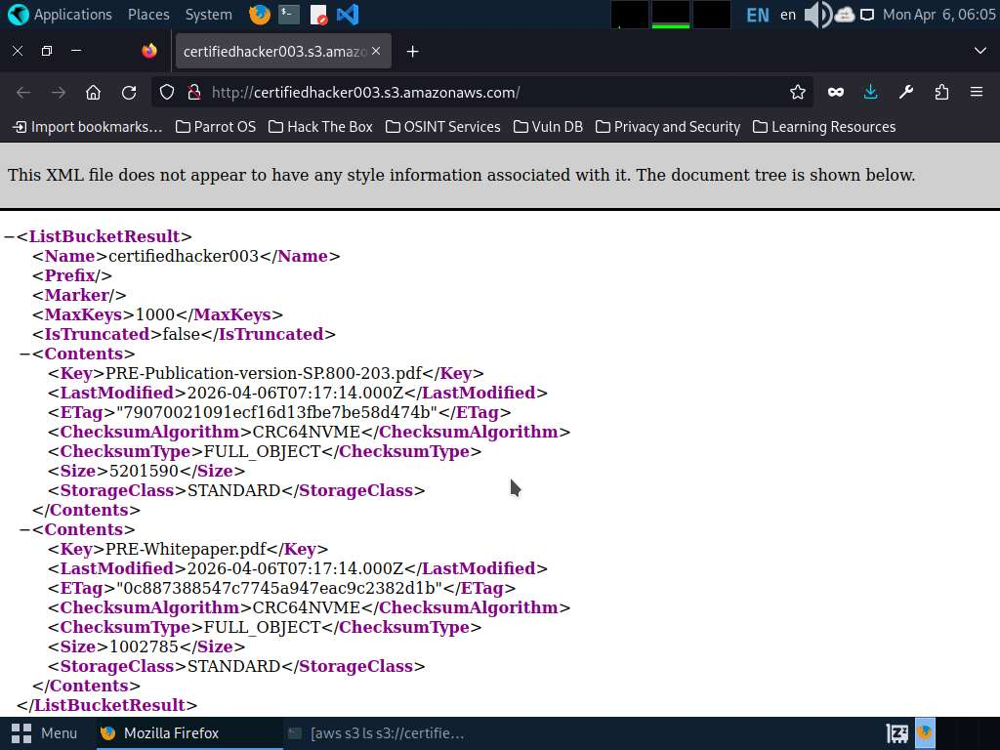

**Figure 2.2:** The browser displayed the files and directories exposed through the public Amazon S3 bucket.

---

### File Uploaded to S3 Bucket

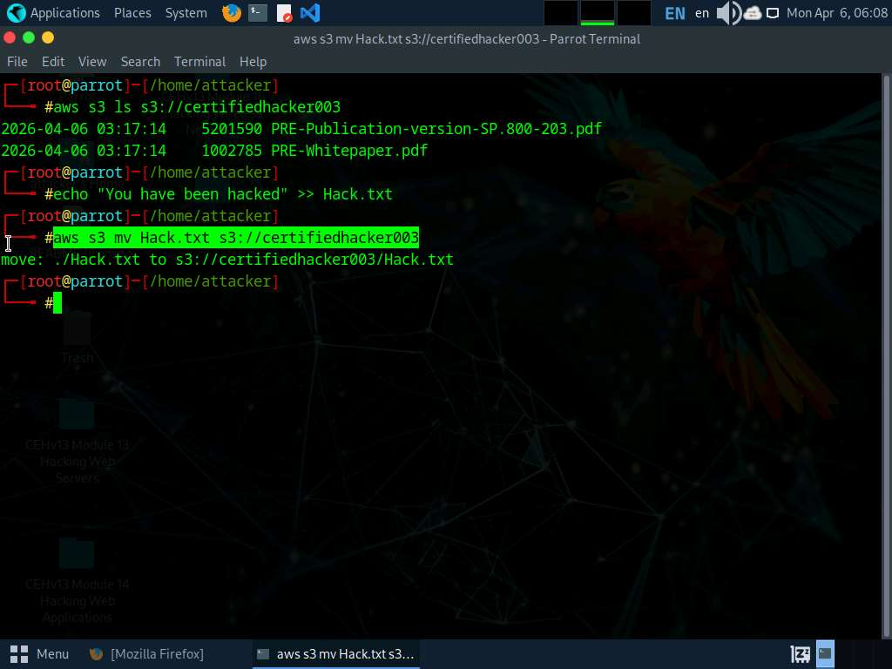

**Figure 2.3:** The sample text file was successfully uploaded to the S3 bucket using AWS CLI, demonstrating write access to the public bucket.

---

### Uploaded File Verified

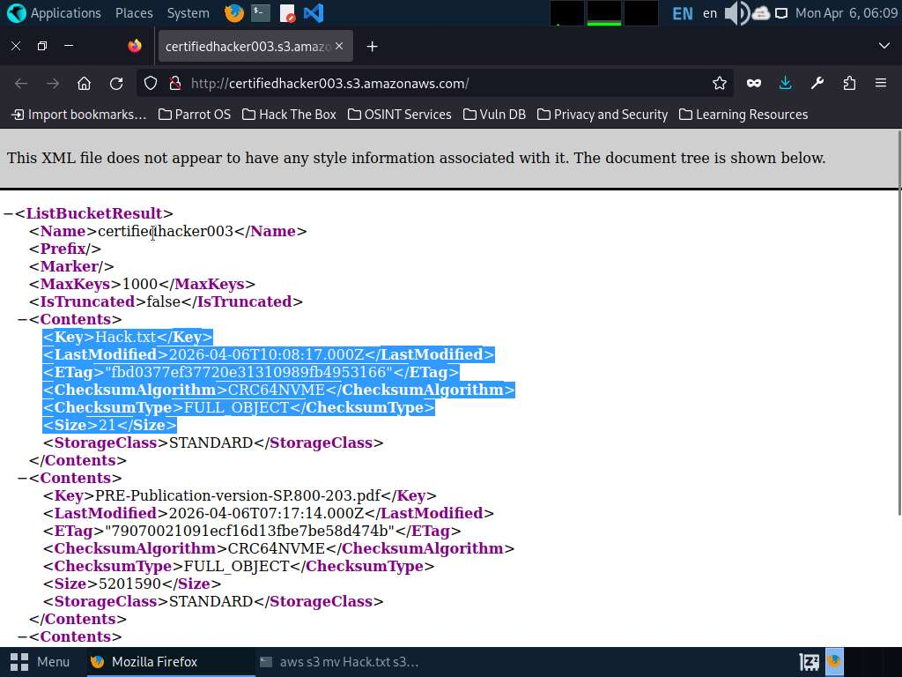

**Figure 2.4:** Reloading the public S3 bucket confirmed that the uploaded file was publicly accessible.

---

### File Deleted from S3 Bucket

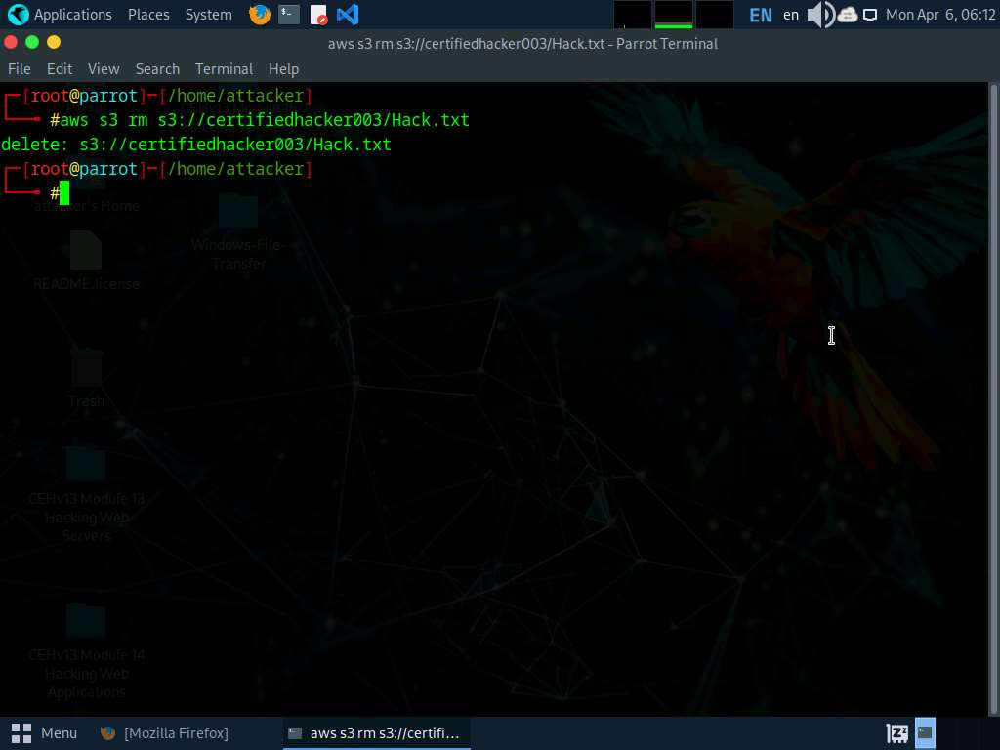

**Figure 2.5:** AWS CLI successfully removed the uploaded file from the S3 bucket.

---

### Bucket Verified After Deletion

**Figure 2.6:** Reloading the public bucket confirmed that the uploaded file had been permanently removed.

---

### Learning Outcome

This task demonstrated how publicly accessible Amazon S3 buckets can be enumerated and exploited when improper access permissions are configured. It highlighted the risks of unauthorized file access, upload, and deletion while reinforcing the importance of implementing least privilege, disabling unnecessary public access, and continuously monitoring cloud storage permissions.

---

### Attack Flow

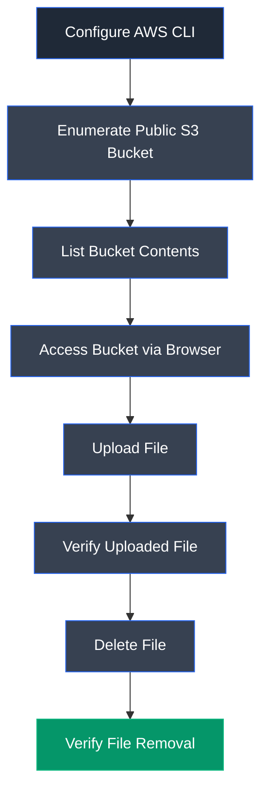
```mermaid
flowchart TD

    A[Configure AWS CLI]
    --> B[Enumerate Public S3 Bucket]
    --> C[List Bucket Contents]
    --> D[Access Bucket via Browser]
    --> E[Upload File]
    --> F[Verify Uploaded File]
    --> G[Delete File]
    --> H[Verify File Removal]

    classDef start fill:#1f2937,color:#fff,stroke:#2563eb
    classDef process fill:#374151,color:#fff,stroke:#2563eb
    classDef success fill:#059669,color:#fff,stroke:#10b981

    class A start
    class B,C,D,E,F,G process
    class H success
```

---

## Overall Learning Outcome

This lab provided practical experience in assessing Amazon S3 bucket security using AWS CLI. By enumerating bucket contents, verifying public exposure, uploading objects, and deleting files, the exercise demonstrated how misconfigured storage permissions can compromise cloud security. It reinforced the importance of restricting public bucket access, applying the principle of least privilege, and continuously auditing cloud storage configurations to prevent unauthorized access and data manipulation.

---

# Lab 3: Perform Privilege Escalation to Gain Higher Privileges

## Objective

Exploit a misconfigured IAM user policy to escalate privileges by creating and attaching an administrator policy, demonstrating how improper permission assignments can lead to complete control over AWS resources.

---

## Background

AWS Identity and Access Management (IAM) controls access to cloud resources through users, groups, roles, and policies. Misconfigured IAM permissions can allow attackers to perform privilege escalation by attaching highly privileged policies to existing accounts. Once administrative privileges are obtained, attackers can enumerate cloud resources, create new users, modify policies, and gain persistent access to the cloud environment. Ethical hackers assess IAM configurations to identify excessive permissions and enforce the principle of least privilege.

---

## Task 1: Escalate IAM User Privileges by Exploiting Misconfigured User Policy

### Tools Used

- [AWS CLI](../../Tools/AWS-CLI.md)

---

### Activity Performed

A custom administrator policy granting unrestricted permissions was created using AWS CLI. The policy was attached to a target IAM user whose existing permissions allowed policy attachment. After confirming that the administrator policy had been successfully assigned, the elevated privileges were used to enumerate IAM users within the AWS environment, demonstrating the impact of insecure IAM policy configurations.

---

### Observations

- Created a custom administrator access policy.
- Attached the policy to the target IAM user.
- Verified that the administrator policy was successfully attached.
- Enumerated IAM users after obtaining elevated privileges.
- Demonstrated the risks of excessive IAM permissions.

---

### Administrator Policy Created

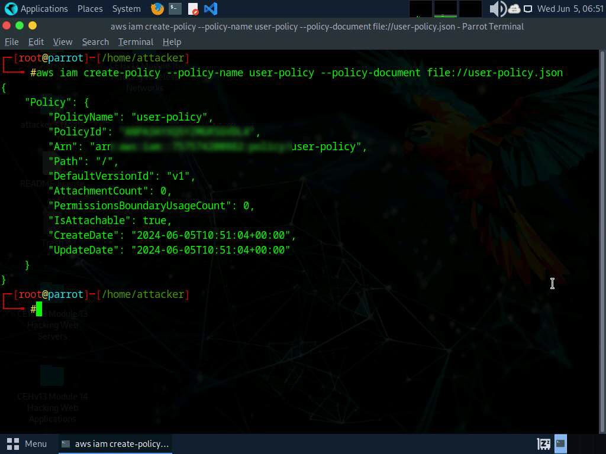

**Figure 3.1:** A custom administrator policy providing unrestricted permissions was successfully created using AWS CLI.

---

### Administrator Policy Attached

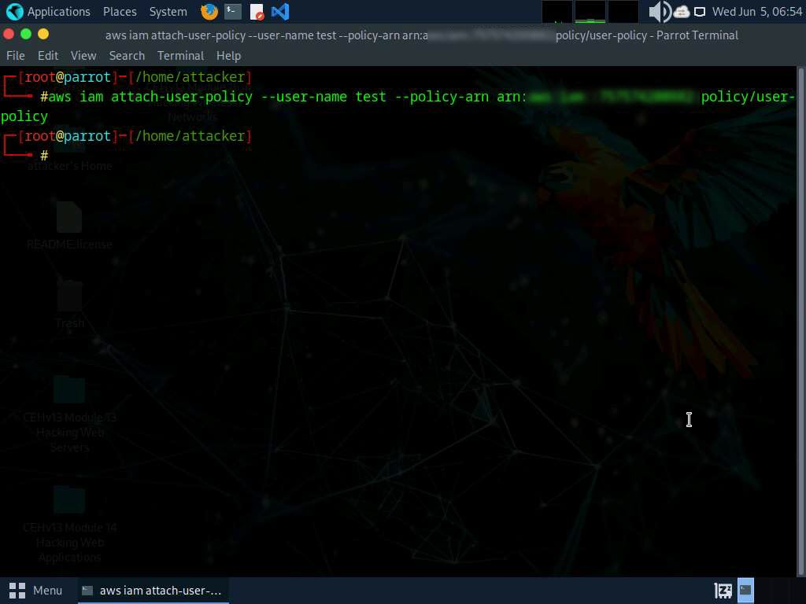

**Figure 3.2:** The administrator policy was successfully attached to the target IAM user, resulting in privilege escalation.

---

### Attached Policies Verified

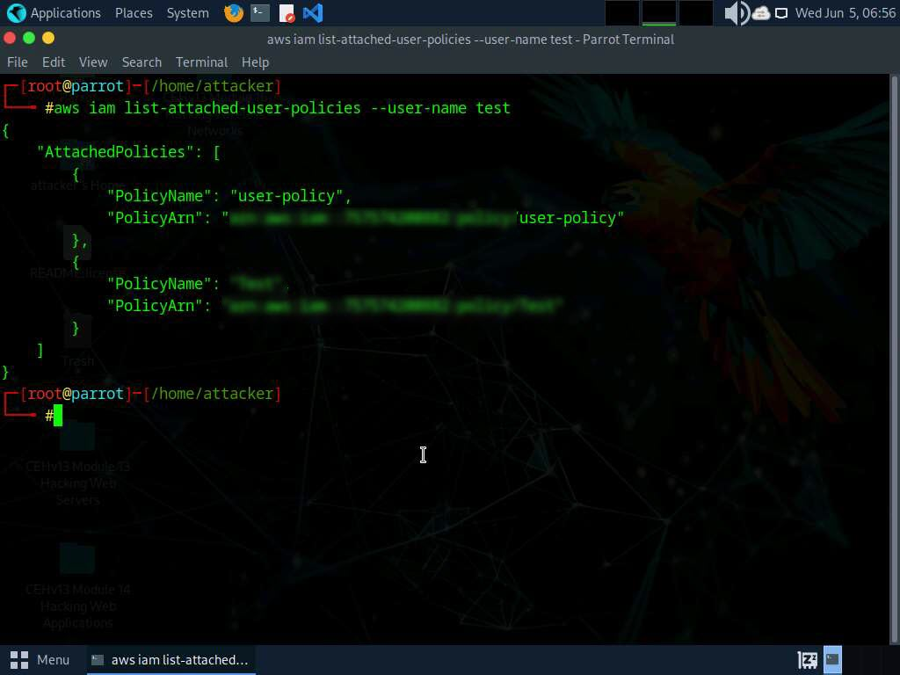

**Figure 3.3:** The attached policies were listed to confirm that the target IAM user had received the administrator policy.

---

### IAM Users Enumerated

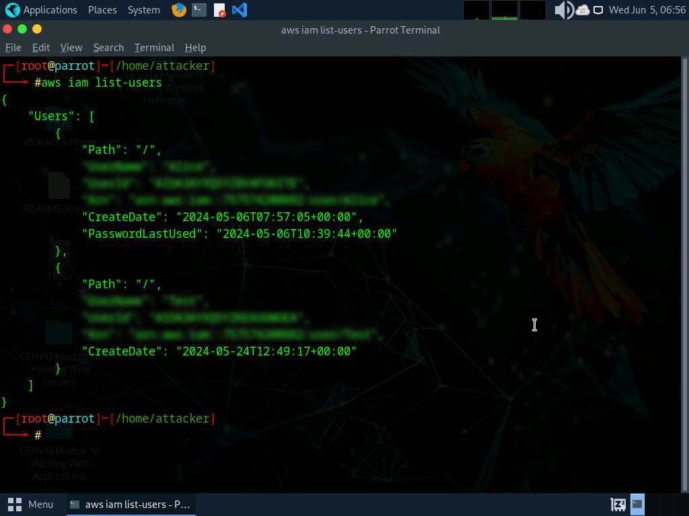

**Figure 3.4:** After privilege escalation, all IAM users within the AWS environment were successfully enumerated.

---

### Learning Outcome

This task demonstrated how misconfigured IAM permissions can be exploited to achieve administrator-level privileges in an AWS environment. It emphasized the importance of enforcing the principle of least privilege, regularly auditing IAM policies, and restricting policy management permissions to prevent unauthorized privilege escalation.

---

### Attack Flow

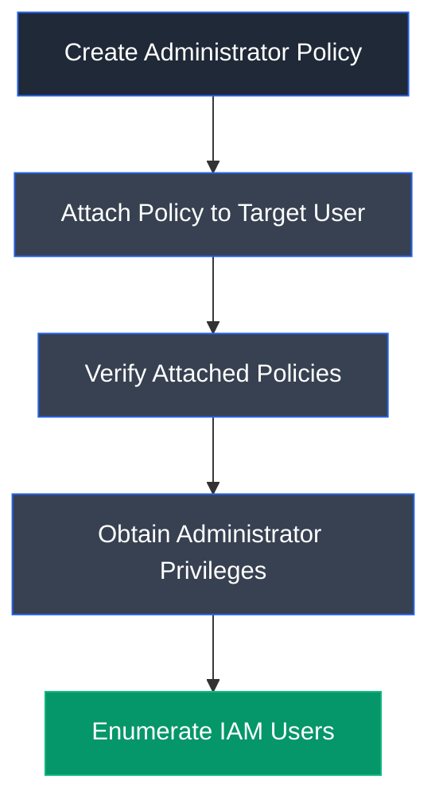
```mermaid
flowchart TD

    A[Create Administrator Policy]
    --> B[Attach Policy to Target User]
    --> C[Verify Attached Policies]
    --> D[Obtain Administrator Privileges]
    --> E[Enumerate IAM Users]

    classDef start fill:#1f2937,color:#fff,stroke:#2563eb
    classDef process fill:#374151,color:#fff,stroke:#2563eb
    classDef success fill:#059669,color:#fff,stroke:#10b981

    class A start
    class B,C,D process
    class E success
```

---

## Overall Learning Outcome

This lab demonstrated how excessive IAM permissions can be abused to escalate privileges within an AWS environment. By creating and attaching an administrator policy to a target user, the exercise highlighted the risks of improper access control and reinforced the importance of least privilege, IAM policy reviews, and continuous cloud security monitoring.

---

# Lab 4: Perform Vulnerability Assessment on Docker Images

## Objective

Perform vulnerability assessment on Docker container images using Trivy to identify security vulnerabilities, analyze their severity, and compare the security posture of secure and vulnerable container images.

---

## Background

Docker images package applications along with their runtime environment and dependencies, enabling consistent deployments across multiple platforms. However, outdated packages and vulnerable software components within container images can introduce security risks. Trivy is an open-source vulnerability scanner that analyzes container images against vulnerability databases to identify known security issues, helping organizations secure containerized applications before deployment.

---

## Task 1: Vulnerability Assessment on Docker Images using Trivy

### Tools Used

- [Trivy](../../Tools/Trivy.md)

---

### Activity Performed

Docker images were assessed using the Trivy vulnerability scanner to evaluate their security posture. A secure Ubuntu image was scanned first to verify the absence of known vulnerabilities. Subsequently, a vulnerable Nginx image was analyzed, where Trivy identified multiple operating system package vulnerabilities, classified them by severity, and reported the associated CVE identifiers. This assessment demonstrated the effectiveness of vulnerability scanning in identifying security weaknesses before container deployment.

---

### Observations

- Successfully scanned the Ubuntu Docker image using Trivy.
- Confirmed that the Ubuntu image contained no known vulnerabilities.
- Scanned the vulnerable Nginx Docker image.
- Identified multiple vulnerabilities affecting installed packages.
- Observed vulnerability classifications based on severity along with associated CVE identifiers.

---

### Ubuntu Image Scan

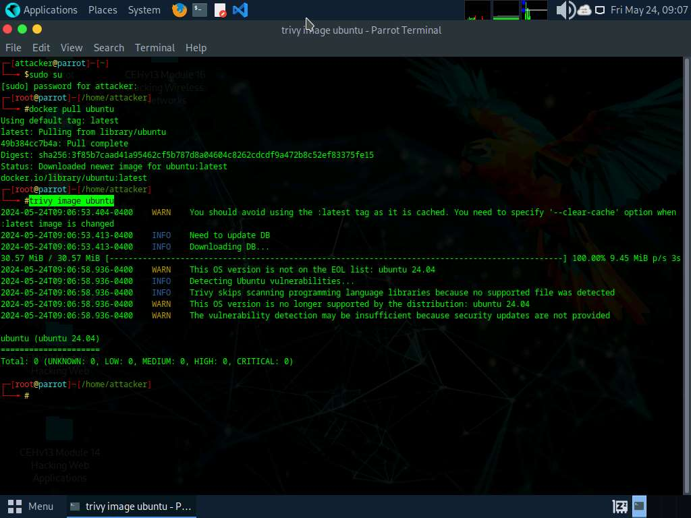

**Figure 4.1:** Trivy scanned the Ubuntu Docker image and reported no known vulnerabilities.

---

### Vulnerable Nginx Image Scan

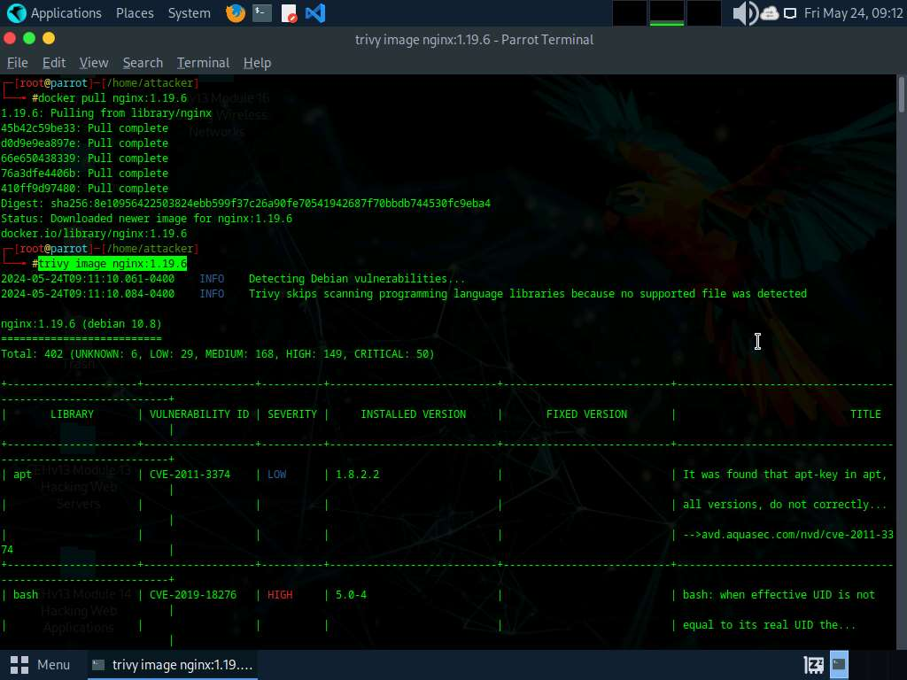

**Figure 4.2:** Trivy detected numerous vulnerabilities in the Nginx Docker image, providing severity classifications and associated CVE details.

---

### Learning Outcome

This task demonstrated how Trivy can effectively identify vulnerabilities within Docker container images before deployment. It reinforced the importance of routinely scanning container images, updating vulnerable packages, and integrating container security assessments into cloud security practices.

---

### Attack Flow

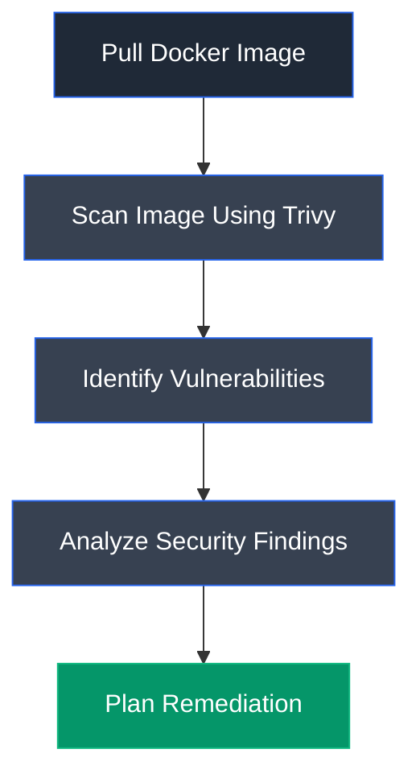
```mermaid
flowchart TD

    A[Pull Docker Image]
    --> B[Scan Image Using Trivy]
    --> C[Identify Vulnerabilities]
    --> D[Analyze Security Findings]
    --> E[Plan Remediation]

    classDef start fill:#1f2937,color:#fff,stroke:#2563eb
    classDef process fill:#374151,color:#fff,stroke:#2563eb
    classDef success fill:#059669,color:#fff,stroke:#10b981

    class A start
    class B,C,D process
    class E success
```

---

## Overall Learning Outcome

This lab demonstrated the use of Trivy for assessing the security of Docker container images. By comparing a secure Ubuntu image with a vulnerable Nginx image, the exercise highlighted the importance of container vulnerability scanning, proactive risk identification, and regular image maintenance to strengthen the security of cloud-native applications.

---

# Key Takeaways

- Understood Azure Active Directory reconnaissance techniques and tenant enumeration.
- Identified security risks associated with publicly accessible Amazon S3 buckets.
- Exploited misconfigured IAM permissions to perform privilege escalation.
- Learned how excessive IAM permissions can lead to administrator-level access.
- Performed vulnerability assessment on Docker container images using Trivy.
- Analyzed vulnerability severity levels and associated CVE information.
- Reinforced the importance of least privilege, secure cloud configurations, and continuous vulnerability management.

---

# Defensive Perspective

Cloud environments should follow the principle of least privilege by granting users only the permissions required to perform their tasks. Public cloud storage should be regularly audited to prevent unintended data exposure, while IAM policies must be reviewed to eliminate excessive permissions that could enable privilege escalation. Container images should be scanned routinely using vulnerability assessment tools such as Trivy before deployment, and organizations should continuously monitor cloud resources, apply security patches, and enforce secure configuration baselines to reduce the overall attack surface.

---

# Interview Questions

1. What is cloud reconnaissance and why is it important?
2. What information can be gathered from Azure Active Directory enumeration?
3. What are the security risks of publicly accessible Amazon S3 buckets?
4. How can IAM misconfigurations lead to privilege escalation?
5. What is the principle of least privilege?
6. What is Docker and why should Docker images be scanned?
7. What is Trivy and what types of vulnerabilities can it detect?
8. Why is container vulnerability assessment important in cloud security?
9. What are CVEs and how are they used during vulnerability assessments?
10. What security best practices help protect cloud environments?

---

# My Reflection

This module provided practical experience in assessing the security of modern cloud environments across Microsoft Azure, Amazon Web Services (AWS), and Docker platforms. I learned how attackers identify exposed cloud resources, exploit misconfigured storage services, abuse excessive IAM permissions to gain elevated privileges, and assess container images for known vulnerabilities. These exercises strengthened my understanding of cloud security best practices and reinforced the importance of secure configurations, access control, and continuous vulnerability assessment.

---