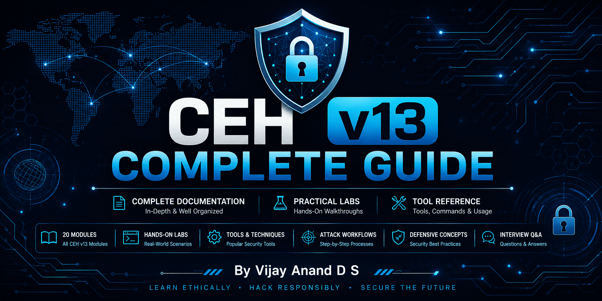

<p align="center">
  
</p>

<p align="center">
  <strong>
    A professionally organized CEH v13 documentation repository covering all 20 modules with detailed theory, practical labs, cybersecurity tool documentation, attack workflows, diagrams, screenshots, defensive concepts, and interview preparation.
  </strong>
</p>

---

[Modules](#-module-navigation) •
[Tools](#-tools-covered) •
[Resources](#-additional-resources) •
[License](#-license) •
[Author](#-author)

---

<p align="center">


</p>

---

> [!IMPORTANT]
> This repository is intended solely for **educational and ethical cybersecurity learning**. All tools, techniques, demonstrations, and practical exercises documented in this repository should only be performed in **authorized environments** with proper permission.

---

# 📚 Repository Highlights

- 📚 Complete CEH v13 Module Documentation (20 Modules)
- 🛠️ 90+ Cybersecurity Tool Documentations
- 🧪 Practical Labs with Step-by-Step Walkthroughs
- 📸 Screenshots and Practical Demonstrations
- 🎯 CEH Exam-Oriented Explanations
- 📖 Beginner to Advanced Learning Resource
- 📂 Professionally organized documentation

---

## 📂 Repository Structure

```text
CEH-v13-Complete-Guide/
│
├── Assets/                 # Repository banners, logos, and images
├── Modules/                # Complete CEH v13 module documentation
├── Tools/                  # 90+ cybersecurity tool documentations
│
├── README.md               # Repository homepage
├── CONTRIBUTING.md         # Contribution guidelines
├── LICENSE                 # MIT License
└── .gitignore              # Git ignore rules
```

---

# 📂 Repository Navigation

| Section | Description |
|---------|-------------|
| 📖 [Modules](Modules/) | Complete documentation for all 20 CEH v13 modules. |
| 🛠 [Tool Documentation](Tools/README.md) | Explore 90+ documented cybersecurity tools used throughout the CEH curriculum. |

---

# 📖 Module Navigation

| Module | Topic |
|---------|-------|
| 01 | [Ethical Hacking Foundations](Modules/Module-01-Ethical-Hacking-Foundations/README.md) |
| 02 | [Footprinting and Reconnaissance](Modules/Module-02-Footprinting-and-Reconnaissance/README.md) |
| 03 | [Scanning Networks](Modules/Module-03-Scanning-Networks/README.md) |
| 04 | [Enumeration](Modules/Module-04-Enumeration/README.md) |
| 05 | [Vulnerability Analysis](Modules/Module-05-Vulnerability-Analysis/README.md) |
| 06 | [System Hacking](Modules/Module-06-System-Hacking/README.md) |
| 07 | [Malware Threats](Modules/Module-07-Malware-Threats/README.md) |
| 08 | [Sniffing](Modules/Module-08-Sniffing/README.md) |
| 09 | [Social Engineering](Modules/Module-09-Social-Engineering/README.md) |
| 10 | [Denial of Service](Modules/Module-10-Denial-of-Service/README.md) |
| 11 | [Session Hijacking](Modules/Module-11-Session-Hijacking/README.md) |
| 12 | [Evading IDS, Firewalls and Honeypots](Modules/Module-12-Evading-IDS-Firewalls-and-Honeypots/README.md) |
| 13 | [Hacking Web Servers](Modules/Module-13-Hacking-Web-Servers/README.md) |
| 14 | [Web Application Hacking](Modules/Module-14-Web-Application-Hacking/README.md) |
| 15 | [SQL Injection](Modules/Module-15-SQL-Injection/README.md) |
| 16 | [Hacking Wireless Networks](Modules/Module-16-Hacking-Wireless-Networks/README.md) |
| 17 | [Hacking Mobile Platforms](Modules/Module-17-Hacking-Mobile-Platforms/README.md) |
| 18 | [IoT and OT Hacking](Modules/Module-18-IoT-and-OT-Hacking/README.md) |
| 19 | [Cloud Computing](Modules/Module-19-Cloud-Computing/README.md) |
| 20 | [Cryptography](Modules/Module-20-Cryptography/README.md) |

---

# 🛠 Tool Documentation

This repository includes **90+ documented cybersecurity tools** used throughout the **CEH v13** curriculum. Each tool includes an overview, purpose, features, practical usage, workflow, advantages, limitations, references, and the module(s) in which it is used.

| Category | Description |
|----------|-------------|
| 🌐 Reconnaissance & OSINT | Information gathering and open-source intelligence |
| 🔍 Scanning & Enumeration | Host discovery, service enumeration, and network mapping |
| 🛡 Vulnerability Assessment | Vulnerability scanning and security assessment |
| 🌍 Web Application Security | Web application testing and exploitation |
| 💻 System Hacking | Exploitation, privilege escalation, persistence, and post-exploitation |
| 🔑 Password Attacks | Password auditing and credential attacks |
| 🦠 Malware Analysis & Reverse Engineering | Malware creation, analysis, debugging, and reverse engineering |
| 📡 Network Analysis | Packet capture, sniffing, and traffic monitoring |
| 📶 Wireless Security | Wireless auditing and Wi-Fi security |
| 📱 Mobile Security | Android and mobile penetration testing |
| ☁ Cloud & Infrastructure | Cloud administration and infrastructure utilities |
| 🔐 Cryptography | Encryption, hashing, and cryptographic utilities |
| 🤖 AI-Assisted Security | AI-powered cybersecurity assistants |
| ⚙ System & Administrative Utilities | Windows/Linux administration and forensic utilities |

📁 **Browse the complete tool documentation:** **[Tool Documentation](Tools/README.md)**

---

# 🎯 Learning Outcomes

By completing this repository, you will be able to:

- Build a strong foundation in ethical hacking.
- Understand the complete CEH v13 syllabus.
- Perform reconnaissance and footprinting.
- Scan and enumerate target systems.
- Conduct vulnerability assessments.
- Understand malware analysis fundamentals.
- Analyze network traffic and packet captures.
- Perform web application security testing.
- Understand SQL Injection methodologies.
- Assess wireless, mobile, cloud, IoT, and OT security.
- Apply cryptographic concepts.
- Understand defensive security best practices.

---

# 📚 Additional Resources

The repository also includes:

- 🛠 Tool Documentation
- 📸 Practical Screenshots
- 🔄 Attack Workflow Diagrams
- 🎯 Learning Outcomes
- 🛡 Defensive Perspectives
- ❓ Interview Questions
- 📁 Repository Roadmap

---

# ⭐ Support

If this repository helped you during your CEH preparation:

- ⭐ Star this repository
- 🍴 Fork this repository
- 📢 Share it with fellow cybersecurity learners

Your support helps others discover this repository and supports the open-source cybersecurity community.

---

# 📄 License

This repository is licensed under the **MIT License**.

---

# 👨‍💻 Author

**Vijay Anand D S**

Cybersecurity Enthusiast • Ethical Hacking Learner • Lifelong Learner