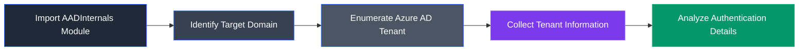

# AADInternals

## Overview

AADInternals is an open-source PowerShell toolkit designed to assess and manage Microsoft Entra ID (formerly Azure Active Directory) environments. It enables security professionals to enumerate Azure AD tenant information, inspect authentication endpoints, discover associated domains, and perform cloud reconnaissance during security assessments.

---

## Purpose

AADInternals is used to:

- Enumerate Azure AD tenants.
- Discover tenant domains.
- Retrieve Azure login information.
- Gather publicly available Azure AD data.
- Assess Azure identity configurations.
- Perform cloud reconnaissance.

---

## Key Features

- Azure AD tenant enumeration.
- Domain discovery.
- Login endpoint identification.
- Identity information gathering.
- PowerShell-based automation.
- Cloud security assessment capabilities.

---

## Installation

Install the PowerShell module:

```powershell
Install-Module AADInternals
```

Import the module:

```powershell
Import-Module AADInternals
```

---

## Typical Workflow



---

## CEH Practical Example

In **Module 19 – Cloud Computing**, AADInternals was used to enumerate Azure Active Directory tenant information, discover associated domains, and gather authentication details during Azure reconnaissance.

---

## Advantages

- Powerful Azure AD enumeration.
- Open-source PowerShell toolkit.
- Useful for cloud reconnaissance.
- Supports Azure identity assessments.
- Easy to automate.

---

## Limitations

- Requires PowerShell.
- Some functions depend on Azure configuration.
- Certain enumeration techniques may be restricted by Microsoft.

---

## Best Practices

- Use only during authorized assessments.
- Follow the principle of least privilege.
- Verify collected information before reporting.
- Keep the module updated.

---

## Used In

- Module 19 – Cloud Computing

---

## References

- https://github.com/Gerenios/AADInternals