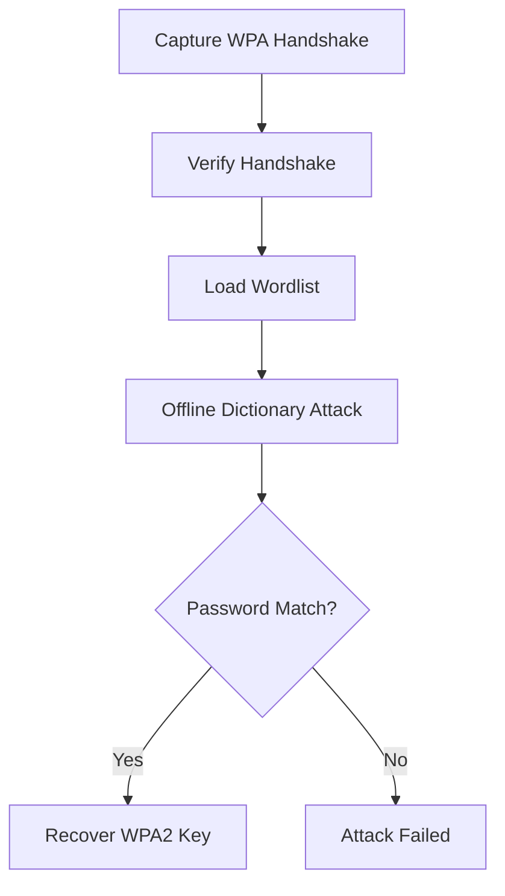

# Aircrack-ng

## Overview

Aircrack-ng is an open-source wireless network security auditing suite used to assess the security of IEEE 802.11 wireless networks. It provides tools for wireless packet capture, monitor mode management, WPA/WPA2 password auditing, packet injection, and wireless traffic analysis.

---

## Purpose

The primary purpose of Aircrack-ng is to evaluate the security of wireless networks by analyzing captured wireless traffic and performing password auditing against captured WPA/WPA2 authentication handshakes during authorized penetration tests.

---

## Key Features

- WPA/WPA2 Password Auditing
- Wireless Packet Analysis
- Dictionary Attack Support
- Monitor Mode Support
- Handshake Verification
- Wireless Packet Capture
- Packet Injection
- Cross-Platform Support

---

## Installation

### Linux

```bash
sudo apt install aircrack-ng
```

### Verify Installation

```bash
aircrack-ng --help
```

---

## Basic Syntax

```bash
aircrack-ng capture.cap
```

Example:

```bash
aircrack-ng -w wordlist.txt capture.cap
```

---

## Commonly Used Options

| Option | Description | Purpose |
|--------|-------------|----------|
| `-w` | Wordlist file path | Specifies the password wordlist for dictionary attacks |
| `-b` | BSSID | Targets a specific wireless network by BSSID (MAC address) |
| `-a` | WPA mode | Specifies WPA/WPA2 attack mode (1 = WPA, 2 = WPA2) |
| `--help` | Help command | Displays help information and available options |
| Capture File | .cap/.pcap file | Contains the captured WPA/WPA2 four-way handshake |
| Wordlist | Password list | Dictionary file containing candidate passwords for testing |
| BSSID | MAC address | MAC address of the target wireless access point |
| WPA/WPA2 Mode | Authentication type | Specifies which wireless encryption standard to target |

---

## Typical Workflow



---

## CEH Practical Example

During **Module 16 – Hacking Wireless Networks**, Aircrack-ng was used with a provided wireless packet capture containing a previously captured WPA2 authentication handshake. The tool performed an offline dictionary attack using a supplied password wordlist and successfully recovered the wireless pre-shared key, demonstrating the importance of strong Wi-Fi passwords.

---

## Advantages

- Industry-standard wireless auditing tool.
- Supports WPA/WPA2 password auditing.
- Open-source and actively maintained.
- Integrates with the Aircrack-ng suite.
- Supports multiple wireless adapters.

---

## Limitations

- Requires authorized testing.
- Depends on captured WPA/WPA2 handshake.
- Strong passwords significantly reduce attack success.
- Live wireless capture requires compatible hardware.

---

## Best Practices

- Test only authorized wireless networks.
- Use strong, unique wireless passphrases.
- Verify captured handshakes before auditing.
- Combine Aircrack-ng with packet analysis tools.
- Upgrade to WPA3 whenever possible.

---

## Used In

- Module 16 – Hacking Wireless Networks

---

## Related Tools

- Wireshark
- Nmap
- ShellGPT

---

## References

- Official: https://www.aircrack-ng.org/
- Documentation: https://www.aircrack-ng.org/documentation.html