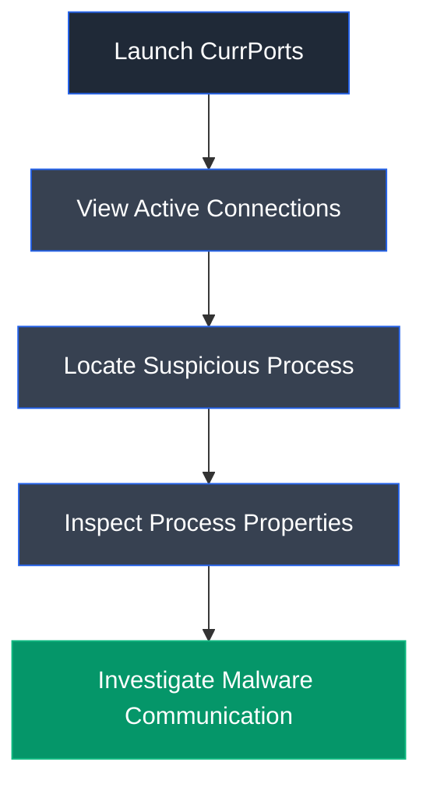

# CurrPorts

## Overview

CurrPorts is a network monitoring utility developed by NirSoft that displays all currently open TCP/IP and UDP ports on a Windows system. It provides detailed information about each connection, including the associated process, executable path, remote address, local port, process ID (PID), and connection state.

## Purpose

CurrPorts is used to monitor active network connections and identify processes communicating over the network. During malware investigations, it helps analysts locate suspicious processes, inspect connection details, and terminate malicious processes or close unwanted network connections.

## Key Features

- Monitor active TCP and UDP connections
- Display process information
- View executable path
- Identify remote IP addresses and ports
- View process properties
- Close TCP connections
- Kill malicious processes
- Export connection information
- Highlight suspicious applications

## Installation

### Windows

CurrPorts is a portable application and does not require installation.

### Verify Installation

Launch `cports.exe` and verify that the list of active TCP/IP and UDP connections is displayed.

## Basic Usage

Run CurrPorts and inspect active network connections associated with running processes.

**Example Workflow**

```text
Launch CurrPorts → Locate Suspicious Process → Inspect Properties → Investigate Connection
```

## Commonly Used Features

| Feature | Description |
|---------|-------------|
| Process Name | Displays the executable owning the connection |
| Process ID | Displays the PID of the process |
| Local Address | Displays the local IP address |
| Remote Address | Displays the remote endpoint |
| Properties | Shows detailed process information |
| Kill Process | Terminates the selected process |
| Close Connection | Closes the selected TCP connection |

## Typical Workflow



## CEH Practical Example

In **Module 07 – Malware Threats**, CurrPorts was used to identify the active network connection established by **Trojan.exe**. The tool displayed the associated process, communication port, executable path, remote address, and process properties, allowing investigation of the malware's communication channel.

## Advantages

- Lightweight and portable
- Easy process-to-port mapping
- Displays detailed process information
- Supports connection termination
- Useful during malware investigations

## Limitations

- Windows-only utility
- Does not inspect packet contents
- Cannot determine whether traffic is encrypted
- Requires analyst interpretation

## Best Practices

- Regularly monitor unknown outbound connections.
- Investigate unsigned or unfamiliar executables.
- Correlate network connections with process monitoring tools.
- Use alongside endpoint protection and firewall logs.

## Used In

- Module 07 – Malware Threats

## References

- https://www.nirsoft.net/utils/cports.html