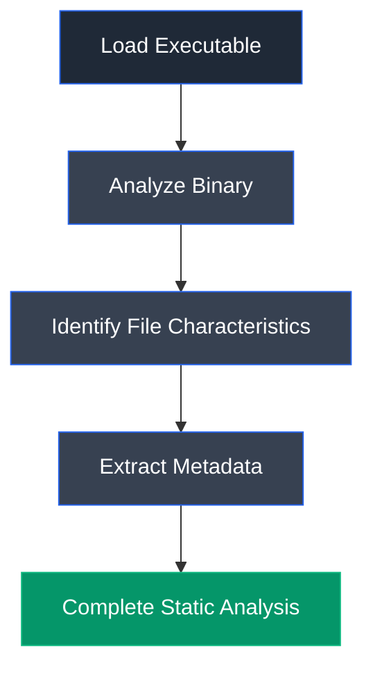

# Detect It Easy (DIE)

## Overview

Detect It Easy (DIE) is an open-source file identification and analysis tool used to determine the characteristics of executable files. It identifies the operating system, compiler, linker, packer, programming language, entropy, hashes, and other metadata without executing the file, making it an effective tool for static malware analysis.

## Purpose

Detect It Easy is used to inspect executable files and determine their internal characteristics before execution. Security analysts and malware researchers use the tool to identify file formats, packing methods, compilation details, and metadata that help assess whether a file may be malicious.

## Key Features

- Executable file identification
- Compiler and linker detection
- Packer and protector detection
- Operating system identification
- Programming language detection
- File metadata analysis
- Hash generation
- Entropy analysis
- Signature detection

## Installation

### Windows

Detect It Easy is distributed as a standalone executable and does not require installation.

### Verify Installation

Launch `die.exe` to open the Detect It Easy interface.

## Basic Usage

Load an executable file into the application to analyze its characteristics.

**Example Workflow**

```text
Load File → Analyze Executable → Review Metadata → Identify File Characteristics
```

## Commonly Used Features

| Feature | Description |
|---------|-------------|
| File Analysis | Detect executable characteristics |
| File Info | View executable metadata |
| Hash | Display MD5, SHA1, SHA256 hashes |
| Entropy | Analyze file entropy |
| Signatures | Detect packers and protectors |
| Hex View | Inspect raw hexadecimal data |

## Typical Workflow



## CEH Practical Example

In **Module 07 – Malware Threats**, Detect It Easy (DIE) was used to analyze an ELF executable without running it. The tool identified the operating system, compiler, programming language, hashes, entropy, and other executable metadata, providing valuable information during static malware analysis.

## Advantages

- Fast executable identification
- No malware execution required
- Supports multiple executable formats
- Displays detailed metadata
- Open-source and lightweight

## Limitations

- Static analysis only
- Cannot observe runtime behavior
- Limited against heavily obfuscated malware
- Requires analyst interpretation

## Best Practices

- Analyze suspicious files before execution.
- Compare file hashes with threat intelligence databases.
- Review entropy values to identify packed executables.
- Combine with dynamic analysis for complete malware investigation.

## Used In

- Module 07 – Malware Threats

## References

- https://github.com/horsicq/Detect-It-Easy