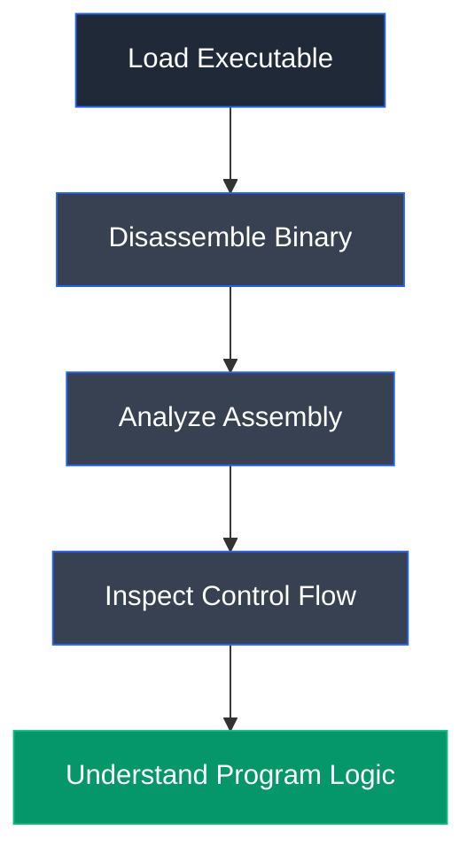

# IDA

## Overview

IDA (Interactive DisAssembler) is a professional disassembler and reverse engineering tool used to analyze executable files by converting machine code into assembly language. It enables analysts to inspect program logic, control flow, imported functions, and executable structure without requiring source code.

## Purpose

IDA is used to reverse engineer software and malware by analyzing assembly instructions, execution flow, and binary structures. It helps security analysts understand how malicious programs operate, identify suspicious functions, and investigate executable behavior during static malware analysis.

## Key Features

- Interactive disassembly
- Assembly code analysis
- Control flow graph visualization
- Function analysis
- Import and export inspection
- Hexadecimal viewer
- Cross-reference analysis
- Binary navigation
- Reverse engineering support

## Installation

### Windows

IDA Free is installed as a desktop application.

### Verify Installation

Launch **IDA Free** and ensure the Quick Start window appears successfully.

## Basic Usage

Open an executable file and allow IDA to analyze the binary automatically.

**Example Workflow**

```text
Load Executable → Auto Analysis → Review Assembly → Analyze Control Flow
```

## Commonly Used Features

| Feature | Description |
|---------|-------------|
| Disassembly View | Displays assembly instructions |
| Flow Graph | Visualizes program execution flow |
| Imports | Lists imported API functions |
| Hex View | Displays executable in hexadecimal |
| Functions | Shows discovered program functions |
| Strings | Displays embedded strings |

## Typical Workflow



## CEH Practical Example

In **Module 07 – Malware Threats**, IDA Free was used to disassemble a malware executable (`face.exe`) for static analysis. The executable's assembly instructions, control flow graph, imported functions, and binary structure were examined to understand its internal logic without executing the malware.

## Advantages

- Powerful reverse engineering capabilities
- Excellent visualization of program flow
- Supports numerous executable formats
- Interactive navigation through binaries
- Widely used by malware analysts

## Limitations

- Requires assembly language knowledge
- Static analysis only
- Advanced features are limited in the free version
- Large binaries may require significant analysis time

## Best Practices

- Perform static analysis before dynamic execution.
- Review imports and control flow together.
- Identify suspicious API calls early.
- Combine with a debugger for deeper malware analysis.

## Used In

- Module 07 – Malware Threats

## References

- https://hex-rays.com/ida-free/