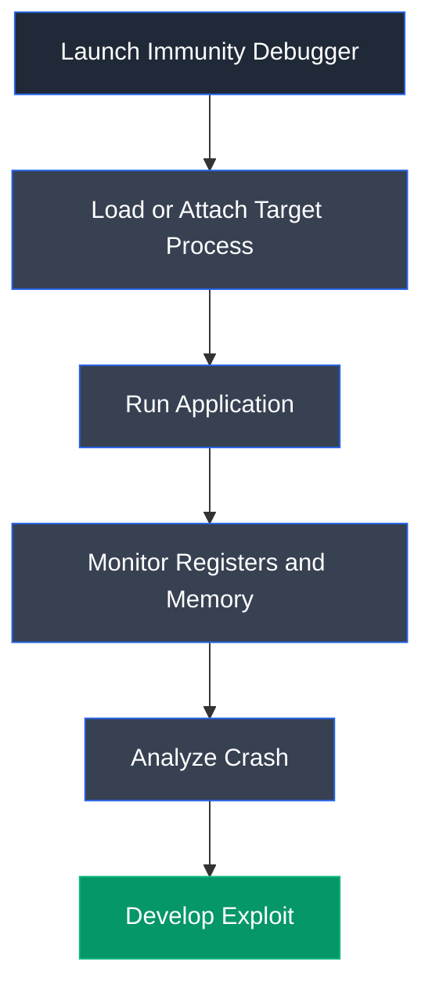

# Immunity Debugger

## Overview

Immunity Debugger is a Windows-based graphical debugger designed for reverse engineering, exploit development, malware analysis, and vulnerability research. It provides powerful debugging capabilities, memory inspection, register analysis, and Python scripting support, making it one of the most widely used tools for developing and analyzing buffer overflow exploits.

---

## Purpose

Immunity Debugger is used to:

- Analyze application execution during runtime.
- Identify software vulnerabilities.
- Develop and test buffer overflow exploits.
- Monitor CPU registers, memory, and stack contents.
- Perform reverse engineering and exploit analysis.

---

## Key Features

- Interactive graphical debugger.
- CPU register and memory inspection.
- Breakpoint management.
- Stack and disassembly analysis.
- Python scripting support.
- Integration with Mona for exploit development.
- Real-time application debugging.

---

## Installation

Download and install Immunity Debugger from the official website.

Launch the application:

```text
Immunity Debugger
```

---

## Basic Usage

Open an executable:

```
File → Open
```

Attach to a running process:

```
File → Attach
```

Start execution:

```
Run → Run
```

Pause execution:

```
Debug → Pause
```

---

## Commonly Used Features

| Feature | Description |
|---------|-------------|
| Attach | Attach the debugger to a running process |
| Run | Execute the loaded application |
| Pause | Pause program execution |
| Breakpoint (F2) | Set or remove a breakpoint |
| Registers | View CPU register values |
| Dump | Inspect process memory |
| Follow in Dump | Navigate to a selected memory address |
| Command Bar | Execute debugger and Mona commands |

---

## Typical Workflow



---

## CEH Practical Example

In **Module 06 – System Hacking**, Immunity Debugger was used during the buffer overflow attack to analyze the vulnerable server, monitor register values, verify EIP control, identify bad characters, locate suitable return addresses, and validate successful exploit execution before achieving remote code execution.

---

## Advantages

- Excellent for exploit development.
- User-friendly graphical interface.
- Powerful memory and register analysis.
- Supports Python extensions such as Mona.
- Widely used in vulnerability research.

---

## Limitations

- Available only for Windows.
- Primarily designed for 32-bit applications.
- Requires debugging knowledge for effective use.
- Modern exploit mitigations may complicate analysis.

---

## Best Practices

- Use only on systems you are authorized to test.
- Verify application stability before debugging.
- Document register states and memory analysis during exploit development.
- Combine with Mona for efficient exploit analysis.
- Use breakpoints strategically to observe execution flow.

---

## Used In

- Module 06 – System Hacking

---

## References

- https://www.immunityinc.com/products/debugger/
- https://www.corelan.be/index.php/2011/07/14/mona-py-the-manual/