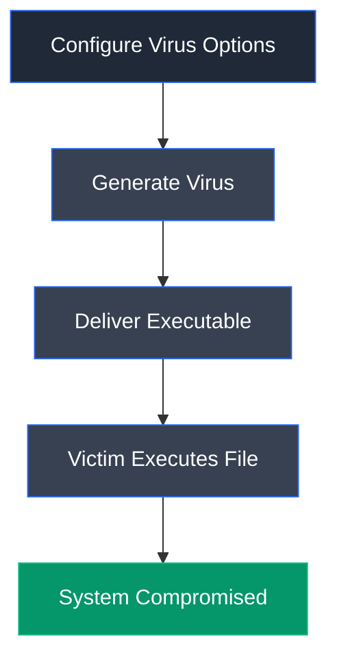

# JPS Virus Maker

## Overview

JPS Virus Maker is a malware simulation tool used to create customized virus executables by selecting predefined malicious behaviors. It is commonly used in controlled environments to demonstrate the effects of malware on Windows systems.

## Purpose

The tool enables users to generate proof-of-concept virus executables for security awareness, malware analysis, and penetration testing demonstrations. It illustrates how malware can modify operating system settings, disable security features, and disrupt system functionality.

## Key Features

- Create custom virus executables
- Configure startup behavior
- Disable Windows security features
- Modify system settings
- Change Windows account password
- Enable persistence
- Simulate worm behavior

## Installation

### Windows

JPS Virus Maker is provided as a standalone executable and does not require installation.

### Verify Installation

Launch the `JPS.exe` executable to access the virus builder interface.

## Basic Syntax

Launch the application, configure the desired virus options, and generate the executable.

**Example**

```text
Configure Options → Create Virus → Generate Executable
```

## Commonly Used Commands

| Feature | Description |
|---------|-------------|
| Auto Startup | Execute automatically after system startup |
| Disable Task Manager | Prevent Task Manager access |
| Disable Windows Update | Disable update services |
| Turn Off Windows Defender | Disable built-in antivirus |
| Turn Off Windows Firewall | Disable firewall protection |
| Change Password | Modify Windows account password |
| Create Virus | Generate the malicious executable |

## Typical Workflow



## CEH Practical Example

In **Module 07 – Malware Threats**, JPS Virus Maker was used to create a customized virus executable containing multiple malicious actions, including disabling administrative features and modifying the Windows account password. The generated executable was executed on a Windows Server 2019 machine to demonstrate the impact of malware infection within a controlled environment.

## Advantages

- Simple graphical interface
- Highly customizable malware simulation
- Useful for malware awareness demonstrations
- Suitable for controlled security labs

## Limitations

- Intended only for educational use
- Detected by modern security solutions
- Windows-specific
- Not suitable for production environments

## Best Practices

- Use only in isolated virtual lab environments.
- Restore infected systems after testing.
- Never distribute generated malware outside authorized environments.
- Ensure endpoint protection is enabled after completing the exercise.

## Used In

- Module 07 – Malware Threats

## References

- EC-Council CEH v13 Official Lab Manuals