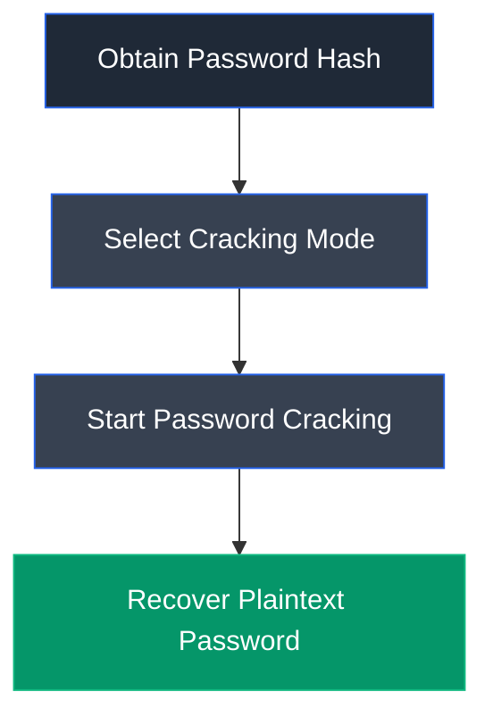

# John the Ripper

## Overview

John the Ripper is a widely used open-source password recovery and password auditing tool designed to identify weak passwords through offline password cracking. It supports numerous password hash formats and employs various cracking techniques, including dictionary attacks, brute-force attacks, rule-based attacks, and incremental mode to recover plaintext passwords from captured hashes.

---

## Purpose

John the Ripper is used to:

- Recover plaintext passwords from captured password hashes.
- Audit password strength during security assessments.
- Identify weak passwords within systems and applications.
- Support penetration testing and password security analysis.
- Validate the effectiveness of organizational password policies.

---

## Key Features

- Supports numerous password hash formats.
- Dictionary, brute-force, and incremental cracking modes.
- Rule-based password mutation.
- Automatic hash type detection.
- Multi-platform support.
- Resume interrupted cracking sessions.
- Highly optimized password cracking engine.

---

## Installation

### Debian / Ubuntu / Parrot OS

John the Ripper is included in most penetration testing distributions.

To install manually:

```bash
sudo apt update
sudo apt install john
```

Launch John the Ripper:

```bash
john
```

---

## Basic Syntax

Crack password hashes:

```bash
john <hash_file>
```

Example:

```bash
john hash.txt
```

---

## Commonly Used Commands

| Command | Description |
|---------|-------------|
| `john hash.txt` | Crack password hashes stored in a file |
| `john --show hash.txt` | Display recovered passwords |
| `john --wordlist=<wordlist> hash.txt` | Perform a dictionary attack |
| `john --incremental hash.txt` | Perform an incremental brute-force attack |
| `john --format=<format> hash.txt` | Specify the password hash format |

---

## Typical Workflow



---

## CEH Practical Example

In **Module 06 – System Hacking**, John the Ripper was used to perform offline password cracking against NTLMv2 authentication hashes captured using Responder. After loading the captured hash into a text file, John successfully recovered the user's plaintext password, demonstrating the effectiveness of offline password attacks against weak credentials.

---

## Advantages

- Fast and efficient password recovery.
- Supports numerous password hash formats.
- Multiple password cracking techniques.
- Highly customizable attack modes.
- Widely used in penetration testing and password auditing.

---

## Limitations

- Strong passwords require significantly more time to crack.
- Success depends on password complexity and cracking method.
- Offline cracking requires access to password hashes.
- Resource-intensive during brute-force attacks.

---

## Best Practices

- Use only with proper authorization.
- Enforce strong password policies to reduce cracking success.
- Store password hashes securely.
- Use multi-factor authentication to reduce credential compromise risks.
- Audit passwords periodically to identify weak credentials.

---

## Used In

- Module 06 – System Hacking

---

## References

- https://www.openwall.com/john/
- https://github.com/openwall/john