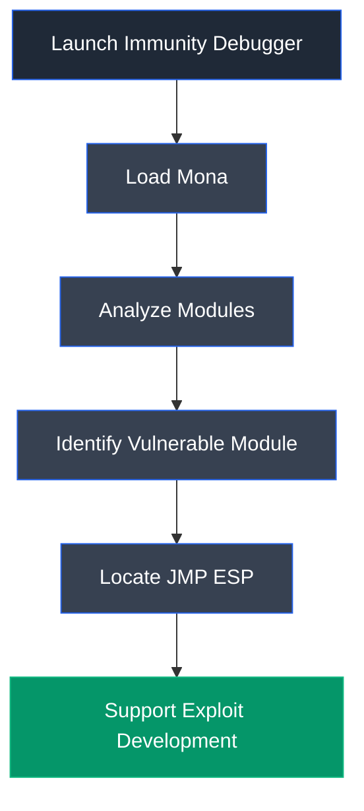

# Mona

## Overview

Mona is a Python extension for Immunity Debugger developed by Corelan Team to simplify exploit development and vulnerability research. It automates many repetitive tasks involved in buffer overflow exploitation, including module enumeration, bad character detection, pattern generation, offset calculation, return address discovery, and ROP gadget identification.

---

## Purpose

Mona is used to:

- Automate buffer overflow exploit development.
- Identify vulnerable modules without memory protections.
- Locate suitable return addresses such as `JMP ESP`.
- Generate cyclic patterns and calculate offsets.
- Detect bad characters affecting shellcode.
- Assist in return-oriented programming (ROP) analysis.

---

## Key Features

- Integrated with Immunity Debugger.
- Module security analysis.
- Pattern creation and offset calculation.
- Bad character analysis.
- Return address and gadget discovery.
- ROP chain generation.
- Automated exploit development utilities.

---

## Installation

Copy the `mona.py` script into the **PyCommands** directory of Immunity Debugger.

Typical location:

```text
C:\Program Files (x86)\Immunity Inc\Immunity Debugger\PyCommands
```

Restart Immunity Debugger after copying the script.

---

## Basic Syntax

List loaded modules:

```text
!mona modules
```

Search for a `JMP ESP` instruction:

```text
!mona find -s "\xff\xe4" -m essfunc.dll
```

---

## Commonly Used Commands

| Command | Description |
|---------|-------------|
| `!mona modules` | Display loaded modules and their security protections |
| `!mona find -s "\xff\xe4" -m essfunc.dll` | Locate a `JMP ESP` instruction within the specified module |
| `!mona bytearray` | Generate a byte array for bad character analysis |
| `!mona compare` | Compare memory with the generated byte array to identify bad characters |
| `!mona pattern_create <length>` | Generate a cyclic pattern |
| `!mona pattern_offset <value>` | Calculate the offset for an overwritten register |

---

## Typical Workflow



---

## CEH Practical Example

In **Module 06 – System Hacking**, Mona was used within Immunity Debugger during the buffer overflow attack to identify modules lacking modern memory protection mechanisms and locate a valid `JMP ESP` instruction. These results were incorporated into the exploit to redirect execution flow toward the injected shellcode and successfully achieve remote code execution.

---

## Advantages

- Automates repetitive exploit development tasks.
- Simplifies buffer overflow analysis.
- Integrates seamlessly with Immunity Debugger.
- Provides accurate module and memory analysis.
- Widely used in exploit development and security research.

---

## Limitations

- Works only with Immunity Debugger.
- Primarily intended for Windows exploit development.
- Requires knowledge of exploit development concepts.
- Less useful outside debugging environments.

---

## Best Practices

- Use only during authorized security assessments.
- Verify module protection settings before selecting return addresses.
- Validate bad characters before generating shellcode.
- Document offsets and return addresses during exploit development.
- Combine Mona with Immunity Debugger for efficient vulnerability analysis.

---

## Used In

- Module 06 – System Hacking

---

## References

- https://www.corelan.be/index.php/2011/07/14/mona-py-the-manual/
- https://github.com/corelan/mona