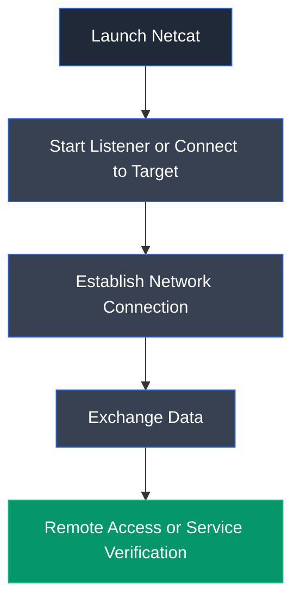

# Netcat

## Overview

Netcat (commonly abbreviated as **nc**) is a versatile command-line networking utility used to read from and write to network connections using TCP or UDP protocols. It is widely used in penetration testing, network troubleshooting, port scanning, banner grabbing, file transfers, and establishing reverse or bind shells, earning it the nickname **"Swiss Army Knife of Networking."**

---

## Purpose

Netcat is used to:

- Establish TCP and UDP network connections.
- Listen for incoming connections on specified ports.
- Create reverse and bind shell listeners.
- Perform banner grabbing and basic service enumeration.
- Transfer files between systems.
- Troubleshoot network connectivity.

---

## Key Features

- Supports both TCP and UDP protocols.
- Client and server (listener) modes.
- Reverse and bind shell support.
- Port scanning capabilities.
- Banner grabbing.
- File transfer support.
- Lightweight and cross-platform.

---

## Installation

### Debian / Ubuntu / Parrot OS

```bash
sudo apt update
sudo apt install netcat-openbsd
```

Launch Netcat:

```bash
nc
```

---

## Basic Syntax

Connect to a remote host:

```bash
nc <IP_Address> <Port>
```

Start a listener:

```bash
nc -nvlp <Port>
```

Example:

```bash
nc -nvlp 4444
```

---

## Commonly Used Commands

| Command | Description |
|---------|-------------|
| `nc -nvlp 4444` | Start a TCP listener on port 4444 |
| `nc <IP> <Port>` | Connect to a remote host |
| `nc -zv <IP> <Port>` | Scan a specific port |
| `nc -zv <IP> 1-1000` | Scan a range of ports |
| `nc -u <IP> <Port>` | Connect using UDP |
| `nc -h` | Display Netcat help |

---

## Typical Workflow



---

## CEH Practical Example

In **Module 06 – System Hacking**, Netcat was used to create a listener on the attacker's machine before executing the crafted buffer overflow exploit. After successful exploitation, the reverse shell connected back to the listening Netcat instance, allowing remote command execution on the compromised target system.

---

## Advantages

- Lightweight and easy to use.
- Supports both TCP and UDP communication.
- Useful for troubleshooting and penetration testing.
- Enables rapid listener configuration.
- Available on multiple operating systems.

---

## Limitations

- Provides no encryption by default.
- Can be detected by endpoint security and network monitoring tools.
- Some operating systems ship with limited Netcat implementations.
- Misuse may expose unauthorized remote access.

---

## Best Practices

- Use only on systems you are authorized to test.
- Prefer encrypted alternatives when transmitting sensitive information.
- Close unused listeners after testing.
- Monitor open ports to detect unauthorized listeners.
- Document all listener configurations during penetration tests.

---

## Used In

- Module 06 – System Hacking

---

## References

- https://nmap.org/ncat/
- https://man.openbsd.org/nc