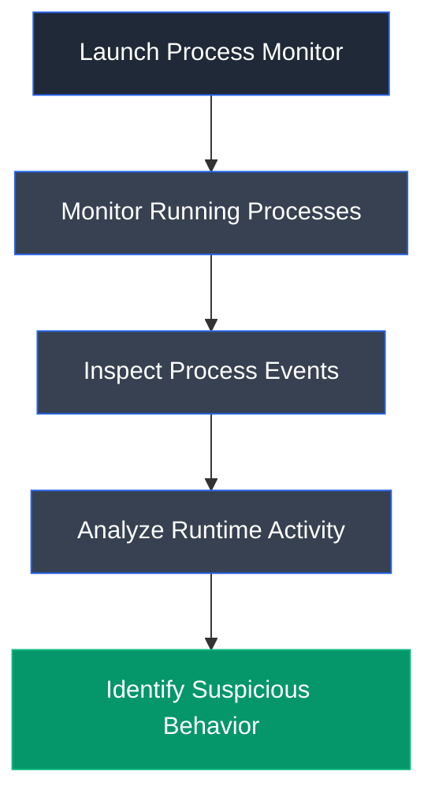

# Process Monitor

## Overview

Process Monitor (Procmon) is an advanced system monitoring utility from Microsoft Sysinternals that provides real-time monitoring of file system, registry, process, thread, and DLL activities on Windows systems. It is widely used for malware analysis, troubleshooting, and forensic investigations.

## Purpose

Process Monitor is used to observe runtime process behavior and identify suspicious activities performed by applications. It enables analysts to monitor process creation, registry modifications, file system access, DLL loading, and other system events generated during malware execution.

## Key Features

- Real-time process monitoring
- File system activity monitoring
- Registry activity monitoring
- Thread monitoring
- DLL and module inspection
- Event filtering
- Process properties analysis
- Stack trace analysis
- Event logging

## Installation

### Windows

Process Monitor is distributed as a standalone Sysinternals utility and does not require installation.

### Verify Installation

Launch `Procmon.exe` and verify that system events begin appearing in real time.

## Basic Usage

Launch Process Monitor and observe runtime system activity generated by processes.

**Example Workflow**

```text
Launch Process Monitor → Locate Process → Analyze Events → Review Process Details
```

## Commonly Used Features

| Feature | Description |
|---------|-------------|
| Event View | Displays real-time system events |
| Process Properties | Shows process information |
| Event Properties | Displays detailed event information |
| Process Tab | Displays process-specific details |
| Stack Tab | Shows loaded modules and execution stack |
| Filters | Filters events by process or operation |

## Typical Workflow



## CEH Practical Example

In **Module 07 – Malware Threats**, Process Monitor was used to observe the runtime behavior of **Trojan.exe**. The tool displayed process events, execution details, process properties, and stack information, enabling analysis of how the malware interacted with the Windows operating system during execution.

## Advantages

- Comprehensive real-time monitoring
- Detailed process and event analysis
- Powerful filtering capabilities
- Trusted Microsoft Sysinternals utility
- Valuable for malware analysis and troubleshooting

## Limitations

- Generates large volumes of events
- Windows-only utility
- Requires analyst expertise
- Long monitoring sessions may consume significant system resources

## Best Practices

- Apply filters to reduce unnecessary events.
- Monitor suspicious processes in isolated environments.
- Correlate process activity with network monitoring tools.
- Save event logs for later forensic analysis.

## Used In

- Module 07 – Malware Threats

## References

- https://learn.microsoft.com/sysinternals/downloads/procmon