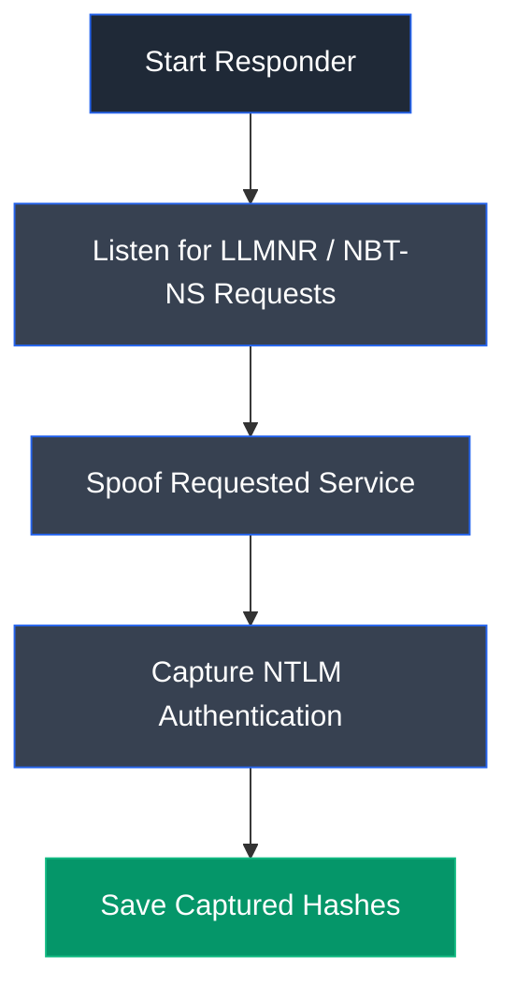

# Responder

## Overview

Responder is an open-source network poisoning tool designed to perform Link-Local Multicast Name Resolution (LLMNR), NetBIOS Name Service (NBT-NS), and Multicast DNS (mDNS) spoofing attacks within local networks. It listens for name resolution requests and impersonates legitimate network services, allowing attackers or penetration testers to capture NTLM authentication hashes transmitted by target systems.

---

## Purpose

Responder is used to:

- Capture NTLMv1 and NTLMv2 authentication hashes.
- Exploit LLMNR, NBT-NS, and mDNS name resolution protocols.
- Perform credential interception attacks within internal networks.
- Collect information about target systems and authenticated users.
- Assess the security risks associated with legacy Windows name resolution protocols.

---

## Key Features

- LLMNR, NBT-NS, and mDNS poisoning.
- NTLMv1 and NTLMv2 hash capture.
- SMB, HTTP, FTP, LDAP, SQL, and other protocol support.
- Automatic credential interception.
- Passive network listening.
- Built-in logging of captured authentication data.
- Supports multiple network interfaces.

---

## Installation

### Debian / Ubuntu / Parrot OS

Responder is included in most penetration testing distributions.

To install manually:

```bash
sudo apt update
sudo apt install responder
```

Launch Responder:

```bash
sudo responder -I <interface>
```

---

## Basic Syntax

Start Responder:

```bash
sudo responder -I <interface>
```

Example:

```bash
sudo responder -I eth0
```

---

## Commonly Used Commands

| Command | Description |
|---------|-------------|
| `sudo responder -I eth0` | Start Responder on the specified network interface |
| `sudo responder -I wlan0` | Start Responder on a wireless network interface |
| `ifconfig` | Display available network interfaces |
| `ip addr` | View network interface information |
| `ls /usr/share/responder/logs` | View captured authentication logs |

---

## Typical Workflow



---

## CEH Practical Example

In **Module 06 – System Hacking**, Responder was used to perform an active online password attack by exploiting LLMNR and NBT-NS name resolution protocols. It intercepted NTLMv2 authentication requests from the target Windows system and captured the user's authentication hash, which was later cracked offline using John the Ripper to recover the plaintext password.

---

## Advantages

- Simple to deploy within local networks.
- Automates credential interception attacks.
- Supports multiple name resolution protocols.
- Generates detailed logs of captured authentication data.
- Widely used during internal network penetration testing.

---

## Limitations

- Effective only within the same broadcast domain.
- Requires LLMNR, NBT-NS, or mDNS to be enabled.
- Modern network security controls may detect poisoning attempts.
- Strong passwords reduce the effectiveness of offline hash cracking.

---

## Best Practices

- Use only with proper authorization during security assessments.
- Disable LLMNR and NBT-NS where possible to reduce the attack surface.
- Enforce strong password policies to protect captured hashes.
- Monitor internal networks for unauthorized name resolution responses.
- Securely handle captured authentication data.

---

## Used In

- Module 06 – System Hacking

---

## References

- https://github.com/lgandx/Responder
- https://github.com/lgandx/Responder/wiki