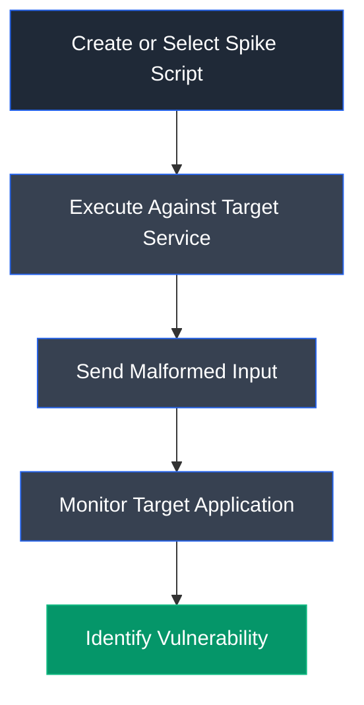

# Spike

## Overview

Spike is an open-source protocol fuzzing framework designed to identify software vulnerabilities by sending malformed or unexpected input to network services and applications. It is commonly used during vulnerability research and exploit development to discover buffer overflow vulnerabilities, application crashes, and other input validation weaknesses.

---

## Purpose

Spike is used to:

- Perform protocol fuzzing against network services.
- Identify buffer overflow vulnerabilities.
- Discover application crashes caused by malformed input.
- Assist in exploit development.
- Evaluate the robustness of applications against unexpected input.

---

## Key Features

- Protocol-based fuzzing.
- Custom fuzzing scripts (.spk files).
- Supports TCP-based services.
- Lightweight command-line utilities.
- Automated malformed input generation.
- Useful for vulnerability discovery and exploit development.

---

## Installation

### Debian / Ubuntu / Parrot OS

Clone the repository:

```bash
git clone https://github.com/guilhermeferreira/spikepp.git
```

Compile the project (if required):

```bash
make
```

---

## Basic Syntax

Run a Spike script against a target service:

```bash
generic_send_tcp <Target_IP> <Port> <Script.spk> 0 0
```

Example:

```bash
generic_send_tcp 10.10.1.11 9999 trun.spk 0 0
```

---

## Commonly Used Commands

| Command | Description |
|---------|-------------|
| `generic_send_tcp <IP> <Port> <Script.spk> 0 0` | Execute a Spike fuzzing script against a target service |
| `generic_send_tcp 10.10.1.11 9999 stats.spk 0 0` | Test the STATS command for vulnerabilities |
| `generic_send_tcp 10.10.1.11 9999 trun.spk 0 0` | Test the TRUN command for buffer overflow vulnerabilities |

---

## Typical Workflow



---

## CEH Practical Example

In **Module 06 – System Hacking**, Spike was used to identify vulnerable commands exposed by the target server. By executing protocol-specific fuzzing scripts such as `stats.spk` and `trun.spk`, malformed input was sent to the vulnerable application, resulting in a controlled crash that confirmed the presence of a buffer overflow vulnerability for further exploit development.

---

## Advantages

- Simple protocol fuzzing framework.
- Effective for discovering buffer overflow vulnerabilities.
- Lightweight and easy to use.
- Supports custom fuzzing scripts.
- Useful during exploit development.

---

## Limitations

- Primarily designed for protocol fuzzing.
- Limited graphical interface.
- Requires knowledge of target protocols.
- May not support modern application fuzzing techniques.

---

## Best Practices

- Perform fuzzing only on authorized systems.
- Monitor the target application during testing.
- Record crash conditions for later analysis.
- Combine Spike with a debugger for exploit development.
- Validate discovered vulnerabilities before exploitation.

---

## Used In

- Module 06 – System Hacking

---

## References

- https://github.com/guilhermeferreira/spikepp
- http://www.immunitysec.com/resources-freesoftware.shtml