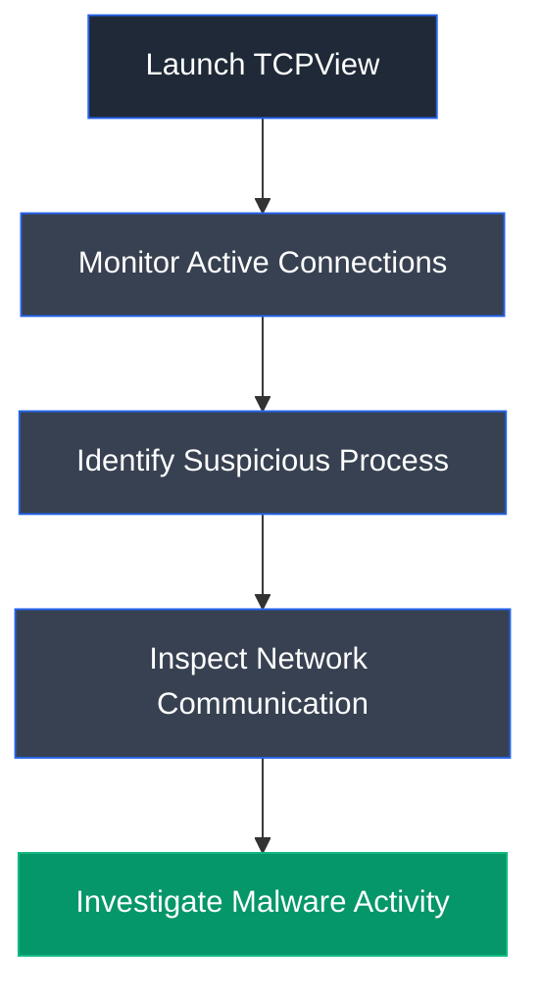

# TCPView

## Overview

TCPView is a Microsoft Sysinternals utility that displays detailed information about all active TCP and UDP endpoints on a Windows system. It provides real-time visibility into network connections, including process names, local and remote addresses, port numbers, connection states, and associated processes.

## Purpose

TCPView is used to monitor network activity and identify applications communicating over TCP or UDP. During malware investigations, it helps analysts detect suspicious network connections, identify command-and-control (C2) communication, and investigate processes responsible for opening network ports.

## Key Features

- Real-time TCP/UDP monitoring
- Process-to-port mapping
- Local and remote address identification
- Connection state monitoring
- Process termination
- Automatic endpoint updates
- DNS name resolution
- Sysinternals integration

## Installation

### Windows

TCPView is distributed as a standalone executable through Microsoft Sysinternals.

### Verify Installation

Launch `tcpview.exe` and verify that active TCP and UDP connections are displayed.

## Basic Usage

Run TCPView and inspect active network connections associated with running processes.

**Example Workflow**

```text
Launch TCPView → Monitor Connections → Identify Suspicious Process → Investigate Communication
```

## Commonly Used Features

| Feature | Description |
|---------|-------------|
| Process Name | Displays the process owning the connection |
| Local Address | Shows the local IP address |
| Local Port | Displays the local communication port |
| Remote Address | Displays the destination IP |
| Remote Port | Shows the destination port |
| Connection State | Displays the TCP connection status |
| Kill Process | Terminates the selected process |

## Typical Workflow



## CEH Practical Example

In **Module 07 – Malware Threats**, TCPView was used to monitor the active network connection established by a Trojan process (`Trojan.exe`). The tool displayed the local and remote addresses, communication port, and connection state, enabling identification of the malware's network activity.

## Advantages

- Real-time network monitoring
- Simple graphical interface
- Easy identification of suspicious connections
- Lightweight Sysinternals utility
- Supports both TCP and UDP monitoring

## Limitations

- Windows-only utility
- Does not perform packet inspection
- Cannot analyze encrypted traffic
- Requires analyst interpretation

## Best Practices

- Monitor unexpected outbound connections.
- Verify unknown processes before terminating them.
- Correlate network activity with process monitoring tools.
- Use alongside firewall and endpoint security logs.

## Used In

- Module 07 – Malware Threats

## References

- https://learn.microsoft.com/sysinternals/downloads/tcpview