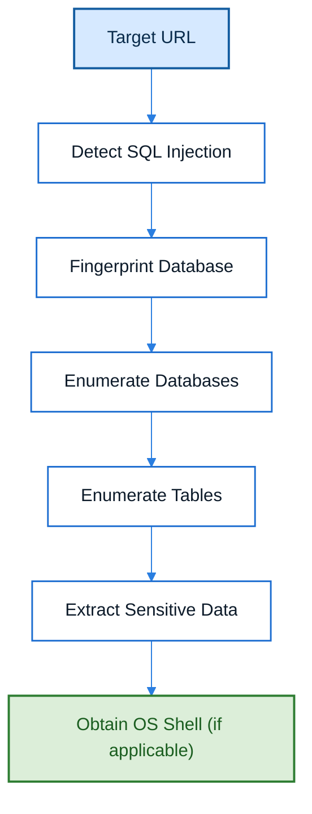

# sqlmap

## Overview

sqlmap is an open-source penetration testing tool that automates the process of detecting and exploiting SQL Injection vulnerabilities in web applications. It supports numerous database management systems and provides features such as database fingerprinting, database enumeration, data extraction, operating system command execution, and privilege escalation where supported.

---

## Purpose

The primary purpose of sqlmap is to assist penetration testers in identifying SQL Injection vulnerabilities and assessing their impact by automating the exploitation process. It reduces manual effort while providing accurate database fingerprinting, enumeration, and exploitation capabilities during authorized security assessments.

---

## Key Features

- Automatic SQL Injection Detection
- Database Fingerprinting
- Database Enumeration
- Table Enumeration
- Data Extraction
- Authentication Cookie Support
- Operating System Command Execution
- Database User Enumeration
- File System Access (where supported)

---

## Installation

### Linux

```bash
sudo apt install sqlmap
```

### Verify Installation

```bash
sqlmap --version
```

---

## Basic Syntax

```bash
sqlmap -u <Target_URL>
```

Example:

```bash
sqlmap -u "http://example.com/profile.php?id=1"
```

---

## Commonly Used Options

| Option | Purpose | Description |
|---|---|---|
| `-u` | Target URL | Specifies the target web application's URL or vulnerable parameter string for testing. |
| `--cookie` | Session Cookie | Sends an authenticated session cookie with requests, useful when testing login-protected areas. |
| `--dbs` | List Databases | Enumerates all available databases on the target DBMS after a SQL Injection vulnerability is confirmed. |
| `-D` | Select Database | Chooses a specific database to target for enumeration or extraction. |
| `--tables` | List Tables | Enumerates all tables within the selected database. Requires `-D <database>`. |
| `-T` | Select Table | Chooses a specific table within the selected database for data extraction. |
| `--dump` | Dump Data | Extracts data from the selected table or from all tables when no specific table is given. |
| `--os-shell` | Operating System Shell | Attempts to open an interactive operating system shell on the compromised database server, if supported. |
| `--batch` | Non-interactive Mode | Runs sqlmap without prompting for confirmation, using default answers for all questions. |

---

## Typical Workflow



---

## CEH Practical Example

During **Module 15 – SQL Injection**, sqlmap was used to assess an authenticated Microsoft SQL Server-backed web application. By supplying the vulnerable URL together with an authenticated session cookie, sqlmap automatically detected the SQL Injection vulnerability, fingerprinted the backend database, enumerated available databases, extracted information from the `user_login` table, and successfully obtained operating system shell access.

---

## Advantages

- Automates SQL Injection detection and exploitation.
- Supports multiple database management systems.
- Performs accurate database fingerprinting.
- Reduces manual testing effort.
- Supports authenticated web applications.
- Widely used by penetration testers and security professionals.

---

## Limitations

- Requires proper authorization before use.
- Some advanced features depend on database permissions.
- May generate false positives that require manual verification.
- Automated exploitation should always be validated by the tester.

---

## Best Practices

- Test only authorized systems.
- Verify identified vulnerabilities manually.
- Supply authentication cookies when testing authenticated applications.
- Understand each command before execution.
- Combine sqlmap with manual testing techniques for comprehensive assessments.

---

## Used In

- Module 15 – SQL Injection

---

## Related Tools

- OWASP ZAP
- ShellGPT
- Burp Suite
- cURL

---

## References

- Official Website: https://sqlmap.org/
- Official Documentation: https://github.com/sqlmapproject/sqlmap/wiki